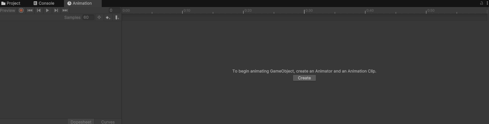
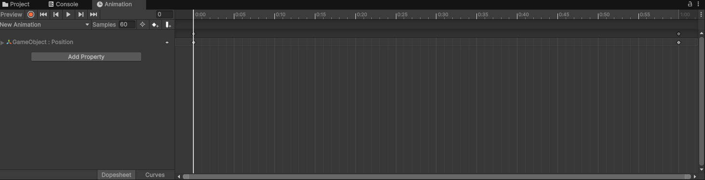

# Animaciones en Unity

Otro de los apartados que son un oficio en sí mismo. Vamos a ver lo básico para poder crear animaciones sencillas para nuestros proyectos, pero el mundo de la animación es inmenso y existen profesionales dedicados exclusivamente a ello. 

Podemos generar animaciones desde tres fuentes distintas, o bien desde el propio Editor de Unity con el componente **Animator** y que se realiza directamente mediante componentes. También podemos importarlas de un programa externo, como un **Asset**, esto es más común en los objetos 3D. Y, por último, también podemos animar objetos desde código, desde un script. Vamos a centrarnos en el primer caso, en las animaciones que podemos crear desde el Editor de Unity. 

## Clips de animación

Los clips de animación representan la propia animación en sí misma. Para crear un Clip de animación debemos anexar la pestaña de animación desde **Window → Animation** también podemos abrirla pulsando el shortcut [Ctrl + 6]). Una vez abierta podemos acoplar la pestaña a cualquier ventana del layout de Unity, es habitual acoplar dicha pestaña a la ventana inferior ya que es una pestaña que nos interesa ver en un formato más panorámico habitualmente para poder observar la línea de tiempo del animator entera. 

Una vez con la pestaña abierta debemos seleccionar el objeto que queremos animar y desde la misma pestaña del animator pinchamos en Create y le asignamos un nombre a dicha animación para, tras esto, guardarla en una carpeta del proyecto. 

Una vez creada se nos mostrarán dos secciones en la pestaña de animación. En la parte superior izquierda tenemos los controles de reproducción de la animación, los típicos botones de grabar, retroceso al comienzo o al final, retroceso rápido o avance rápido y un botón de play/pausa. Justo debajo de estos controles tenemos el nombre de la animación que estamos editando, el cuál se muestra en una lista desplegable por si quisiéramos cambiar de animación o crear una nueva. 

Debajo tenemos el botón de agregar una propiedad, y aquí está la clave de esta pestaña, desde esta sección se nos mostrarán los componentes que posee el objeto y que permiten ser animados, al expandir alguno de los componentes encontraremos las propiedades disponibles y al hacer clic en botón ‘+’ de la parte derecha se agrega esa propiedad al panel izquierdo del animator. De esta forma, podremos animar esa propiedad concreta cambiando sus valores en la línea de tiempo de la derecha de la pestaña de animación. Es habitual hacer esto con las propiedades del componente Transform, por ejemplo, para mover o rotar el objeto al reproducir la animación.

En la línea de tiempo encontramos unos iconos al principio y al final, estos iconos representan los **keyframes** o **fotogramas clave** de la animación. Los fotogramas clave son los fotogramas definidos por el usuario que Unity utilizará como referencia para generar la animación, por norma general, a mayor número de fotogramas, más fluída se verá la animación, pero esto es muy relativo al tipo de animación y al estilo artístico que estemos utilizando. El programa se encargará de interpelar fotogramas generados por el motor para mejorar la calidad de la animación entre los fotogramas clave que nosotros le hemos indicado.

Para generar los fotogramas clave de la animación podemos hacerlo de dos formas. La primera forma es generarlos de forma manual, para ello, haremos clic derecho sobre la línea de tiempo y seleccionaremos add key, esto nos generará un nuevo fotograma clave en la parte izquierda, dónde podremos cambiar el valor de la propiedad que estamos modificando. La otra forma de hacerlo es mediante la grabación de la animación usando los controles del reproductor, para ello, mientras grabamos debemos mover la línea de tiempo dónde queremos el fotograma clave y en la vista de la escena movemos o modificamos la propiedad en cuestión. Si al hacer esto modificamos una propiedad que no está en el listado, esta se añadirá automáticamente al animator y a la animación. Es importante acordarse de desactivar el botón de grabación al terminar, ya que de lo contrario podría darnos pie a errores en la animación inesperados por volver a tocar el objeto sin querer.

Una vez tenemos la animación creada, debemos aplicarla al objeto que  nos interesa, para ello también existen dos formas de hacerlo, la primera es mediante un componente llamado **Animation** y la segunda mediante otro llamado **Animator**. 

El componente **Animation** podemos agregarlo directamente en un objeto y asignarle algún Clip ya creado, esto añadirá la animación a un array de animaciones que contiene el componente, si añadimos más, se irán añadiendo en los siguientes elementos del array, empezando por supuesto en la posición 0, aunque podemos cambiar el orden a posteriori. Contiene una propiedad clave para reproducir la animación automáticamente (llamada Play Automatically), que reproduce la primera animación que se encuentra en el Array.  Este componente se utiliza habitualmente cuando el objeto posee una animación básica que no va a estar alternando con otras continuamente. Por ejemplo, una moneda que sube y baja continuamente hasta que desaparece tras ser recogida por el jugador. 

Por otro lado, el componente **Animator** es algo más complejo, y está pensado para objetos que poseen varias animaciones las cuáles van a estar alternándose continuamente, como puede ser por ejemplo, el objeto del jugador principal en un juego en tercera persona, que suele tener que alternar entre una animación de correr, otra de atacar, otra de agacharse, otra de idle, etc. El animator tiene una gran cantidad de opciones, pero vamos a centrarnos en el funcionamiento básico del mismo.

Al añadir un componente **Animator** a nuestro **GameObject**, nos va a solicitar que le añadamos un **Controller** (**Animation** **Controller**)  en lugar de una animación. Este controlador no es otra cosa que otro tipo de Asset que podemos crear desde **Create → Animation Controller** y que será el encargado de definir cuándo se ejecuta una animación u otra y las transiciones entre ellas.

Para modificar el **Animator Controller** a nuestro gusto debemos abrir una nueva pestaña llamada Animator, que podemos encontrar en **Windows → Animation → Animator**. Esta pestaña nos mostrará un grafo con dos estados por defecto, que son el estado de entrada (Entry) y el estado “cualquier estado” Any state), que hace referencia a cualquier otro estado no recogido. Este componente es en sí mismo, una máquina de estados para controlar las animaciones.

En primer lugar debemos agregar los clips de animación que nos interesa manejar en este animator. Esto podemos hacerlo arrastrando el asset de la animación directamente al animator, al hacer esto, de forma automática nos relaciona el estado Entry con la primera animación que le introducimos mediante una flecha en dirección hacia la misma. Hace esto porque interpreta automáticamente que esa animación es el estado en el que queremos que esté el objeto nada más inicie. 

Si agregamos un segundo clip de animación, este se quedará en gris y sin relaciones a la espera de que agreguemos algún enlace desde otro estado hacia él. Para hacer esto, debemos hacer clic derecho sobre el estado del que queremos partir y seleccionar la opción Make Transition o hacer transición, tras esto debemos mover el ratón hacia el siguiente clip dónde queremos que vaya la transición y hacer clic de nuevo para que quede reflejada en el diagrama. 

Un ejemplo típico de diagrama animator de estados sería la relación entre un estado Idle de un personaje principal, que debería estar relacionado con las animaciones de salto y de correr, por ejemplo, pero también deberían de estar relacionadas entre sí, y a su vez de vuelta con el estado Idle. Esto sería, de forma muy resumida, los estados de un personaje que tiene una animación de estar quiero, otra de correr y otra de saltar, y las relaciones entre ellas.

Si seleccionamos alguno de los clips de animación en el Animator, podremos ver en el inspector algunos parámetros interesantes que podremos modificar, como la velocidad o si queremos que se reproduzca en modo espejo. Esto último es útil en animaciones de correr, saltar o atacar en juegos 2D para no tener que duplicarlas a la hora de, correr hacia la derecha o hacia la izquierda, por ejemplo, pudiendo reciclar una única animación de correr para ambas direcciones usandola con el modo o sin el modo espejo. 

El verdadero potencial del Animator está en su barra de la izquierda, en la pestaña de parámetros o Parameters, dónde podremos añadir un nuevo parámetro que sea de tipo float, int, bool o un trigger. Al añadir un nuevo parámetro, haremos que este esté disponible en el Animator para condicionar la transición de una animación a otra. Para hacer esto, debemos pulsar sobre la flecha que une dos estados o animaciones y agregar la condición a la lista de condiciones, indicando la variable y el valor de dicha variable que dispara el cambio de estado.

Gracias a esto y a través del código podremos hacer que se cambie de un estado a otro en base al valor de una variable. Por ejemplo, podríamos indicar que se pase del estado Idle al estado corriendo, cuándo una variable booleana se ponga a true, y poner esta variable a true cuándo el jugador pulse una tecla concreta para moverse. Otro ejemplo también podría ser el cambiar de un estado caminando a corriendo a través de una variable de tipo float que controla la velocidad del movimiento del jugador. 

