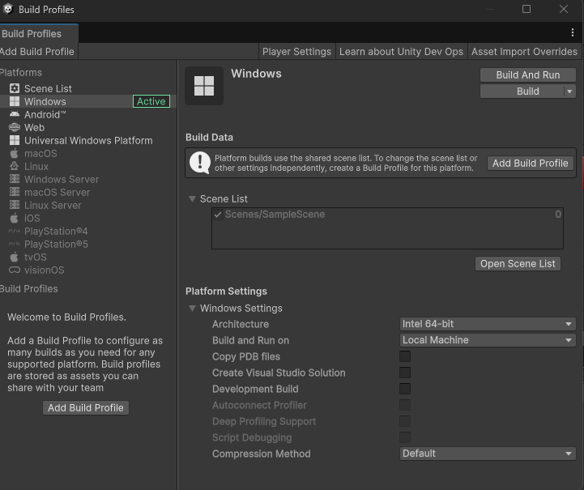
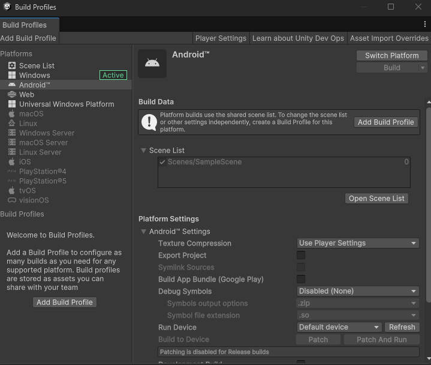
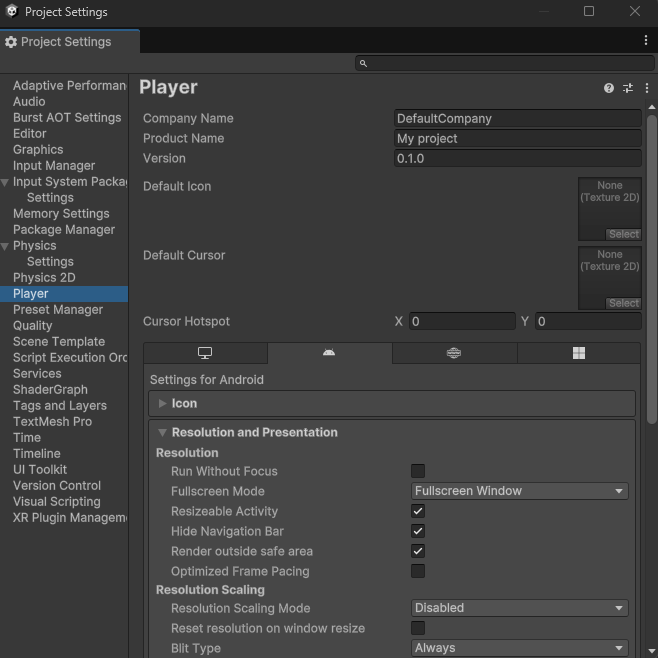

# ¿Cómo hacer una build en Unity?

Una vez que hemos terminado de desarrollar nuestro juego en Unity, es hora de crear una build para distribuirlo a otros usuarios. Una build es una versión ejecutable del juego que se puede instalar y ejecutar en diferentes plataformas, como Windows, macOS, Linux, Android, iOS, etc.  

Cuándo ya tenemos listo nuestro juego y queremos **probar** a **ejecutarlo fuera del entorno del Unity Engine** debemos exportarlo en una build para poder probarlo en producción y, si todo va bien, publicarlo y compartirlo. 

Para ello, Unity, como vimos en un inicio, tiene múltiples plataformas a las que nos es posible exportar nuestro juego, desde WebGL para navegador, varios SO de PC o móviles hasta distintas consolas o incluso televisores inteligentes o realidad virtual. 

Para ver las opciones de compilación iremos a la barra principal de herramientas superior y nos iremos a la opción de **File → Build Profiles**. Aquí vamos a seleccionar en primer lugar las escenas que queremos añadir al proceso de compilación y el orden en el que queremos que se compilen. Esto podemos hacerlo arrastrando dichas escenas desde la pestaña de Project o pulsando en el botón de **Open Scene List**, que nos añadirá automáticamente las que tenemos abiertas.

Tras esto, en la barra de la izquierda de la pestaña de **Build Profiles** vamos a seleccionar para qué plataforma queremos realizar dicha build. Si queremos realizar esta acción para más de una plataforma, deberemos hacerlo por separado de una en una. 

Tras seleccionar la que queremos debemos pulsar en el botón inferior que nos dice Switch Platform, este proceso puede tardar unos minutos dependiendo de nuestro procesador. 

Por defecto, podremos exportar nuestro juego en Windows, Linux o Mac como un ejecutable pero podemos agregar los paquetes necesarios para las demás plataformas desde esta misma pestaña, seleccionando dicha plataforma y pulsando en el botón para instalar los paquetes necesarios desde el Unity Hub, pero es importante entender en caso de algunas plataformas que es necesario instalar más cosas al margen de estos paquetes. Por ejemplo, para exportar para Android es necesario tener instalado un SDK y un JDK. Esto también se aplica a otras plataformas, que tienen sus requisitos específicos, es muy común también que para poder exportar para ciertas consolas las empresas dueñas de dichas licencias nos tengan que facilitar un dev kit para dicha consola. 

Por último, teniendo la plataforma seleccionada, podremos acceder al **Project Settings**, en dónde podremos configurar cosas como la resolución, orientación por defecto de dispositivo, nombre de la compañía, del producto, la versión, el icono por defecto, el cursor por defecto y otros aspectos más avanzados como las librerías que se usan para compilar o qué API gráfica utilizar. Desde la documentación podemos informarnos más sobre cada una de estas opciones. 

Una vez tenemos todo configurado tenemos dos opciones para generar la build. La primera es el botón de Build, que simplemente compila y nos guarda el archivo ya como un ejecutable, y la otra es Build and Run, que también nos ejecutará automáticamente el proyecto para probarlo. 
