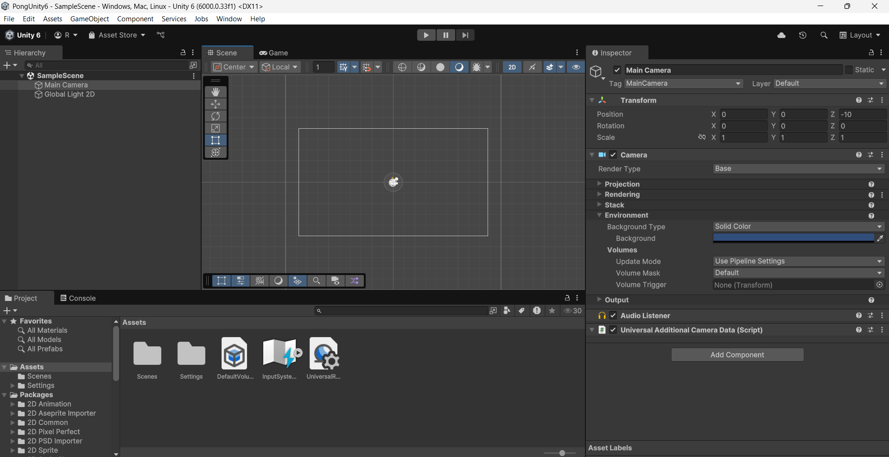
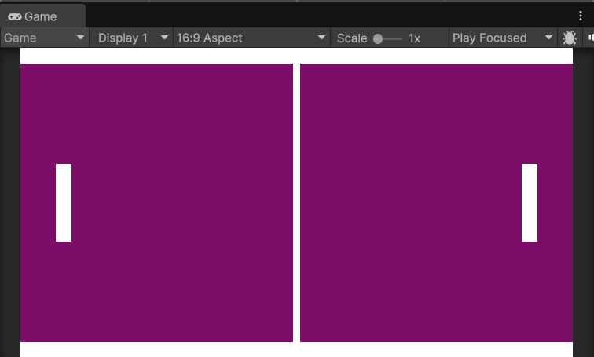
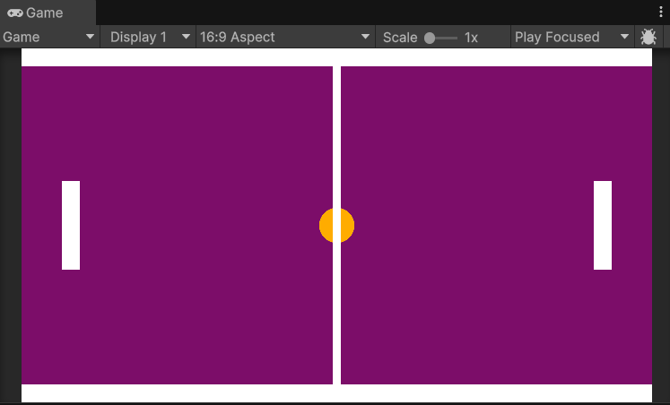
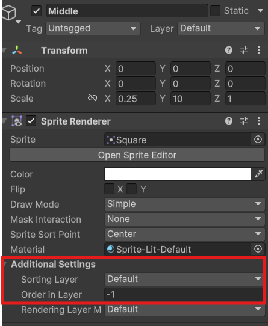
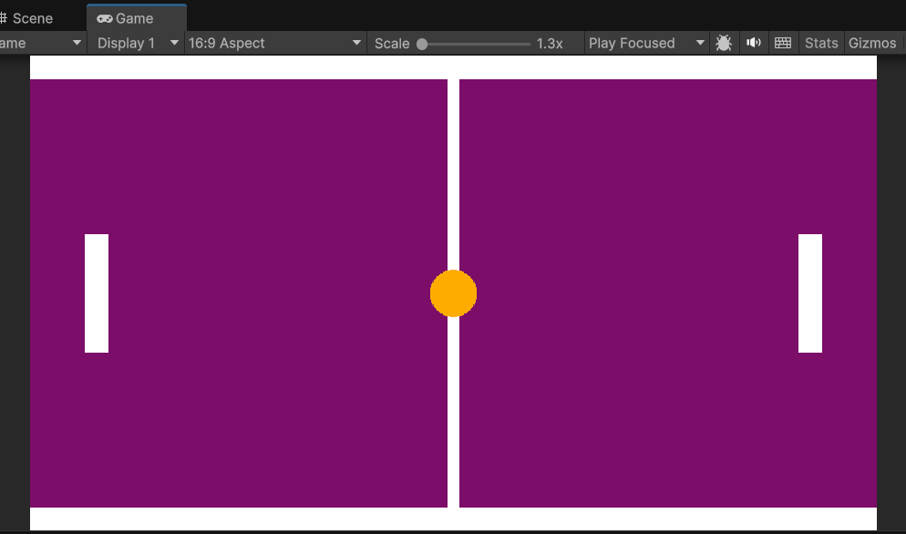
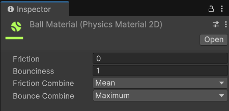
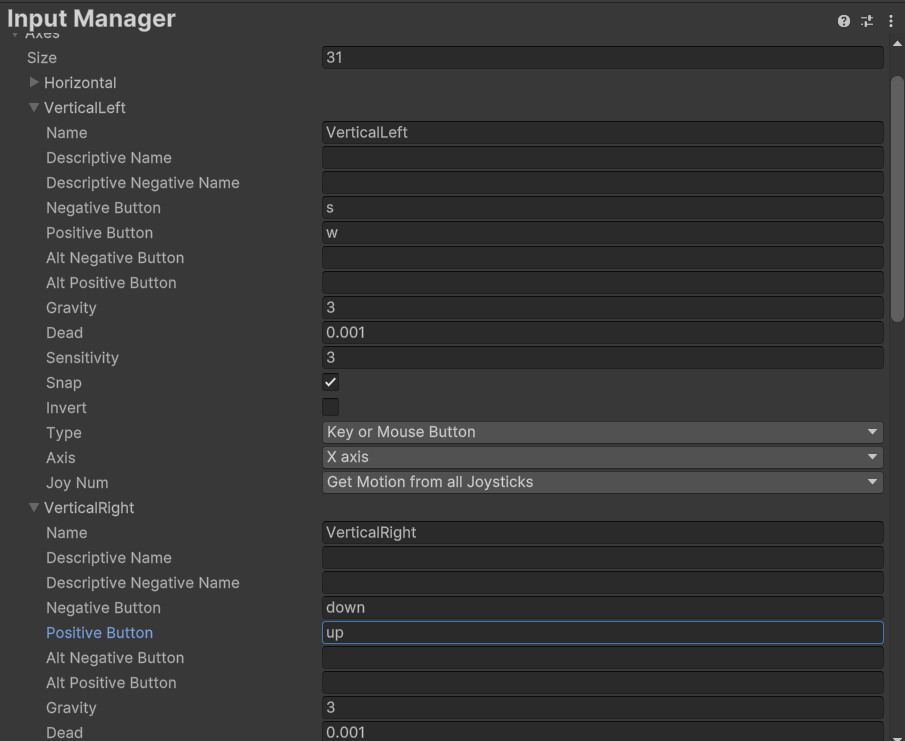

# Pong 

El pong fue publicado por Atari en 1972 y es uno de los primeros videojuegos de la historia. El juego es un simulador de tenis de mesa en el que los jugadores controlan una paleta y deben golpear una pelota de un lado a otro de la pantalla. El objetivo es hacer que la pelota pase al otro lado de la pantalla sin que el oponente la devuelva. El juego fue un gran éxito y ayudó a popularizar los videojuegos en todo el mundo.

Creado por Nolan Bushnell y basado en el juego de tenis de mesa, Pong fue un gran éxito en los salones recreativos de la época. El juego fue tan popular que Atari tuvo que fabricar más máquinas para satisfacer la demanda. Pong fue el primer juego de arcade de Atari y ayudó a establecer a la compañía como un líder en la industria de los videojuegos.  

Vamos a hacer una versión mínima de Pong en Unity. Este juego nos va a servir para conocer un poco mejor el entorno, el sistema de físicas, las colisiones y el manejo general del programa.

## Primera versión PvP

Empezaremos creando una primera versión del juego en la que dos jugadores controlan las palas y deben golpear la pelota para que no se salga de la pantalla. En esta versión no habrá IA.

Cada jugador jugará con unas teclas concretas del teclado, el jugador de la izqueirda jugará con las teclas W y S, mientras que el de la derecha jugará con las flechas arriba y abajo. La pelota se moverá sola y rebotará en las palas y en las barras superior e inferior. Si la pelota se sale de la pantalla, el jugador que no la haya golpeado perderá un punto. El juego terminará cuando uno de los jugadores llegue a 5 puntos.


### Creando el proyecto

Partiremos de un proyecto vacío en Unity utilizando la plantilla de Universal 2D Core de Unity 6. 

Esta plantilla ya nos viene con una escena 2D que contiene una cámara y una luz de tipo **GlobalLight**, podemos cambiar el color de fondo de lo que muestra la cámara en su componente Camera y en concreto en la propiedad **Environment -> Background** (Siempre y cuándo el **Background Type** lo dejemos como viene por defecto, en *Solid Color*).



### Creando el escenario

Para empezar a crear el escenario del juego crearemos varios **GameObject** de la siguiente forma:
1. Hacemos clic derecho sobre la pestaña de la jerarquía y seleccionamos 2D Object -> Sprite -> Square.
2. Cambiamos el nombre del objeto a **BarraSuperior** o algo por el estilo.
3. Posicionamos el objeto en la parte superior de la pantalla y ajustamos su tamaño para que sea una barra que ocupe toda la pantalla, es decir, que ocupe el ancho del cuadrado que marca lo que la cámara va a renderizar.
4. Le añadimos un componente **Box Collider 2D** para que más adelante la pelota y las palas de los jugadores colisionen con ella.
5. Con Control + D duplicamos el objeto y lo posicionamos en la parte inferior de la pantalla.

Para crear las "porterías" vamos a hacer exactamente el mismo proceso que para las barras superior e inferior, pero en este caso vamos a posicionarlas fuera del alcance de la cámara, justo a la derecha y a la izquierda del límite que marca la cámara para que no se vean.

Si en la pantalla de **Game** queremos ver como se vería el juego en ejecución, podemos hacer clic en el botón **Maximize on Play** que se encuentra en la esquina superior derecha de la ventana de **Game**. Pero para ver una resolución parecida a la cámara que estamos renderizando podemos clicar el aspecto dónde por defecto pone **Free Aspect** y poner un valor de 16:9.

Crearemos también una línea en el medio utilizando los mismos pasos que para las barras, pero en este caso la posicionaremos en el centro de la pantalla y la haremos más estrecha.
Esta línea sin embargo, no debe llevar el componente **Box Collider 2D**, ya que es meramente visual y no queremos que la pelota colisione contra ella. 

Para las palas de los jugadores vamos a hacer lo mismo que para las barras, pero en este caso las vamos a hacer más estrechas y las vamos a posicionar en los extremos de la pantalla.

Podemos jugar con la posición en el eje X de las palas y ponerlo a nuestro gusto, pero es importante que las palas no se salgan de la pantalla, ya que si la pelota colisiona con ellas y se sale de la pantalla, el juego no funcionará correctamente.

:::note[Sobre los nombres de los GameObject]
Es importante que los nombres de los GameObject sean descriptivos y claros, ya que nos ayudarán a identificarlos más fácilmente en la jerarquía y en el código.
::: 

:::info[Sobre los colores y los tamaños]
Podemos cambiar los colores de los objetos y ajustar los tamaños a nuestro gusto, pero es importante que las barras superior e inferior ocupen toda la pantalla y que las palas no se salgan de la pantalla.    
:::



#### Creando la pelota

Para crear la pelota vamos a seguir los mismos pasos que para las barras, pero en este caso vamos a hacerla más pequeña y la vamos a posicionar en el centro de la pantalla.
Podemos usar un color diferente para la pelota para que se distinga mejor de las barras y las palas.
También podemos usar un Sprite circular en lugar de un cuadrado, no hay problema en ello.

Al igual que a las palas y a las barras, le añadimos un componente **Box Collider 2D** para que colisione con las barras y las palas.

Podemos darle otro color a la pelota para que se distinga mejor de las palas y las barras, al hacerlo es posible que nos ocurra que queda "dibujada" por detrás de la línea central decorativa (si la hemos añadido). 



Para solucionar esto bastaría con seleccionar la línea central y en su componente **Sprite Renderer** darle un valor al **Order in Layer** inferior al de la pelota, por ejemplo, -1, ya que por defecto el resto de objetos deberían tener un valor 0.





Llegados a este punto añadiremos un nuevo componente a las palas y a la pelota, el componente **Rigidbody 2D**. Este componente es el encargado de aplicar las físicas a los objetos, en este caso, a las palas y a la pelota.  

Si ahora mismo ejecutamos el juego podremos ver como los tres elementos caen por la pantalla, esto es debido a que el componente **Rigidbody 2D** les está aplicando la gravedad. Para evitar esto, vamos a desactivar la propiedad **Gravity Scale** de los **Rigidbody 2D** de las palas y de la pelota.  

Para solucionar esto vamos a poner la propiedad **Gravity Scale** de los **Rigidbody 2D** de las palas y de la pelota a 0.

Si volvemos a ejecutar ya deberían de mantenerse en la posición en la que estaban.

Ahora ya podemos empezar con el Scripting para mover las palas y la pelota.

#### Dándole vida a la pelota

Para hacer que la pelota se mueva vamos a generar un Script. Para ello, nos situamos en la pestaña de **Project** y hacemos clic derecho en la carpeta **Assets** y seleccionamos **Create -> C# Script**.

Lo ideal para mantener el proyecto organizado es crear una carpeta llamada **Scripts** y dentro de ella crear el script o moverlo a la misma.

Vamos a llamarlo **Ball** y lo abrimos con el editor de código que tengamos configurado. En mi caso Visual Studio.

:::info[Sobre el editor de código]
Unity nos permite configurar el editor de código que queramos, pero por defecto viene configurado con Visual Studio. Si no lo tenemos instalado, podemos descargarlo desde [la página oficial de Microsoft](https://visualstudio.microsoft.com/es/downloads/).
:::

:::tip[Elegir un editor de código por defecto]
Si no tenemos un editor de código por defecto, podemos elegir uno desde **Edit -> Preferences -> External Tools** y seleccionar el editor que queramos usar.
:::

Partiremos de un MonoBehaviour básico, por lo que el código inicial será el siguiente:

```csharp title="Ball.cs"
using UnityEngine;

public class Ball : MonoBehaviour
{
    // Start is called once before the first execution of Update after the MonoBehaviour is created
    void Start()
    {
        
    }

    // Update is called once per frame
    void Update()
    {
        
    }
}
```

:::info[Sobre el MonoBehaviour]
Al heredar de **MonoBehaviour** estamos creando un script que se ejecutará en el contexto de Unity. Esto significa que podemos utilizar las funciones de Unity, como **Start()** y **Update()**, para ejecutar código en momentos específicos del ciclo de vida del juego.

**Start()** se ejecuta una vez al inicio del juego, mientras que **Update()** se ejecuta una vez por cada frame del juego. Esto es útil para ejecutar código que necesita ser actualizado constantemente, como el movimiento de la pelota.  

Tenéis más información sobre el ciclo de vida de un MonoBehaviour en la documentación oficial de Unity y en la sección de [Scripting en Unity](../1-Unity/9-Scripting.mdx).
:::

Podemos eliminar el método **Update()** por ahora, ya que no lo vamos a utilizar.

Empezaremos creando dentro de la clase **Ball** una variable pública de tipo **float** que llamaremos **speed** y le daremos un valor de 5.0f. Esta variable será la velocidad a la que se moverá la pelota.

Aunque le demos un valor inicial, al ser pública podremos modificarla desde el editor de Unity. Para ello, simplemente debemos seleccionar el objeto que contiene el script y en el componente **Ball** podremos ver la variable **speed** y modificar su valor.

Además de la velocidad, añadiremos también una variable de tipo **Rigidbody2D** que llamaremos **rb**. Esta variable contendrá la referencia al componente **Rigidbody2D** de la pelota. Más adelante se lo asignaremos arrastrándolo desde el editor.

Necesitamos este componente para aplicarle fuerzas a la pelota y hacer que se mueva. 

Vamos a inicializar también, por último, una variable de tipo **Vector2** llamada *startPos* que contendrá la posición inicial de la pelota. Esta variable la utilizaremos para reiniciar la posición de la pelota cuando un jugador pierda un punto.

```csharp title="Ball.cs"
using UnityEngine;

public class Ball : MonoBehaviour
{
  // highlight-start
    public float speed = 5.0f;
    public Rigidbody2D rb; // This is set in the inspector, represents the Rigidbody2D component of the ball
    private Vector2 startPos; // Represents the initial position of the ball
  // highlight-end

    // Start is called once before the first execution of Update after the MonoBehaviour is created
    void Start()
    {
        
    }
}
```

:::warning[Sobre las variables públicas]
Las variables públicas son visibles en el editor de Unity y podemos modificarlas desde allí. Esto es útil para ajustar valores sin necesidad de modificar el código.

**Es importante tener en cuenta que si le damos un valor inicial en el script, este valor se sobrescribirá por el que le demos en el editor.**
:::

Ahora, en el método **Start()** vamos a inicializar la variable **startPos** con la posición de la pelota. Para ello, utilizamos la propiedad **transform.position** de la pelota, que nos dará la posición actual del objeto en el espacio 2D.

```csharp title="Ball.cs"
using UnityEngine;

public class Ball : MonoBehaviour
{
    public float speed = 5.0f;
    public Rigidbody2D rb; // This is set in the inspector, represents the Rigidbody2D component of the ball
    private Vector2 startPos; // Represents the initial position of the ball

    // Start is called once before the first execution of Update after the MonoBehaviour is created
    void Start()
    {
        // highlight-next-line
        startPos = transform.position; // Initialize startPos with the current position of the ball
    }
}
```

:::info[Sobre la posición de los objetos]
La posición de los objetos en Unity se representa mediante un vector de 3 dimensiones (X, Y, Z). En el caso de los objetos 2D, la dimensión Z no se utiliza y la posición se representa mediante un vector de 2 dimensiones (X, Y). 

La posición de los objetos se puede modificar mediante el componente **Transform** de cada objeto. Este componente contiene la posición, rotación y escala del objeto en el espacio 3D.
:::

Una vez tenemos la posición inicial de la pelota almacenada, crearemos un método llamado **Launch()** para lanzar la pelota al comienzo del juevo. Este método se encargará de asignar la velocidad a la pelota y de darle una dirección aleatoria al lanzarla.

Para hacer que no siempre salga hacia el mismo lado, utilizaremos la función **Random.Range()** para generar un número aleatorio entre -1 y 1. 

Declararemos dos variables, una para el eje x y otro para el eje y, que llamaremos **xDir** e **yDir** respectivamente. Inicializaremos estas variables a 1 o -1 de forma aleatoria, para darle velocidad en ese eje pero no siempre en la misma dirección.

Una vez calculadas las direcciones accederemos a la propiedad **linearVelocity** del **Rigidbody2D** de la pelota y le asignaremos un nuevo vector con las direcciones calculadas multiplicando el valor aleatorio por la velocidad asignada.

Esta propiedad es un **Vector2** que representa la velocidad lineal del objeto en el espacio 2D. Al asignarle un nuevo vector, estamos cambiando la dirección y la velocidad de la pelota. Para hacerlo, le pasaremos un nuevo objeto **Vector2** con las direcciones calculadas y la velocidad deseada.

Llamaremos a este método **Launch()** para que sea más fácil de identificar y lo llamaremos desde el método **Start()** para que la pelota se lance al inicio del juego.

```csharp title="Ball.cs"   
using UnityEngine;

public class Ball : MonoBehaviour
{
    public float speed = 5f;
    public Rigidbody2D rb;
    private Vector2 startPos;


    // Start is called once before the first execution of Update after the MonoBehaviour is created
    void Start()
    {
        startPos = transform.position;   
        // highlight-next-line
        Launch(); // Call the Launch method to start the ball's movement
    }
    
    // highlight-start
    public void Launch()
    {
        float xDir = Random.Range(0, 2) == 0 ? -1 : 1;
        float yDir = Random.Range(0, 2) == 0 ? -1 : 1;
        rb.linearVelocity = new Vector2(xDir * speed, yDir * speed); // This was "velocity" in previous Unity versions
    }
    // highlight-end
}

```

Si ejecutamos el juego ahora, la pelota debería moverse en una dirección aleatoria al inicio del juego. Podemos probar varias veces para ver como la pelota se mueve en diferentes direcciones.

:::warning[Si la pelota no se mueve]
Si la pelota no se mueve, asegúrate de que el componente **Rigidbody2D** está asignado correctamente en el editor. Para ello, selecciona la pelota en la jerarquía y en el componente **Ball** arrastra el componente **Rigidbody2D** de la pelota al campo **rb** desde el propio inspector.

En caso de ejecutar sin haberlo hecho Unity nos mostrará un error en la consola indicando que el componente **Rigidbody2D** no está asignado:

```plaintext
UnassignedReferenceException: The variable rb of Ball has not been assigned.
You probably need to assign the rb variable of the Ball script in the inspector.
UnityEngine.Object+MarshalledUnityObject.TryThrowEditorNullExceptionObject (UnityEngine.Object unityObj, System.String parameterName) (at <84f0d810adef4e6c8deab33e4ae93f7c>:0)
UnityEngine.Bindings.ThrowHelper.ThrowNullReferenceException (System.Object obj) (at <84f0d810adef4e6c8deab33e4ae93f7c>:0)
UnityEngine.Rigidbody2D.set_linearVelocity (UnityEngine.Vector2 value) (at <947c566dcd374e379abfce2ae0b65eaf>:0)
Ball.Launch () (at Assets/Scripts/Ball.cs:21)
Ball.Start () (at Assets/Scripts/Ball.cs:14)
```
:::

:::info[Sobre el Rigidbody2D]
El **Rigidbody2D** es un componente que permite simular la física en objetos 2D. Este componente nos permite aplicar fuerzas, colisiones y movimientos a los objetos de forma realista. 
En este caso, estamos utilizando el **Rigidbody2D** para mover la pelota y hacer que colisione con las palas y las barras.
:::

:::note[Sobre la propiedad linearVelocity]
La propiedad **linearVelocity** es la velocidad lineal del objeto en el espacio 2D. Esta propiedad se utiliza para mover el objeto en una dirección específica y a una velocidad determinada.   

En versiones anteriores de Unity, esta propiedad se llamaba **velocity**. Si estás utilizando una versión anterior de Unity, puedes cambiar **linearVelocity** por **velocity** y debería funcionar sin problemas.
:::

Obviamente, la pelota sale disparada pero todavía no rebota como queremos si no que al chocar con las palas o las barras se va frenando.

Para solucionar esto le daremos un material físico 2D que simule el rebote. Para ello, crearemos un nuevo **Physics Material 2D** desde la pestaña de **Project** y haciendo clic derecho en la carpeta **Assets** y seleccionando **Create -> 2D -> Physics Material 2D**.

Para tener todo mejor organizado, crearemos una carpeta llamada **Materials** y dentro de ella crearemos el material físico o lo movemos ahí si ya lo hemos creado.

Vamos a llamarlo **BallMaterial** y lo abrimos para configurarlo. En el inspector podemos ver varias propiedades, pero las que nos interesan son **Friction** y **Bounciness**.
La propiedad **Friction** es la fricción del material, que determina cuánto se frena el objeto al chocar con otro objeto. La propiedad **Bounciness** es la elasticidad del material, que determina cuánto rebota el objeto al chocar con otro objeto.
Podemos dejar la fricción a 0 y la elasticidad a 1 para que la pelota rebote al máximo.



Una vez configurado el material, lo arrastramos al componente **Circle Collider 2D** de la pelota. Esto hará que la pelota rebote al chocar con las palas y las barras.

Si ejecutamos el juego ahora, la pelota debería rebotar al chocar con las palas y las barras.

Sin embargo, ahora tenemos otro problemilla, y es que al rebotar contra las palas estas salen disparadas para atrás y frenan la pelota y se descolocan completamente.

Para evitar esto debemos hacer que las palas no puedan moverse en el eje X (horizontal) y que solo se muevan en el eje Y (vertical). 

Para ello, vamos a seleccionarlas ambas y en el componente **Rigidbody 2D** de las palas vamos a poner la propiedad **Constraints** en **Freeze Position X**. Esto hará que las palas no se muevan en el eje X y solo se muevan en el eje Y.

Una vez hecho esto, vamos a seleccionarlas de nuevo pero esta vez junto con la pelota y en el componente **Rigidbody 2D** de la pelota vamos a poner la propiedad **Constraints** en **Freeze Rotation Z**. Esto hará que la pelota no rote al chocar con las palas y las barras.

Esto, aunque visualmente no se note, hará que la pelota no rote al chocar con las palas y las barras, y tampoco las propias palas.

Ahora, al ejecutar ya podemos ver como la pelota rebota al chocar con las palas y las barras, y las palas no se mueven en el eje X.

:::info[Sobre los Constraints]
Los **Constraints** son propiedades del componente **Rigidbody2D** que nos permiten restringir el movimiento y la rotación de los objetos. Esto es útil para evitar que los objetos se muevan o roten de forma no deseada al chocar con otros objetos.
:::

:::note[Sobre el Freeze Position y Freeze Rotation]
La propiedad **Freeze Position** es un constraint que nos permite restringir el movimiento de un objeto en un eje específico. En este caso, estamos restringiendo el movimiento de las palas en el eje X para que solo se muevan en el eje Y.

La propiedad **Freeze Rotation** es un constraint que nos permite restringir la rotación de un objeto en un eje específico. En este caso, estamos restringiendo la rotación de la pelota en el eje Z para que no rote al chocar con las palas y las barras.
:::

Antes de continuar, vamos a añadir un método en el Script de la pelota que nos permita reiniciar la posición de la pelota al inicio del juego.

Este método se llamará **Reset()** y simplemente le quitará la velocidad residual que lleve la pelota, le asignará la posición inicial de la pelota a la posición actual de la misma y volverá a lanzarla para seguir con el juevo.
Este método debe ser **público** para poder llamarlo desde otros scripts.

```csharp title="Ball.cs"

...
    public void Reset()
    {
        rb.linearVelocity = Vector2.zero;
        transform.position = startPos;
        Launch();
    }
}

```

Ya todo funciona como debería, pero todavía no podemos mover las palas para jugar, vamos a hacer que esto sea posible.

### Moviendo las palas

#### Configurando el InputManager

Antes de empezar a programar, vamos a abrir el **Input Manager** de Unity. Para ello, vamos a **Edit -> Project Settings -> Input Manager**.

En este menú podemos ver los ejes de entrada que tiene configurados Unity por defecto. Estos ejes son los que utilizaremos para mover las palas.

Podemos ver que ya hay varios ejes configurados, pero los que nos interesa el eje **Vertical**. Este eje es el que utilizaremos para mover las palas hacia arriba y hacia abajo.

Vamos a crear dos nuevos ejes, uno para cada pala. Para ello, hacemos clic derecho sobre el eje **Vertical** y seleccionamos **Duplicate Array Element**. Esto creará una copia del eje **Vertical**.

Vamos a renombrar el nuevo eje a **VerticalLeft** y el otro a **VerticalRight**.

Una vez hecho esto, vamos a cambiar las propiedades de cada eje para que se ajusten a lo que queremos.

Para el eje **VerticalLeft** vamos a cambiar el nombre a **VerticalLeft** y en la propiedad **Positive Button** vamos a poner la tecla **w** y en la propiedad **Negative Button** vamos a poner la tecla **s**.
Para el eje **VerticalRight** vamos a cambiar el nombre a **VerticalRight** y en la propiedad **Positive Button** vamos a poner la tecla **up** y en la propiedad **Negative Button** vamos a poner la tecla **down**.



:::info[Sobre el Input Manager]
El **Input Manager** es una herramienta de Unity que nos permite gestionar los ejes de entrada y las teclas que utilizaremos en el juego. Podemos crear nuevos ejes, duplicar ejes existentes y cambiar las propiedades de cada eje para ajustarlas a nuestras necesidades.
:::

:::note[Sobre los ejes de entrada]
Los ejes de entrada son una forma de gestionar las entradas del jugador en Unity. Estos ejes nos permiten asignar teclas y botones a acciones específicas en el juego. Por ejemplo, podemos asignar la tecla **w** para mover hacia arriba y la tecla **s** para mover hacia abajo. 
Esto nos permite gestionar las entradas del jugador de forma más sencilla y flexible.
:::

#### Creando el Script de las palas

Vamos a crear un nuevo Script para las palas. Para ello, hacemos clic derecho en la carpeta **Scripts** y seleccionamos **Create -> C# Script**. Vamos a llamarlo **Player** y lo abrimos con el editor de código. 

Comenzaremos igual que antes asignando unas cuantas variables que necesitaremos para el movimiento de las palas. En este caso, vamos a necesitar una variable pública de tipo **float** que llamaremos **speed** y le daremos un valor de 5.0f. Esta variable será la velocidad a la que se moverán las palas.

Al igual que con la bola, podemos modificarla desde el editor para ir ajustando la velocidad que más nos guste. 

Añadiremos también una variable pública de tipo **Rigidbody2D** que llamaremos **rb**. Esta variable contendrá la referencia al componente **Rigidbody2D** de la pala. Más adelante se lo asignaremos arrastrándolo desde el editor.

También añadiremos una variable privada de tipo float llamada **verticalInput** que contendrá la entrada vertical del jugador. Esta variable la utilizaremos para mover la pala hacia arriba y hacia abajo.

Por último, también añadiremos otra variable privada de tipo **Vector2** llamada **startPos** que contendrá la posición inicial de la pala. Esta variable la utilizaremos para reiniciar la posición de la pala cuando un jugador pierda un punto.

```csharp title="Player.cs"
using UnityEngine;

public class Player : MonoBehaviour
{
    // highlight-start
    public float speed = 5f; // This is set in the inspector
    public Rigidbody2D rb; // This is set in the inspector
    private float verticalInput = 0f;
    private Vector2 startPos; // Represents the initial transform position of the gameobject
    // highlight-end

    // Start is called once before the first execution of Update after the MonoBehaviour is created
    void Start()
    {
        // highlight-next-line
        startPos = transform.position;
    }

    // Update is called once per frame
    void Update()
    {

    }
}
```

A continuación comenzaremos a programar el movimiento de la pala. Para ello, en el método **Update()** vamos a asignar la variable **verticalInput** a la entrada vertical del jugador. Para ello, utilizaremos la función **Input.GetAxisRaw()** y le pasaremos el nombre del eje que queremos utilizar.
En este caso, utilizaremos el eje **VerticalLeft** para la pala izquierda y el eje **VerticalRight** para la pala derecha. Pero antes de hacer esa distinción probaremos con el **VerticalLeft** para ambas palas y luego ya lo separaremos.

Detectamos el movimiento y después aplicamos velocidad al igual que con la pelota anteriormente usando el **Rigidbody2D** de la pala. Para ello, utilizamos la propiedad **velocity** del **Rigidbody2D** de la pala y le asignamos un nuevo vector con la dirección y la velocidad deseada.
Para ello, utilizamos la propiedad **linearVelocity** del **Rigidbody2D** de la pala y le asignamos un nuevo vector con la dirección y la velocidad deseada.

```csharp title="Player.cs"
...
    // highlight-start
    void Update()
    {
        verticalInput = Input.GetAxisRaw("VerticalLeft");
        rb.velocity = new Vector2(rb.linearVelocity.x, verticalInput * speed);
    }
    // highlight-end
}
```

:::info[Sobre el Input.GetAxisRaw()]
La función **Input.GetAxisRaw()** nos permite obtener la entrada del jugador de forma más precisa y rápida. Esta función devuelve un valor entre -1 y 1, donde -1 representa la entrada negativa (hacia abajo) y 1 representa la entrada positiva (hacia arriba).
Esto nos permite mover la pala hacia arriba y hacia abajo de forma más precisa y rápida.
:::

:::nota[Input.GetAxisRaw() vs Input.GetAxis()]
La función **Input.GetAxis()** nos permite obtener la entrada del jugador de forma más suave y gradual. Esta función devuelve un valor entre -1 y 1, donde -1 representa la entrada negativa (hacia abajo) y 1 representa la entrada positiva (hacia arriba).
Sin embargo, esta función puede ser un poco más lenta y menos precisa que **Input.GetAxisRaw()**.

Para este juego, utilizaremos **Input.GetAxisRaw()** para obtener la entrada del jugador de forma más precisa y rápida. Sin embargo, si queremos un movimiento más suave y gradual, podemos utilizar **Input.GetAxis()**.
:::

Si ejecutamos, veremos como podemos mover ambas palas con las teclas W y S.

:::warning[Si no se mueve la pala]
Si la pala no se mueve, asegúrate de que el componente **Rigidbody2D** está asignado correctamente en el editor. Para ello, selecciona la pala en la jerarquía y en el componente **Player** arrastra el componente **Rigidbody2D** de la pala al campo **rb** desde el propio inspector.
:::

Vamos a separar los controles de las palas para que cada una tenga su propio control. Para ello, vamos a crear una variable pública de tipo **boolean** que llamaremos **isPlayerLeft**. Esta variable nos servirá para distinguir entre la pala izquierda y la pala derecha.
Vamos a ponerla en **true** para la pala izquierda y en **false** para la pala derecha.

Además, en el propio método **Update()** vamos a comprobar si la pala es la izquierda o la derecha. Para ello, utilizaremos un **if** y comprobaremos si la variable **isPlayerLeft** es **true** o **false**.
Si es **true**, utilizaremos el eje **VerticalLeft** y si es **false**, utilizaremos el eje **VerticalRight**.

```csharp title="Player.cs"
...
    // highlight-start
    public bool isPlayerLeft = true; // This is set in the inspector

    void Update()
    {
        if (isPlayerLeft)
        {
            verticalInput = Input.GetAxisRaw("VerticalLeft");
        }
        else
        {
            verticalInput = Input.GetAxisRaw("VerticalRight");
        }
        rb.velocity = new Vector2(rb.linearVelocity.x, verticalInput * speed);
    }
    // highlight-end
}
```

Tras realizar estos cambios, en el inspector de cada pala podemos ver la variable **isPlayerLeft** y podemos marcarla como **true** o **false**.
Si marcamos la pala izquierda como **true** y la pala derecha como **false**, ahora podremos mover ambas palas con las teclas W y S para la pala izquierda y las flechas arriba y abajo para la pala derecha.

Podemos probar a ejecutar el juego y ver como ambas palas se mueven correctamente.

Por último, al igual que habíamos hecho con la pelota, vamos a añadir un método en el Script de las palas que nos permita reiniciar la posición de la pala al inicio del juego. 

Este método se llamará **Reset()** y simplemente le asignará la posición inicial de la pala a la posición actual de la misma.

```csharp title="Player.cs"
...
    public void Reset()
    {
        rb.linearVelocity = Vector2.zero;
        transform.position = startPos;
    }
}
```

