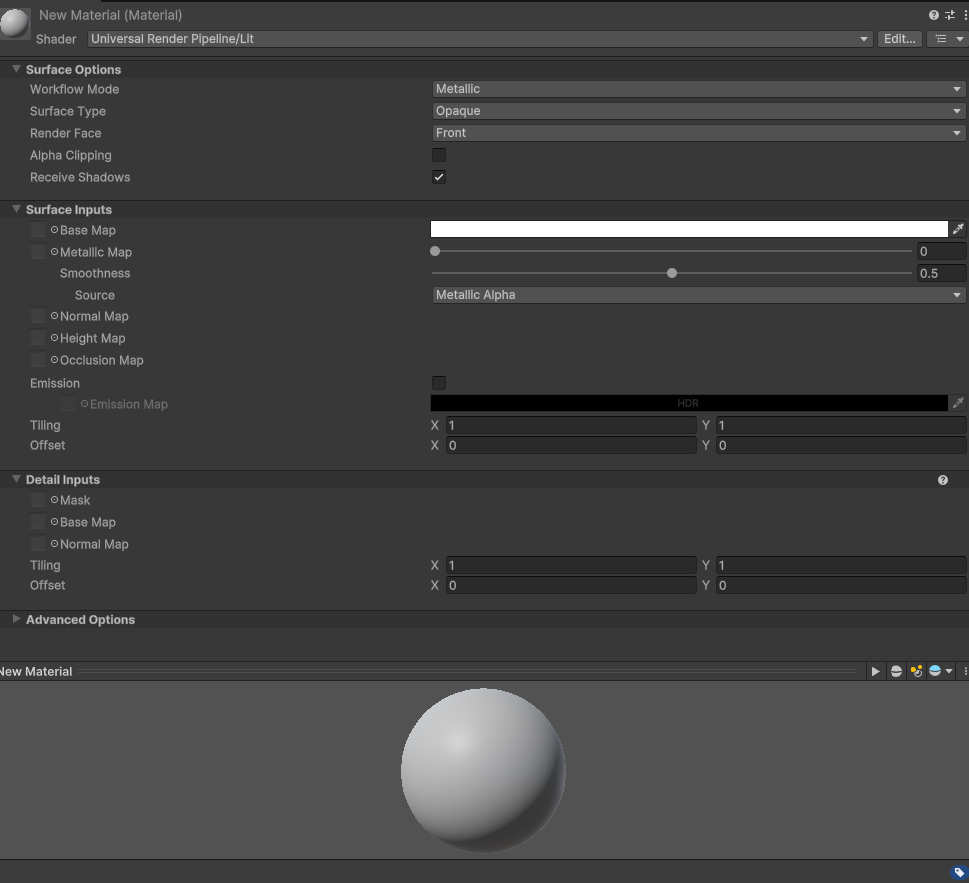

# Materiale, Shaders y Texturas en Unity

## Materiales

Los **materiales** en Unity son componentes que se utilizan para definir la apariencia visual de los objetos en la escena.

En Unity podemos asignarle un material a objetos 3D y este material será el que le dará color, textura y otros efectos, pero también podemos asignar un material a un objeto 2D para que interactúen con la luz o crear un material especial enfocado en las físicas. 

Los materiales son importantes ya que sin ellos los objetos son incapaces de representar en la pantalla la iluminación o las sombras proyectadas por ellos mismos. 

Para crear un material seguiremos un proceso parecido a la creación de cualquier otro Asset. Desde la pestaña de **Proyecto → Create → Material**. Y este Asset simplemente arrastrarlo al objeto o desde el componente que admite un material seleccionar el material creado. 

Una vez tenemos un objeto con un material asignado podremos ver las propiedades de dicho material desde el inspector, como ocurre con el resto de componentes. Las propiedades más relevantes de los materiales son el shader, las texturas o el modo de renderizado.

## Shaders

Los **shaders** en Unity son programas que se utilizan para definir cómo se renderizan los objetos en la escena.

Los shaders en Unity se escriben en un lenguaje de programación llamado **ShaderLab** que es similar a Cg/HLSL.

Los shaders definen cómo se calcula la iluminación, las sombras, los reflejos y otros efectos visuales en los objetos de la escena.

Los shaders son otro de esos temas que son lo suficientemente complejos en sí mismos para tratarlos a parte por un profesional. Los Shaders son programas que determinan, a través de algoritmos más o menos complejos y cálculos matemáticos,  cómo se ve un objeto en pantalla al ser renderizado y determina los parámetros que pueden personalizarse. Unity ya incluye una serie de shaders con los que podemos trabajar. 

### ShaderLab

**ShaderLab** es un lenguaje de programación específico de Unity que se utiliza para escribir shaders.

Los shaders en Unity se escriben en ShaderLab y se pueden combinar con Cg/HLSL para definir cómo se renderizan los objetos en la escena.

ShaderLab proporciona una serie de directivas y funciones que facilitan la escritura de shaders y permiten definir cómo se calcula la iluminación, las sombras, los reflejos y otros efectos visuales en los objetos de la escena.  

### Shader Graph

**Shader Graph** es una herramienta visual que permite crear shaders en Unity sin necesidad de escribir código.

Con Shader Graph se pueden crear shaders arrastrando y conectando nodos en una interfaz gráfica, lo que facilita la creación de shaders complejos sin necesidad de programar.   

## Texturas

Las **texturas** en Unity son imágenes que se utilizan para definir la apariencia visual de los objetos en la escena.

Las texturas se pueden aplicar a los materiales de los objetos para darles color, detalle y realismo.

Las texturas son imágenes que envuelven a un objeto 3D para darle color, efectos de sombreado, reflejos y demás. Es una práctica habitual sustituir un modelo 3D con una gran cantidad de vértices y polígonos por uno de menor resolución con una textura aplicada que simula la resolución del modelo más detallado, esto se hace para ahorrar recursos, sobretodo cuándo el modelo no está en primer plano y ese nivel de detalle no se puede apreciar. 

Existen muchos tipos de texturas, por ejemplo, las hay que simplemente aplican color, también llamado diffuse (base o albedo) y otras que le otorgan profundidad, que son las llamadas normal maps o mapas de normales. Otras definen sombras detalladas como pueden ser las oclusión u occlusion, entre otras. 

Las texturas también son assets que podemos reutilizar en otros materiales. Pueden generarse en programas como Maya, 3Dsmax o Blender (uno de los programas más utilizados para generar modelos 3D actualmente), aunque también pueden generarse desde programas de edición y creación de imagen como GIMP o Photoshop. Por supuesto, al igual que ocurre con el resto de Assets, también podemos encontrar texturas gratuitas y de pago en internet. 

Para aplicar una textura a un material simplemente arrastramos la textura al material o al objeto directamente.

## Render Mode o Modo de Renderizado

El **modo de renderizado** en Unity define cómo se renderizan los objetos en la escena.

Existen varios modos de renderizado en Unity, como:

- **Opaque**: Modo de renderizado opaco que no permite ver a través del objeto.
- **Transparent**: Modo de renderizado transparente que permite ver a través del objeto.
- **Cutout**: Modo de renderizado con recorte que permite ver a través del objeto con un recorte definido.
- **Fade**: Modo de renderizado con desvanecimiento que permite ver a través del objeto con un desvanecimiento gradual.

El modo de renderizado se puede configurar en el material de un objeto para definir cómo se renderiza en la escena.

