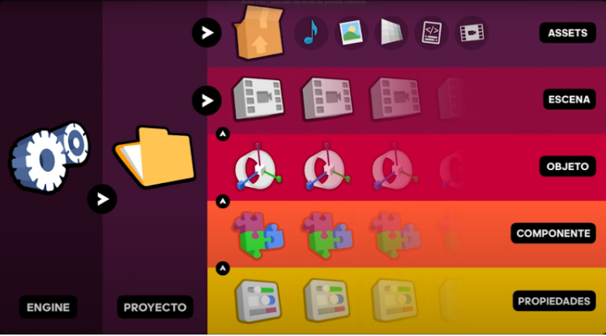
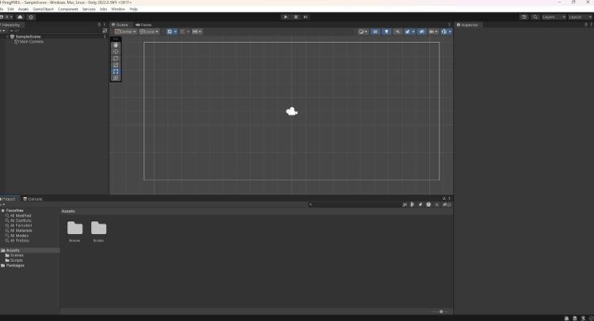
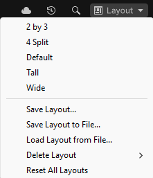
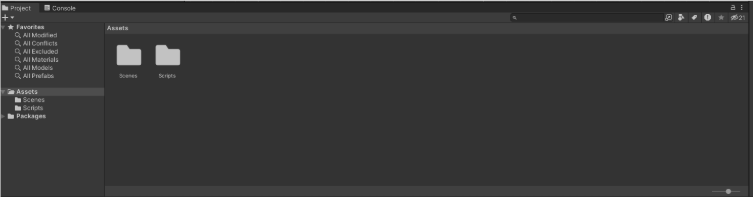
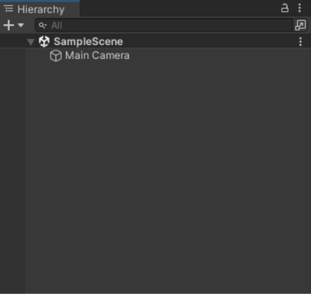
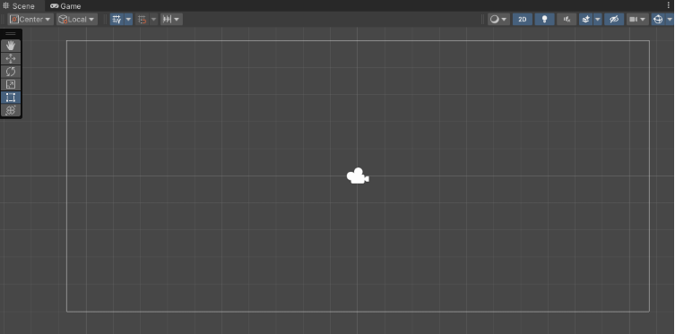
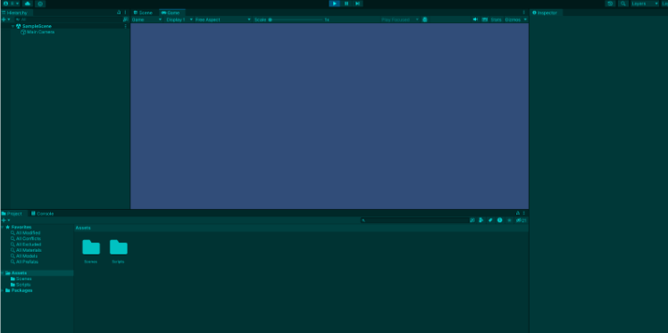
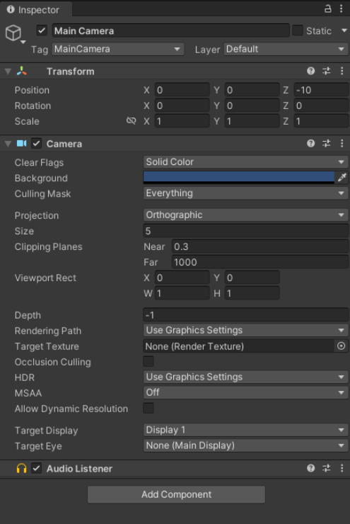
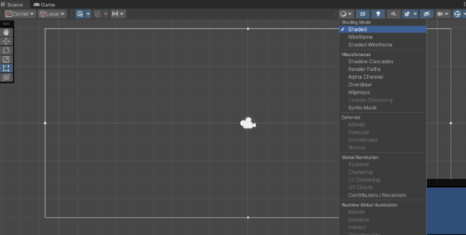
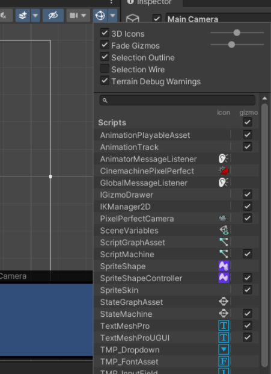

# Desarrollo de videojuegos con Unity

## Documentación oficial

- [Unity](https://unity.com/es)
- [Manual de Unity](https://docs.unity3d.com/Manual/index.html)
- [Scripting API](https://docs.unity3d.com/ScriptReference/index.html)
- [Manual de la Asset Store](https://docs.unity3d.com/Manual/AssetStore.html)

## Instalación de Unity Hub y Unity Editor

Para descargar Unity no tenemos más que entrar en [la página de descarga oficial](https://unity.com/download) y descargar el instalador correspondiente a nuestro sistema operativo. 

Adicionalmente debemos registrarnos en su web seleccionando la opción personal o estudiante, [desde aquí](https://unity.com/products), y gracias a estar logueados podremos después acceder a otros servicios de la compañía como son su tienda de Assets o su UVC (Unity Version Control). 
Aunque por supuesto, también podemos llevar un control de nuestros proyectos usando Git. 

Las licencias personales son gratuitas y para pequeños grupos de desarrolladores también, aunque los planes de pago van cambiando con el tiempo, en general no vamos a tener muchas limitaciones con los planes gratuitos.

Se puede instalar Unity en Windows, Linux o Mac siempre y cuando contemos también con una API gráfica como pueden ser las DirectX, Intel o AMD GPU, OpenGL, Vulkan, Nvidia o AMD GPUs a día de hoy. 

Una vez descargado el instalador, el programa que se nos ha instalado en el equipo es Unity Hub, un programa desde el cuál podremos gestionar los proyectos que tenemos almacenados y desde el cuál podremos alternar entre las diferentes versiones del editor que tengamos instaladas. 

El asistente de instalación es bastante sencillo de entender, nos pedirá loguearnos para crear nuestra propia cuenta de desarrolladores de Unity lo que nos permitirá almacenar nuestro progreso y comprar complementos para nuestros juegos en la Asset Store. 

Una vez instalado Unity Hub ya podremos empezar a crear nuestros propios proyectos. 

## Creación de un proyecto en Unity

Para crear un proyecto en Unity, simplemente abrimos Unity Hub y seleccionamos la pestaña de proyectos.

Una vez estamos en el menú de crear un nuevo proyecto, seleccionamos la versión de Unity que queremos utilizar, la carpeta donde queremos guardar el proyecto y el nombre del mismo.

Además, podremos partir de alguna de las plantillas que nos ofrece Unity, como puede ser un proyecto en 2D o en 3D, un proyecto de AR o VR, un proyecto de renderizado de alta definición, etc.

## Estructura de un proyecto

Al crear un proyecto nuevo lo primero que tenemos que definir son 3 cosas, el **directorio** dónde se va a crear el proyecto, el **nombre** del mismo y si va a estar enfocado al **2D** o al **3D**. 

Una vez seleccionado todo esto, tras pulsar en crear el nuevo proyecto, Unity Hub va a crear una nueva carpeta con el nombre de nuestro proyecto dentro de la carpeta que le indicamos y dentro de esta carpeta tendremos todos los archivos y librerías necesarios para el desarrollo de nuestro nuevo juego y que son los que necesita Unity para trabajar. 

Dentro de esta carpeta, la principal del proyecto que es la que coincide con el nombre está la carpeta **Assets**, muy parecida a la carpeta /src en los proyectos Android, dentro de ella almacenaremos todos los recursos que necesitaremos en nuestro juego como pueden ser un sonido, una imagen, una malla en 3D, un archivo de código o script o una escena del juego, existen muchos tipos de assets que iremos viendo poco a poco. Lo ideal sería ir organizando esta carpeta de una forma eficiente para no volvernos locos buscando un asset concreto cuándo el proyecto crezca.

Las **aplicaciones** en Unity están basadas en **escenas**, estas escenas además de ser un propio asset serán como un lienzo dónde iremos creando nuestro juego y podemos crear tantas como necesitemos, cada escena puede ser un nivel, por ejemplo, pero no necesariamente tiene porqué ser así, cada una de ellas contiene un identificador único que nos va a permitir navegar entre ellas posteriormente. Es una buena práctica mantener una estructura de assets limpia tanto a nivel carpetas como con los nombres de los archivos. 

Las **escenas** están compuestas por un grupo de objetos o **GameObjects**, el diseño de la programación de Unity está basado en el POO, estos objetos no tienen una representación como tal en la escena, sino que requiere del siguiente elemento en la jerarquía, un objeto está compuesto de **componentes**. 

De forma que las escenas son un grupo de objetos y los objetos son un grupo de componentes, de los cuales existe una gran variedad de tipos de componentes, que, a su vez, van a tener más o menos **propiedades**. 

Por ejemplo, una cámara es un objeto que contiene el componente cámara y una luz es un objeto que posee el componente luz, además todos los objetos poseen por defecto el componente transform, el cúal es el encargado de posicionar los objetos en la escena, ya que este nos permite otorgar su posición, escala y rotación dentro de la misma. 

Se pueden agregar tantos componentes necesitemos en un objeto como queramos. 

Existe una gran variedad de componentes y cada uno posee a su vez las propiedades necesarias para trabajar con partes diferentes del desarrollo. 

Estas propiedades determinan sus características o comportamientos y finalmente tendrán los valores que son los que definen al objeto en su totalidad. 

Es muy importante entender la estructura de cómo está organizado el proyecto para así entender de una forma más eficiente como acceder a los objetos. 

Por otro lado tenemos la configuración de Unity, la cuál se divide en dos niveles, el primero de ellos es la correspondiente al Engine, el cuál se puede modificar desde la pestaña Edit o Edición de la barra superior y entrando en Preferences o Preferencias y dónde vamos a encontrar un listado de opciones que se pueden ir personalizando y se van a ver aplicados a todos los proyectos que creemos desde Unity Hub. 

El segundo nivel de configuración se corresponde con los cambios que hagamos con respecto al proyecto en el cuál estamos trabajando actualmente, esto se refiere por ejemplo a los cambios que hagamos en la iluminación global, las físicas, los inputs, etc. 

Todos estos cambios sólo afectarán al proyecto actual, todas estas configuraciones están almacenadas en la carpeta del proyecto, pero se editan directamente desde el programa como veremos a continuación.

## ¿Cómo usar la interfaz y las ventanas de Unity?

En primer lugar hablaremos del **Layout** que hace referencia la manera en la que están distribuidas las **ventanas** que podemos acoplar como queramos, posicionarlas como más nos guste, cada ventana tiene varias pestañas con distinta información. 

La primera vez que ejecutamos Unity, el layout **por defecto** tiene la escena en la parte central, el inspector a la derecha, las carpetas y archivos del proyecto en la ventana inferior y la jerarquía del proyecto a la izquierda. Iremos viendo poco a poco para qué se usa cada ventana. Podremos también ir añadiendo más pestañas y ventanas desde la opción Window o Ventana, dónde encontraremos todas las disponibles. 

Las **pestañas** pueden arrastrarse también para añadirlas a otras ventanas existentes y desacoplarse para crear una ventana independiente. para abarcar incluso varias pantallas y trabajar de la forma más eficiente y cómoda posible. 

En la parte superior derecha de la barra del editor (dónde sale la opción Default la primera vez que abrimos el programa en una lista desplegable) también podemos seleccionar entre varios layouts diferentes que vienen configurados por defecto y que tienen un aspecto coherente para según qué tipo de proyectos y de distribución de monitores de trabajo que tengamos. Aquí también podemos guardar nuestro layout actual si lo hemos personalizado a nuestro gusto para no perderlo.

Todas las pestañas tiene un botón de opciones en el margen superior derecho. 

Dentro de las principales pestañas que necesitamos para trabajar, empezaremos hablando de la pestaña de Proyecto o **Project**, que es la inferior por defecto. 

Esta pestaña contiene precisamente un **explorador** de carpetas dónde podremos seleccionar y arrastrar los distintos assets y crear nuevos haciendo clic derecho, o simplemente arrastrando archivos desde fuera del programa hacia aquí. También podremos crear carpetas para organizar los assets directamente desde aquí. También tenemos una barra de búsqueda y un botón de filtros para los proyectos grandes. En resumen, esta pestaña se utiliza para organizar los assets.

La siguiente pestaña importante es la izquierda, es decir, la de **Hierarchy** o Jerarquía, la cual contiene las escenas del proyecto y todos los objetos del juego, los cuáles pueden ser creados desde 0 o a partir de un asset. Aquí es dónde iremos agregando todos nuestros objetos al escenario como pueden ser los elementos de los escenarios, personajes, UI, etc. Todos los objetos pueden contener otros, y todos los objetos deben estar en una escena a nivel jerárquico. Esta pestaña está directamente conectada con la pestaña central, que es la de la escena o Scene, pestaña en la cuál se nos muestra una previsualización de cómo está quedando nuestro juego a nivel visual. Si usamos el buscador de esta pestaña nos va a ayudar también a encontrar objetos ya que nos mostrará solo los buscados en la escena. 

Justo encima de la pestaña de Jerarquía encontramos la barra de herramientas con la que podremos manejar los objetos del juego, con opciones como mover, escalar o rotar los mismos (en las versiones más actuales del editor estas opciones se han movido a dentro de la propia pestaña de escena, con buen criterio ya que son herramientas para interactuar con la misma). En el centro de esta barra encontramos también los botones de play y pausa del proyecto, los cuales nos sirven para ejecutar y probar nuestro juego mientras lo estamos desarrollando. 

Al pulsar el **Play**, se nos cambia la pestaña de **Escena** por la de Juego o **Game** y se ejecuta el juego como tal para que lo probemos y debuguear antes de exportar una build del mismo, en esta pestaña podemos también modificar las resoluciones para probar como se ve en distintos dispositivos el juego. El color de la interfaz de Unity puede cambiarse mientras probamos el juego en la pestaña de Game para así saber que estamos probando el mismo y que los cambios que hagamos no se verán reflejados en el proyecto hasta que salgamos de este modo, esto nos sirve para probar cambios en tiempo de ejecución, pero no guarda dichos cambios a menos que pasemos la ejecución y los realicemos antes de darle a Play. 

El color del que se pone la interfaz mientras probamos el juego puede modificarse en:  

**Edit → preferencias → colores → playmode tint**

El jugeo corriendo con el playmode tint en un tono azul turquesa:

La siguiente pestaña importante es la del **inspector**, ubicada a la derecha por defecto, la cuál nos ayuda a inspeccionar un objeto de la escena, mostrándonos todos los componentes y sus propiedades que tenga el objeto seleccionado. Además, también podremos ir añadiendo otros componentes y modificando sus propiedades y los valores de las mismas. 

Estas son las pestañas básicas pero existen muchas otras para sus funciones concretas, las cuales serán más o menos interesantes dependiendo del tipo de proyecto que estemos realizando.

## Navegar por la escena en Unity

Profundizando un poco más en la pestaña de **Scene** o Escena, en la parte superior izquierda, en la pestaña de más a la izquierda, podemos personalizar lo que vemos en la preview de la escena, o más bien, cómo la vemos, podemos elegir entre distintos modos de sombreado como  “shaded” o sombreada que es el modo por defecto, wireframe, el cuál nos muestra la malla de polígonos de la escena, y ambas opciones para ver ambas cosas a la vez. 

Además también podemos elegir otros modos de visualización para cosas más concretas.

Inmediatamente después de esta opción desplegable nos encontramos con un botón para alternar la vista entre el 2D y el 3D. Otro para activar y desactivar las luces de la escena. Otro para el audio del proyecto y otras opciones para activar o desactivar la visibilidad de los Skybox, Fog, Flares, los materiales animados, las partículas, etc.

Un poco más a la derecha en esta misma barra, el icono del ojo nos permite visualizar u ocultar todos los objetos seleccionados en la jerarquía. La última opción de la parte izquierda de esta barra sirve para seleccionar el eje que marca la grilla de visualización y su opacidad.

Por el otro lado de la barra de herramientas, a la derecha del todo, encontramos primero (más a la izquierda en esta parte derecha) algunas herramientas que podemos crear con un poco de código. 

Tras ellas, el menú de la cámara, pero ojo, es importante entender que **estas opciones de la cámara no hacen referencia a la cámara con la que se va a renderizar el juego**, si no que es la cámara utilizada para navegar en la escena. Aquí pues, podemos cambiar la velocidad de desplazamiento, proyección y otras opciones.

Después tenemos los **Gizmos**, que son los pequeños iconos que aparecen en la escena para indicar dónde se encuentra una cámara del juego o una fuente de luz, etc. Desde esta opción podemos personalizarlos a nuestro gusto. 

Una de las tareas que más vamos a realizar durante el desarrollo de un juego en Unity es navegar por la escena, ya sea para colocar objetos mientras diseñamos un nivel o para hacer alguna configuración y para ello disponemos de diferentes métodos. 

En primer lugar con el *clic izquierdo* del ratón podemos **seleccionar un objeto de la escena**, y, al seleccionarlo esto va a hacer que sus **componentes aparecen detallados en el inspector**. Esto también ocurre si lo **seleccionamos desde la jerarquía** por supuesto. 

Con el objeto seleccionado también podemos hacer una selección mayor *clicando* en otros objetos si mantenemos la tecla de **control** en Windows y Linux o la tecla de **comando** en Mac. 

Manteniendo el *clic izquierdo* y *arrastrando* también podemos s**eleccionar varios objetos**, se seleccionarán todos los que entren en el área de selección cuadrángular generada por el movimiento de arrastre. 

Con la tecla **Alt** y el *clic izquierdo* podemos **mover el ratón para mover la cámara** de la escena, es decir, lo que vemos en ella, **alrededor del punto central** de la misma escena. 

Haciendo *clic derecho* y *moviendo el ratón* también podemos **mover la cámara de la escena** pero con el **centro en el punto dónde hemos clicado**. 

Si combinamos este *clic derecho* con las teclas **W**, **A**, **S** y **D**, podremos **movernos por la escena como si estuviéramos moviendo el punto en el que hemos clicado**, el efecto conseguido es parecido a una cámara en primera persona para revisar la escena. 

Con las teclas **Q** y **E** podremos **movernos verticalmente** por la escena y mientras nos movemos con las teclas podemos utilizar la *rueda del ratón* para **modificar la velocidad a la que nos desplazamos** por la escena. Esta velocidad también se puede modificar desde la barra superior de la escena, en el icono de la cámara de la escena.

Presionando el *botón de la rueda del ratón* o el *botón central* tendremos activada la **mano de arrastre**, la cual nos permite **movernos por la escena hacia cualquier lado**. Esta herramienta también podemos seleccionarla desde la barra de herramientas superior izquierda, de la cuál ya hablamos anteriormente. 

Si combinamos el *botón de la rueda del ratón* y la tecla **Shift** podremos **acelerar el movimiento** de la mano de arrastre. 

Haciendo **Scroll** con la rueda controlaremos el **zoom de la cámara** de la escena. 

En la esquina superior derecha de la escena, justo debajo de la barra de herramientas de la misma, encontramos unos conos (que son un gizmo) que hacen referencia a los **distintos ejes de coordenadas de la escena**, haciendo *clic izquierdo* en cada uno de ellos nos llevará a la **posición inicial del eje seleccionado**. 

También podemos hacer *clic derecho* sobre el gizmo y **seleccionar la vista desde el eje que marquemos** en el menú que se despliega. Desde este gizmo podemos hacer un par de cosas más, la primera es **cambiar la perspectiva** visual de la escena, especialmente útil para juegos que utilizan una perspectiva isométrica, por ejemplo. Y, por último, también podemos **bloquear la rotación del desplazamiento**. 

Otra opción útil para desplazarnos por la escena es **centrar la vista desde un objeto**, que se puede hacer al tenerlo **seleccionado** presionando la tecla **F** o bien haciendo **doble clic** sobre él en la pestaña de jerarquía.
