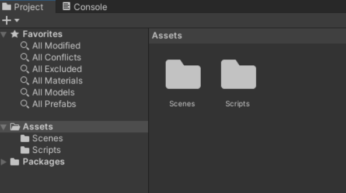

# Assets en Unity

## ¿Qué son los assets en Unity?

Los **assets** en Unity son los recursos que se utilizan para crear un videojuego. 
Estos recursos pueden ser modelos 3D, texturas, sonidos, scripts, animaciones, etc.

Como ya vimos anteriormente, los assets son necesarios para construir un proyecto en Unity, estos son los recursos de todo tipo que utilizaremos para ir creando nuestros objetos. Vamos a hablar más en detalle sobre ellos.

Existen distintos tipos de Assets dependiendo del tipo de archivo y se pueden crear de dos formas principalmente. 

La primera es a través de herramientas externas como pueden ser imágenes para generar **Sprites** o **texturas** y que se pueden trabajar desde programas como *Photoshop* o *GIMP* (para imágenes rasterizadas), *Illustrator* o *Inkscape* (para vectoriales), *Krita* (animaciones) o cualquier otro software de edición y/o creación de imágenes. 

En 3D se pueden generar modelos o animaciones a través de programas como *Blender*, *Maya* o cualquier otro programa destinado a ello. 

Para la música y los sonidos de FX existen programas como *Audition*, *Audacity*, *FLStudio* o *LMMS*. 

Una vez creados este tipo de Assets deben ser importados en Unity y para ello podemos simplemente **arrastrarlos** a la carpeta de nuestro proyecto o bien incluyéndose dentro de la misma desde el explorador de archivos de nuestro sistema operativo o bien arrastrarlos directamente desde él a la pestaña de Project del editor de Unity. 

También podemos hacer *clic derecho* en la pestaña de proyecto y seleccionar importar nuevo asset, esto también podemos hacerlo desde la barra de herramientas principal, seleccionando la misma opción de **importar**. 

La segunda forma de crear estos assets es crearlos desde el propio editor, estos assets suelen ser **Scripts** de código, **escenas**, **prefabs**, **materiales** y **otros** muchos posibles.

Para saber como hacer esto podemos simplemente hacer clic en el símbolo de ‘+’ en la parte superior izquierda de la pestaña de **Project** y esto nos desplegará una lista con todas las posibilidades. 

Esto también puede realizarse haciendo *clic derecho* en la pestaña de proyecto y seleccionar la opción crear, o, desde la barra de herramientas principal en la sección de Assets seleccionar crear. 

Al seleccionar este desplegable veremos muchas posibilidades de Assets para crear, muchos se irán conociendo a medida que se vaya avanzando en el desarrollo de juegos, los hay muy utilizados en todos los proyectos como son el crear un Script de C#, las escenas u otros y los hay más situacionales dependiendo del tipo de proyecto que estemos haciendo. 

## ¿Dónde conseguir Assets?

Tanto los Assets artísticos como los de programación u otras funcionalidades que podemos tener a través de Assets podemos crearlos nosotros mismos o conseguirlos en tiendas como la propia asset store de unity u otras tiendas. 

Algunos son de pago y otros son gratuitos. 

Al comenzar a desarrollar es una buena práctica empezar haciendo juegos cortos con assets gratuitos para así conocer mejor el uso del motor y los posibles problemas y errores comunes que podemos encontrar en el desarrollo. 

En las tiendas de Assets podremos filtrar y buscar los Assets más apropiados que necesitemos para cada proyecto. 

Enlaces a algunas tiendas y webs de Assets:
- Unity Asset Store: https://assetstore.unity.com/
- Itchi.io Game Assets: https://itch.io/game-asset
- Itchio tools: https://itch.io/tools
- Pixabay: https://pixabay.com/es/
- Música y SFX en Fiftysounds: https://www.fiftysounds.com/es/

Una ventaja importante entre la Unity Asset Store con respecto de las demás, es que podemos buscar recursos directamente desde la pestaña de Project de nuestro Editor de Unity, simplemente haciendo una búsqueda en la barra de búsqueda de esta pestaña y seleccionando el filtro de la Asset Store nos mostrará los Assets que coincidan con lo que estamos buscando, tanto los gratuitos como los de pago y al hacer clic nos llevará a la tienda para descargar lo seleccionado. 

## GameObjects a partir de Assets

Hablemos ahora de los **GameObjects**, es decir, los objetos que contienen los componentes y sus propiedades. 

Para crear estos objetos lo más sencillo es arrastrar un Asset desde la pestaña de proyecto directamente a la escena, y esto nos generará el objeto en la jerarquía.

Pero también podremos crear varios tipos de objetos que nos ofrece Unity al hacer clic derecho en la jerarquía y seleccionando alguno de los objetos de la parte inferior del menú de selección, podemos crear un objeto vacío, que tan solo contendrá el componente transform, recursos de objetos 3D o 2D, objetos de efectos, de luz, de audio, de video, de UI para los menús y los indicadores en pantalla y las cámaras. 

