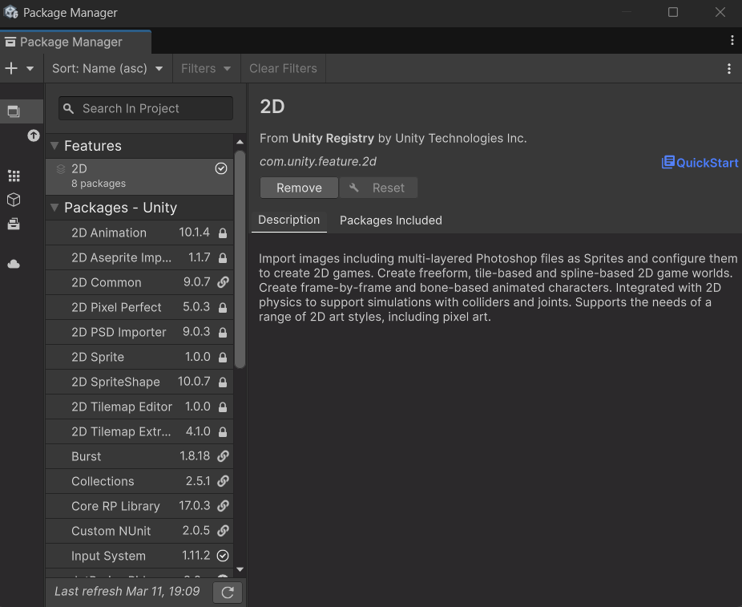

# Packages o paquetes en Unity

Los **paquetes** en Unity son una forma de distribuir y compartir funcionalidades y recursos entre proyectos.

## ¿Qué es un paquete en Unity?

Los **packages** en Unity son paquetes de funcionalidades que se pueden utilizar para realizar ciertas tareas o funciones específicas en el proyecto. No confundamos los packages con los assets.

Al instalar un package, este puede incluir un grupo de assets, librerías de código, plantillas o escenas de ejemplo, pero dependerá totalmente de la finalidad del mismo.

Existen tres tipos de packages:
- **Built-In**
- **Verified**
- **Preview**

Los paquetes **built-in** o paquetes integrados son todas las funcionalidades que ya vienen incluidas por defecto en UNity como pueden ser las físicas, el sistema de partículas, la UI el cloth entre otros. 

Los paquetes **verified** o verificados son todas aquellas funcionalidades que ya han pasado por sus etapas de pruebas y tests y que Unity como empresa que gestiona el motor considera que funcionan correctamente en cierta versión del editor

Por último, los **preview** son paquetes que se encuentran en fase de prueba, podemos incluirlos en nuestros proyectos pero podría generar errores o también no ser del todo compatibles con la versión de nuestro editor o con otros paquetes instalados. 

Al instalar un **package** o un asset de la tienda, Unity lo descarga y lo almacena en el caché global. Esto quiere decir que si para un proyecto hemos descargado un paquete o un asset y queremos utilizarlo en otro proyecto ya no hará falta volver a descargarlo de la tienda nuevamente. 

Los paquetes son gestionados por el **package** **manager**. el cuál nos permite instalarlos, desinstalarlos, actualizarlos o desactivar cualquiera de ellos. Para acceder al package manager desde nuestro editor podemos hacerlo en la barra de herramientas principal yendo a la opción **Window → Package Manager**.

Al seleccionarlo nos mostrará un listado de los paquetes registrados por Unity, los cuales podremos instalar, pero si pulsamos en la lista desplegable de la barra superior de la ventana del package manager podremos filtrar por los paquetes del proyecto (los que ya están integrados actualmente en el proyecto), nuestros propios assets (que son los paquetes y assets descargados y que están almacenados en caché) y los built-in packages, aquí están todos los paquetes por defecto, los cuales también podremos desactivar de nuestro proyecto en caso de no estar utilizándolos, algo que hará que se reduzca el tamaño de nuestras builds una vez exportados los proyectos. así como también reducir el tiempo de compilación del mismo. 

También podremos agregar paquetes aquí pulsando en la tecla ‘+’ de la izquierda. En la misma barra también podremos filtrar el listado desde el buscador y gestionar las opciones avanzadas desde la opción advanced, justo a la izquierda de la barra de búsqueda, desde esta misma opción es donde podremos seleccionar si queremos que se nos muestren los paquetes en estado preview, las dependencias de los paquetes y también podremos resetear los paquetes a los paquetes por defecto solamente. 

Instalar, desinstalar y editar un package es bastante trivial desde el package manager, también podremos leer la documentación de cada paquete instalado, la cuál está disponible desde un enlace en la pestaña correspondiente al package del que nos queremos informar dentro del propio manager. 

Los packages instalados en el proyecto actual también pueden verse desde la columna izquierda de la pestaña de **Project**. 

Para acabar de entender los paquetes hay que tener en cuenta los **manifiestos**, los cuales son archivos en formato json que se alojan dentro de la carpeta packages del proyecto y que sirven como registro de paquetes. Hay dos tipos, tenemos el manifiesto del proyecto (manifest.json) que almacena la información que necesita el package manager para ubicar y descargar los paquetes al igual que las dependencias del proyecto, y, por otro lado, el manifiesto del paquete (packages-lock.json), el cuál almacena información del paquete en sí, su versión y sus requerimientos. 

Entender cómo usar los paquetes es importante ya que hay muchas funcionalidades que no están añadidas por defecto o no son paquetes built-in como puede ser el uso de Shader Graph, la animación 2D y muchos otros. Cuando estemos buscando ejemplos de cómo hacer algo en concreto y nos encontremos con algún ejemplo que utiliza funciones del editor que nosotros no tenemos, esto será seguramente porque tiene algún paquete añadido que nosotros no tenemos añadido.

