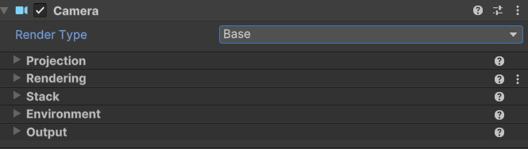

# Cámaras en Unity

La cámara es uno de los principales elementos de un videojuego, es la encargada de mostrar los objetos en pantalla, este proceso pasa por diferentes fases y es denominado renderizar o render. 
Por defecto al crear una escena, esta siempre tendrá una cámara y una luz agregadas. 

Ambas son objetos de la escena que podemos inspeccionar desde el inspector en la parte derecha para ver cómo están configurados y qué componentes los forman, junto con sus propiedades. 
Al hacerlo, nos daremos cuenta de que simplemente es un objeto que contiene un componente Transform, otro Camera y un Audio Listener. 
Además, podemos observar también que tiene el Tag MainCamera asignado y el Layer por defecto.

Esta cámara podemos moverla o rotarla en la escena a nuestro antojo y el resultado de hacerlo se puede previsualizar en el preview de la parte inferior cuándo la tenemos seleccionada o en la pestaña de Game al lanzar el juego. 
Podemos tener múltiples cámaras en nuestra escena y alternar entre ellas, superponerlas o disponerlas en un espacio concreto. 
Siempre debe haber al menos una cámara en la escena para que pueda ser renderizada en la pantalla, además de asegurarnos de que tan solo exista una cámara con el tag MainCamera.

## Propiedades principales de un componente Camera

    

### Render Type

- **Base**: Renderiza la cámara en la pantalla. 
- **Overlay**: Renderiza la cámara por encima de la cámara base.    
