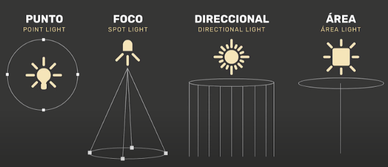

# Iluminar escenas en Unity

Todo objeto 2D o 3D necesita luz para ser visto. Nuestra luz necesita de un emisor y para que un objeto interprete esa luz necesita de un material, este material tiene parámetros que van a interpretar la luz de una forma determinada y a proyectar las sombras y los reflejos entre otras cosas  de una forma también concreta. 

Aunque la iluminación es un tema muy complejo y que en proyectos grandes suele tener especialistas encargados en exclusiva en iluminar correctamente las escenas, a continuación veremos lo básico para poder trabajar con ella de forma correcta. 

## Tipos de luces en Unity

Calcular la luz es uno de los procesos computacionales más costosos a nivel de recursos y es por esto que no hay un único método para calcularla. Tenemos la luz directa (realtime direct), que se aplica directamente en un objeto y se actualiza en tiempo real en cada fotograma (frame), en este tipo el dispositivo final (el hardware donde ejecutamos nuestro juego) será el encargado de procesar dicho cálculo y por ello, el rendimiento dependerá directamente de este. 

Por otro lado, tenemos la luz indirecta o también llamada iluminación global (pre-computed indirect). Esta se genera a partir de un archivo que contiene los datos de la luz y, por lo tanto, no tiene que ser calculada en tiempo real. Estos archivos se generan al hacer una build del juego y dependerá del equipo en el que se compile el juego antes de generar esta build con el ejecutable. Esto dependerá completamente del tamaño de la escena y la cantidad de luces pre computadas que tenemos. Esta iluminación es más compleja pero ofrece un acabado más realista (normalmente). Esto podría hacernos pensar que es mejor usar siempre la luz indirecta pre computada, pero esta iluminación debería aplicarse solamente a objetos que no se encuentren en movimiento, ya que si prefijamos una iluminación ya calculada a un objeto en movimiento este, al moverse, no verá cambios en su iluminación y en cómo le afectan las sombras y los reflejos, por lo que no tendría sentido y no sería realista. Sólo aplicaremos luz pre compilada a los objetos inmóviles de la escena, y así deberemos indicarle a Unity, marcándolos en el inspector como estáticos o static. 

## Crear una luz en Unity

Para crear una luz en Unity, simplemente hay que hacer clic en el menú "GameObject" y seleccionar la opción "Light".

Esto creará un GameObject con un componente de luz que se puede configurar para ajustar su intensidad, color, rango, etc.

## Tipos de luces en Unity

Unity ofrece varios tipos de luces que se pueden utilizar en una escena:

- **Directional Light**: Luz direccional que simula la luz del sol y proyecta sombras paralelas.
- **Point Light**: Luz puntual que emite luz en todas direcciones desde un punto y proyecta sombras en todas direcciones.
- **Spotlight**: Luz de foco que emite luz en una dirección y proyecta sombras en un cono.
- **Area Light**: Luz de área que emite luz desde un área y proyecta sombras en todas direcciones.

Cada tipo de luz tiene sus propias propiedades y se puede configurar para ajustar su apariencia y comportamiento en la escena.

## Configurar una luz en Unity

Una vez creada una luz en Unity, se pueden ajustar sus propiedades en el inspector para cambiar su intensidad, color, rango, etc.

Algunas de las propiedades más comunes que se pueden configurar en una luz son:

- **Intensity**: Define la intensidad de la luz.
- **Color**: Define el color de la luz.
- **Range**: Define el rango de la luz.
- **Spot Angle**: Define el ángulo del cono de una luz de foco.
- **Shadows**: Define si la luz proyecta sombras o no.
- **Shadow Type**: Define el tipo de sombras que proyecta la luz.
