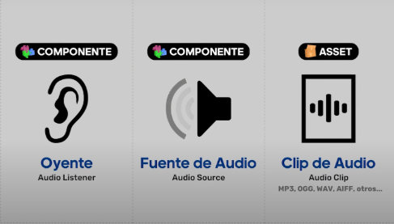
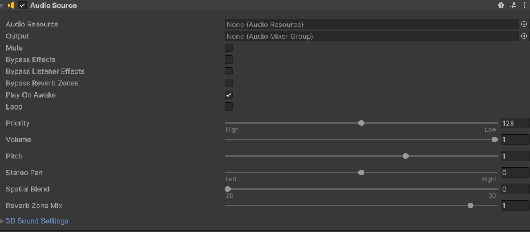

# Audio y efectos de sonido (SFX)

El audio y los efectos de sonido, así como la iluminación y las cámaras, son un mundo en sí mismos en cuanto a complejidad. No vamos a explicar detalles demasiado técnicos sobre cómo trabajar ni crear este tipo de assets, tan solo vamos a centrarnos en cómo incorporar música y efectos de sonido en nuestros proyectos y trabajar con ellos desde el motor. 

Para que pueda existir un sonido en Unity necesitamos principalmente dos componentes. Por un lado, un Audio Listener, que hará de oyente, por defecto ya viene incluído uno en la Main Camera. Y por otro lado, un Audio Source o fuente de audio. Ambos componentes pueden agregarse a cualquier objeto de la escena, pero es recomendable que solo exista un único oyente. 

El Audio Source, por su parte, necesita de un clip de audio para reproducir el sonido que queramos que reproduzca. Estos clips de audio pueden estar en varios formatos aceptados por el motor como son MP3, OGG, WAV o AIFF entre otros y deben añadirse a la pestaña de proyecto como cualquier otro Asset.



En el componente Audio Listener no hay nada que configurar. 
Será en el Audio Source dónde vamos a configurar todo lo relacionado con el clip que hemos añadido. Todas las configuraciones podremos hacerlas desde el inspector o a través de scripts que controlan el audio.

## Configuración de un Audio Source

Una vez añadido un Audio Source a un objeto de la escena, podremos configurar sus propiedades desde el inspector. Algunas de las propiedades más comunes que se pueden configurar en un Audio Source son:   

- **Audio Resource**: El clip de audio que se va a reproducir.
- **Output**: El dispositivo de salida del audio. Este dispositivo debe ser un Audio Mixer Group.
- **Volume**: El volumen del audio.
- **Pitch**: La velocidad de reproducción del audio.
- **Loop**: Si el audio se va a reproducir en bucle.
- **Spatial Blend**: La mezcla espacial del audio.
- **Play On Awake**: Si el audio se va a reproducir automáticamente al iniciar la escena.
- **Mute**: Si el audio se va a reproducir en silencio.



Existen otras propiedades más avanzadas que se pueden configurar en un Audio Source, como la configuración de efectos de sonido, la configuración de 3D sound, la configuración de reverb zones, etc.

## Configuración de un Audio Mixer

Los Audio Mixers en Unity son componentes que se utilizan para mezclar y procesar el audio en tiempo real. Los Audio Mixers se pueden utilizar para aplicar efectos de sonido, ajustar el volumen, el pitch, la panorámica, etc.    

Para crear un Audio Mixer en Unity, simplemente hay que hacer clic en el menú "Assets" y seleccionar la opción "**Create -> Audio Mixer**". Esto creará un Audio Mixer en la pestaña de proyecto que se puede utilizar para mezclar y procesar el audio en la escena.

Esto funciona como cualquier otro mixer de un programa de audio, solo que algo más limitado, nos permite básicamente crear grupos de fuentes de audio para controlar su volumen, aplicar efectos y otros parámetros. 


## Configuración de un Audio Mixer Group

Los Audio Mixer Groups en Unity son componentes que se utilizan para agrupar y mezclar fuentes de audio en un Audio Mixer. Los Audio Mixer Groups se pueden utilizar para aplicar efectos de sonido, ajustar el volumen, el pitch, la panorámica, etc. a un grupo de fuentes de audio.  

Para crear un Audio Mixer Group en Unity, simplemente hay que hacer clic en el menú "Assets" y seleccionar la opción "**Create -> Audio Mixer Group**". Esto creará un Audio Mixer Group en la pestaña de proyecto que se puede utilizar para agrupar y mezclar fuentes de audio en un Audio Mixer.

Una vez creado un Audio Mixer Group, se pueden configurar sus propiedades desde el inspector para ajustar su volumen, aplicar efectos de sonido, ajustar el pitch, la panorámica, etc.  

## Configuración de efectos de sonido

Los efectos de sonido en Unity son componentes que se utilizan para aplicar efectos de sonido a fuentes de audio en la escena. Los efectos de sonido se pueden utilizar para aplicar reverberación, eco, distorsión, etc. a un clip de audio.   

Para crear un efecto de sonido en Unity, simplemente hay que hacer clic en el menú "Assets" y seleccionar la opción "**Create -> Audio -> Audio Effect**". Esto creará un efecto de sonido en la pestaña de proyecto que se puede utilizar para aplicar efectos de sonido a fuentes de audio en la escena.

Una vez creado un efecto de sonido, se pueden configurar sus propiedades desde el inspector para ajustar su volumen, aplicar efectos de sonido, ajustar el pitch, la panorámica, etc.   

## Reproducir audio desde un script

Para reproducir audio desde un script en Unity, se puede utilizar el método `Play()` del componente Audio Source. Este método se puede utilizar para reproducir un clip de audio en un Audio Source en la escena.   

Por ejemplo, el siguiente script reproduce un clip de audio en un Audio Source cuando se presiona una tecla:

```csharp
using UnityEngine;

public class PlayAudio : MonoBehaviour
{
    public AudioSource audioSource;
    public AudioClip audioClip;

    void Update()
    {
        if (Input.GetKeyDown(KeyCode.Space))
        {
            audioSource.clip = audioClip;
            audioSource.Play();
        }
    }
}
```

Este script reproduce el clip de audio asignado al Audio Source cuando se presiona la tecla `Space`.

