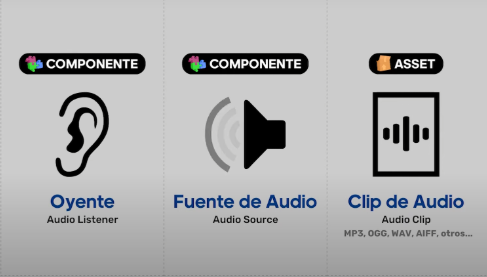
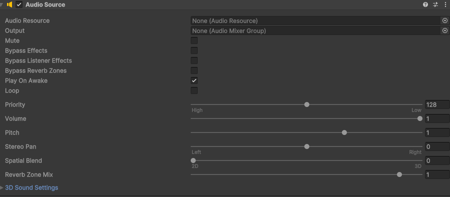

# Audio y efectos de sonido (SFX)

El audio y los efectos de sonido, así como la iluminación y las cámaras, son un mundo en sí mismos en cuanto a complejidad. No vamos a explicar detalles demasiado técnicos sobre cómo trabajar ni crear este tipo de assets, tan solo vamos a centrarnos en cómo incorporar música y efectos de sonido en nuestros proyectos y trabajar con ellos desde el motor. 

Para que pueda existir un sonido en Unity necesitamos principalmente dos componentes. Por un lado, un Audio Listener, que hará de oyente, por defecto ya viene incluído uno en la Main Camera. Y por otro lado, un Audio Source o fuente de audio. Ambos componentes pueden agregarse a cualquier objeto de la escena, pero es recomendable que solo exista un único oyente. 

El Audio Source, por su parte, necesita de un clip de audio para reproducir el sonido que queramos que reproduzca. Estos clips de audio pueden estar en varios formatos aceptados por el motor como son MP3, OGG, WAV o AIFF entre otros y deben añadirse a la pestaña de proyecto como cualquier otro Asset.



En el componente Audio Listener no hay nada que configurar. 
Será en el Audio Source dónde vamos a configurar todo lo relacionado con el clip que hemos añadido. Todas las configuraciones podremos hacerlas desde el inspector o a través de scripts que controlan el audio.

## Configuración de un Audio Source

Una vez añadido un Audio Source a un objeto de la escena, podremos configurar sus propiedades desde el inspector. Algunas de las propiedades más comunes que se pueden configurar en un Audio Source son:   

- **Audio Resource**: El clip de audio que se va a reproducir (en versiones anteriores a Unity 6 esta propiedad se llamaba **AudioClip**).
- **Output**: El dispositivo de salida del audio. Este dispositivo debe ser un Audio Mixer Group.
- **Volume**: El volumen del audio.
- **Pitch**: El tono del audio. Al cambiarlo cambia también la velocidad de reproducción. Variarlo un poco de forma aleatoria es un truco muy usado para que un mismo efecto de sonido no resulte repetitivo.
- **Loop**: Si el audio se va a reproducir en bucle.
- **Spatial Blend**: Define si el sonido es 2D (se oye igual esté donde esté, lo habitual en música y en juegos 2D) o 3D (su volumen y panorámica dependen de la posición respecto al Audio Listener).
- **Play On Awake**: Si el audio se va a reproducir automáticamente al iniciar la escena.
- **Mute**: Si el audio se va a reproducir en silencio.



Existen otras propiedades más avanzadas que se pueden configurar en un Audio Source, como la configuración de efectos de sonido, la configuración de 3D sound, la configuración de reverb zones, etc.

## Configuración de un Audio Mixer

Los Audio Mixers en Unity son componentes que se utilizan para mezclar y procesar el audio en tiempo real. Los Audio Mixers se pueden utilizar para aplicar efectos de sonido, ajustar el volumen, el pitch, la panorámica, etc.    

Para crear un Audio Mixer en Unity, simplemente hay que hacer clic en el menú "Assets" y seleccionar la opción "**Create -> Audio Mixer**". Esto creará un Audio Mixer en la pestaña de proyecto que se puede utilizar para mezclar y procesar el audio en la escena.

Esto funciona como cualquier otro mixer de un programa de audio, solo que algo más limitado, nos permite básicamente crear grupos de fuentes de audio para controlar su volumen, aplicar efectos y otros parámetros. 


## Configuración de un Audio Mixer Group

Los grupos (*Audio Mixer Groups*) sirven para agrupar varias fuentes de audio dentro de un Audio Mixer y controlarlas juntas. Lo habitual es tener, por ejemplo, un grupo **Music** y otro **SFX**, ambos hijos del grupo **Master**, para poder ajustar por separado el volumen de la música y de los efectos.

Los grupos no son assets independientes, sino que se crean **dentro** de un Audio Mixer: al hacer doble clic sobre el mixer se abre la ventana **Audio Mixer** y, en el apartado **Groups**, se añaden con el botón **+**. Después, en cada Audio Source, se selecciona el grupo al que pertenece en su propiedad **Output**.

## Configuración de efectos de sonido

Unity permite aplicar efectos como reverberación, eco, distorsión o filtros de frecuencia de dos formas:

- **En un grupo del Audio Mixer**: en la ventana del mixer, cada grupo tiene un botón **Add Effect** con el que se le añaden efectos (*Echo*, *Lowpass*, *Distortion*...), que se aplican a todos los sonidos de ese grupo.
- **Como componentes**: añadiendo a un objeto que tenga un Audio Source componentes como **Audio Reverb Filter**, **Audio Echo Filter** o **Audio Low Pass Filter** (en **Add Component → Audio**).

Para simular la reverberación de un espacio concreto (una cueva, una sala...), existe además el componente **Audio Reverb Zone**, que aplica el efecto a los sonidos cuando el Audio Listener está dentro de la zona.

:::tip[Controlar el volumen desde código]
Para crear un menú de opciones con el volumen de la música y de los efectos, se puede **exponer** el parámetro de volumen de cada grupo (clic derecho sobre *Volume* en el inspector del grupo → *Expose*) y modificarlo desde código con `audioMixer.SetFloat("MusicVolume", valorEnDecibelios)`.
:::

## Reproducir audio desde un script

Para reproducir audio desde un script en Unity tenemos dos métodos principales del componente Audio Source:

- `Play()`: reproduce el clip asignado al Audio Source. Si ya estaba sonando, vuelve a empezar. Es lo adecuado para la música.
- `PlayOneShot(clip)`: reproduce un clip **sin interrumpir** lo que ya está sonando en ese Audio Source. Es lo adecuado para los efectos de sonido, ya que permite que varios se solapen (por ejemplo, varios disparos seguidos).

Por ejemplo, el siguiente script reproduce un efecto de sonido cada vez que el objeto choca con algo:

```csharp
using UnityEngine;

public class SonidoColision : MonoBehaviour
{
    [SerializeField] private AudioSource audioSource;
    [SerializeField] private AudioClip sonidoGolpe;

    private void OnCollisionEnter2D(Collision2D collision)
    {
        audioSource.pitch = Random.Range(0.9f, 1.1f); // Pequeña variación para que no suene siempre igual
        audioSource.PlayOneShot(sonidoGolpe);
    }
}
```

Este script reproduce el clip `sonidoGolpe` en el Audio Source asignado cada vez que se produce una colisión.

:::warning[Sonidos al destruir un objeto]
Si reproducimos un sonido en el Audio Source de un objeto y justo después lo destruimos (por ejemplo, un bloque que se rompe), el sonido se cortará. En esos casos se puede usar `AudioSource.PlayClipAtPoint(clip, posicion)`, que crea un objeto temporal que reproduce el sonido, o reproducirlo desde un objeto que no se destruya, como un *AudioManager*.
:::

