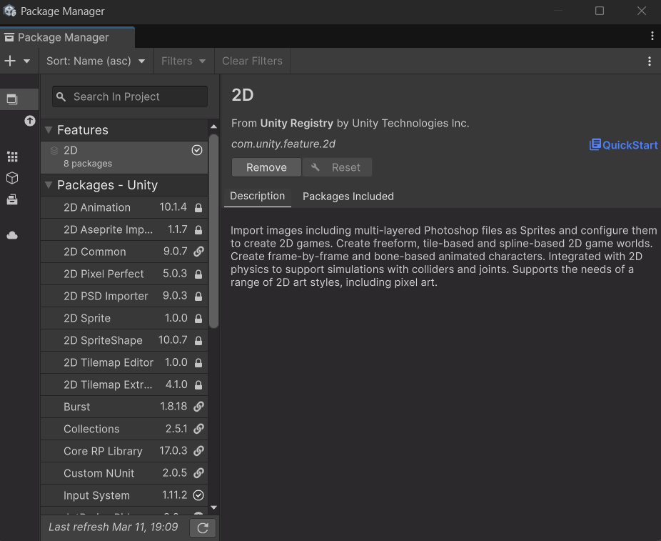

# Packages o paquetes en Unity

Los **paquetes** en Unity son una forma de distribuir y compartir funcionalidades y recursos entre proyectos.

## ¿Qué es un paquete en Unity?

Los **packages** en Unity son paquetes de funcionalidades que se pueden utilizar para realizar ciertas tareas o funciones específicas en el proyecto. No confundamos los packages con los assets.

Al instalar un package, este puede incluir un grupo de assets, librerías de código, plantillas o escenas de ejemplo, pero dependerá totalmente de la finalidad del mismo.

Por un lado, están los paquetes **built-in** o integrados, que son funcionalidades del propio motor que se pueden activar o desactivar según las necesitemos, como las físicas, el sistema de partículas, el audio o el cloth, entre otros.

Por otro lado, el resto de paquetes (como Input System, Cinemachine, Shader Graph o 2D Animation) se clasifican según su **estado de desarrollo**:

- **Release**: paquetes que han pasado todas las pruebas y que Unity garantiza que funcionan correctamente con nuestra versión del editor. Son los que deberíamos usar normalmente.
- **Pre-release**: paquetes que estarán disponibles como *Release* próximamente, pero que todavía están en las últimas fases de pruebas.
- **Experimental**: paquetes en fase de desarrollo temprano, que pueden cambiar mucho, generar errores o no ser compatibles con otros paquetes. No se recomienda usarlos en proyectos serios.
- **Deprecated**: paquetes obsoletos que ya no se mantienen y que no se deberían usar en proyectos nuevos.

En versiones antiguas del editor, los paquetes *Release* se llamaban *Verified* y los *Pre-release* y *Experimental* se agrupaban como *Preview*. 

Al instalar un **package** o un asset de la tienda, Unity lo descarga y lo almacena en el caché global. Esto quiere decir que si para un proyecto hemos descargado un paquete o un asset y queremos utilizarlo en otro proyecto ya no hará falta volver a descargarlo de la tienda nuevamente. 

Los paquetes son gestionados por el **package** **manager**. el cuál nos permite instalarlos, desinstalarlos, actualizarlos o desactivar cualquiera de ellos. Para acceder al package manager desde nuestro editor podemos hacerlo en la barra de herramientas principal yendo a la opción **Window → Package Manager**.

Al seleccionarlo nos mostrará un listado de los paquetes registrados por Unity, los cuales podremos instalar, pero si pulsamos en la lista desplegable de la barra superior de la ventana del package manager podremos filtrar por los paquetes del proyecto (los que ya están integrados actualmente en el proyecto), nuestros propios assets (que son los paquetes y assets descargados y que están almacenados en caché) y los built-in packages, aquí están todos los paquetes por defecto, los cuales también podremos desactivar de nuestro proyecto en caso de no estar utilizándolos, algo que hará que se reduzca el tamaño de nuestras builds una vez exportados los proyectos. así como también reducir el tiempo de compilación del mismo. 

También podremos agregar paquetes aquí pulsando en la tecla ‘+’ de la izquierda. En la misma barra también podremos filtrar el listado desde el buscador y gestionar las opciones avanzadas desde la opción advanced, justo a la izquierda de la barra de búsqueda, desde esta misma opción es donde podremos seleccionar si queremos que se nos muestren los paquetes en estado preview, las dependencias de los paquetes y también podremos resetear los paquetes a los paquetes por defecto solamente. 

Instalar, desinstalar y editar un package es bastante trivial desde el package manager, también podremos leer la documentación de cada paquete instalado, la cuál está disponible desde un enlace en la pestaña correspondiente al package del que nos queremos informar dentro del propio manager. 

Los packages instalados en el proyecto actual también pueden verse desde la columna izquierda de la pestaña de **Project**. 

Para acabar de entender los paquetes hay que tener en cuenta los archivos en formato JSON que se alojan dentro de la carpeta **Packages** del proyecto y que sirven como registro de paquetes:

- **manifest.json**: el manifiesto del proyecto. Contiene la lista de paquetes que hemos añadido al proyecto y su versión. Es el que modifica el Package Manager al instalar o desinstalar paquetes.
- **packages-lock.json**: registra la versión exacta de todos los paquetes instalados, incluidas las dependencias que se instalan automáticamente, para que el proyecto se reconstruya siempre igual en cualquier equipo.

Además, cada paquete tiene su propio manifiesto, un archivo **package.json** con su nombre, versión y dependencias. 

:::tip[Paquetes y Git]
Al subir un proyecto de Unity a Git, la carpeta **Packages** sí debe incluirse (a diferencia de la carpeta *Library*, que se regenera sola), ya que en ella están `manifest.json` y `packages-lock.json`. Al abrir el proyecto en otro equipo, Unity descargará automáticamente los paquetes necesarios.
:::

Entender cómo usar los paquetes es importante ya que hay muchas funcionalidades que no están añadidas por defecto o no son paquetes built-in como puede ser el uso de Shader Graph, la animación 2D y muchos otros. Cuando estemos buscando ejemplos de cómo hacer algo en concreto y nos encontremos con algún ejemplo que utiliza funciones del editor que nosotros no tenemos, esto será seguramente porque tiene algún paquete añadido que nosotros no tenemos añadido.

