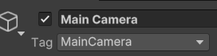
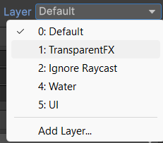

# ¿Qué son y para qué sirven los Tags y los Layers en Unity?

## Sobre los Tags

Mientras desarrollamos un videojuego es interesante poder acceder e identificar a los objetos de la escena, para realizar cierto tipo de acciones. 
Este acceso se hace por código y existen varias formas de hacerlo, una de ellas es mediante el uso de tags o etiquetas. 
Estas tags o etiquetas no son más que una palabra que se puede asignar a uno o varios objetos. 

Por defecto, los objetos no contienen ninguna etiqueta y no es obligatorio que la tengan. 
A pesar de esto, Unity nos ofrece una serie de etiquetas preestablecidas que suelen ser comunes en el desarrollo, como puede ser la etiqueta Player que se le asigna al jugador, o la etiqueta MainCamera, la cuál se le asigna a la cámara principal de nuestra escena. 



Podemos crear nuestros propios tags seleccionando el objeto al que queremos añadir la etiqueta y en el desplegable seleccionando una de las etiquetas existentes o seleccionando la opción de añadir una nueva, la cuál pasará a estar disponible en la lista desplegable a partir de entonces. 
Los tags deben ser lo más representativos en su denominación y evitar el uso de caracteres especiales y seguir el estilo PascalCase (por ejemplo, `Enemy`, `PowerUp`). Cada objeto solo puede tener **un** tag.

Todavía no hemos entrado en el scripting en Unity pero para que nos vayamos haciendo una idea del uso de estas tags, pueden servirnos para:

- Comprobar de qué tipo es un objeto con el que hemos chocado, con el método `CompareTag("Enemy")`, que es más eficiente que comparar `gameObject.tag == "Enemy"`.
- Buscar el primer objeto que tenga un tag con `GameObject.FindWithTag("Player")`, o todos los que lo tengan con `GameObject.FindGameObjectsWithTag("Enemy")`.

```csharp
private void OnCollisionEnter2D(Collision2D collision)
{
    if (collision.gameObject.CompareTag("Enemy"))
    {
        Debug.Log("¡Has chocado con un enemigo!");
    }
}
```

:::tip[Cuidado con las búsquedas]
Las funciones `Find...` recorren todos los objetos de la escena, por lo que no deben usarse en `Update()`. Lo habitual es buscar una sola vez en `Start()` y guardar la referencia, o mejor aún, asignarla desde el inspector.
:::

## Sobre los Layers

Las capas o layers de una escena nos servirán para agrupar varios objetos de la escena y esta agrupación no va a ser representada en la escena (como sí ocurre en otros motores), si no que sirve para ciertas acciones específicas, como puede ser decidir qué capas se van a renderizar en cámara, qué capas van a recibir iluminación o con cuales se van a detectar colisiones mediante código y el raycast. 

En proyectos 2D, el orden en que se dibujan los sprites (qué se ve por delante) **no** se controla con los layers, sino con los **Sorting Layers** y la propiedad **Order in Layer** del componente Sprite Renderer, que se configuran en **Edit → Project Settings → Tags and Layers**. 

Para crear un nuevo Layer, al igual que con las tags, debemos tener seleccionado un objeto de la escena y en el desplegable de los layers escoger la opción de añadir uno nuevo. Al seleccionar esta opción, podremos ver las capas ya creadas por defecto y las que nosotros hemos creado. 

Existen 32 capas (de la 0 a la 31). Las capas 0, 1, 2, 4 y 5 son capas integradas de Unity (*Default*, *TransparentFX*, *Ignore Raycast*, *Water* y *UI*) y no se pueden renombrar. El resto (la 3, la 6, la 7 y de la 8 a la 31) son capas que nosotros podremos utilizar para lo que queramos.

El index o índice de las capas es importante ya que podremos utilizarlo por código para poder referenciar los layers. Lo más cómodo, sin embargo, es declarar una variable de tipo `LayerMask` pública o con `[SerializeField]` y elegir las capas desde el inspector:

```csharp
[SerializeField] private LayerMask groundLayer;

bool enSuelo = Physics2D.OverlapCircle(transform.position, 0.1f, groundLayer);
```



