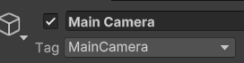

# ¿Qué son y para qué sirven los Tags y los Layers en Unity?

## Sobre los Tags

Mientras desarrollamos un videojuego es interesante poder acceder e identificar a los objetos de la escena, para realizar cierto tipo de acciones. 
Este acceso se hace por código y existen varias formas de hacerlo, una de ellas es mediante el uso de tags o etiquetas. 
Estas tags o etiquetas no son más que una palabra que se puede asignar a uno o varios objetos. 

Por defecto, los objetos no contienen ninguna etiqueta y no es obligatorio que la tengan. 
A pesar de esto, Unity nos ofrece una serie de etiquetas preestablecidas que suelen ser comunes en el desarrollo, como puede ser la etiqueta Player que se le asigna al jugador, o la etiqueta MainCamera, la cuál se le asigna a la cámara principal de nuestra escena. 

Podemos crear nuestros propios tags seleccionando el objeto al que queremos añadir la etiqueta y en el desplegable seleccionando una de las etiquetas existentes o seleccionando la opción de añadir una nueva, la cuál pasará a estar disponible en la lista desplegable a partir de entonces. 
Los tags deben ser lo más representativos en su denominación y evitar el uso de caracteres especiales y seguir el estilo CamelCase. 

También se pueden crear Subtags o Sub etiquetas concatenando las etiquetas padre con las etiquetas hijas junto con una barra (“/”) en medio. 
Por ejemplo, si tenemos el tag Enemy pero queremos tener varios tipos de enemigos, podemos crear las etiquetas Enemy/Goomba o Enemy/Koopa. 
Esto nos ayudará sobre todo a la hora de organizar nuestros objetos. 

Todavía no hemos entrado en el scripting en Unity pero para que nos vayamos haciendo una idea del uso de estas tags, esto puede servirnos precisamente para acceder a todos los objetos que contengan un tag determinado. 
Esto se realizará con el método ***FindObjectWithTag(“TAG”)*** de la clase GameObject, método que, como vemos, recibe un tag por parámetro en forma de String. 

## Sobre los Layers

Las capas o layers de una escena nos servirán para agrupar varios objetos de la escena y esta agrupación no va a ser representada en la escena (como sí ocurre en otros motores), si no que sirve para ciertas acciones específicas, como puede ser decidir qué capas se van a renderizar en cámara, qué capas van a recibir iluminación o con cuales se van a detectar colisiones mediante código y el raycast. 

Estas capas también nos sirven para decidir qué objetos se van a mostrar por delante unos de otros en un proyecto 2D, aunque esto podemos también definirlo en una misma capa. 

Para crear un nuevo Layer, al igual que con las tags, debemos tener seleccionado un objeto de la escena y en el desplegable de los layers escoger la opción de añadir uno nuevo. Al seleccionar esta opción, podremos ver las capas ya creadas por defecto y las que nosotros hemos creado. 

Las capas de la 0 a la 7 son capas reservadas por Unity, mientras que las capas de la 8 a la 31 son capas que nosotros podremos utilizar para lo que queramos.

El index o índice de las capas es importante ya que podremos utilizarlo por código para poder referenciar los layers. 

