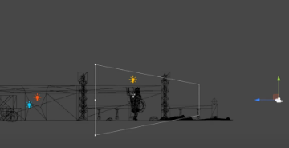
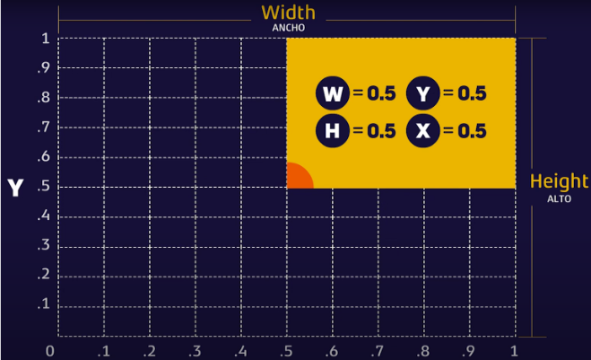

# Cámaras en Unity

La cámara es uno de los principales elementos de un videojuego, es la encargada de mostrar los objetos en pantalla, este proceso pasa por diferentes fases y es denominado renderizar o render. 
Por defecto al crear una escena, esta siempre tendrá una cámara y una luz agregadas. 

Ambas son objetos de la escena que podemos inspeccionar desde el inspector en la parte derecha para ver cómo están configurados y qué componentes los forman, junto con sus propiedades. 
Al hacerlo, nos daremos cuenta de que simplemente es un objeto que contiene un componente Transform, otro Camera y un Audio Listener. 
Además, podemos observar también que tiene el Tag MainCamera asignado y el Layer por defecto.

Esta cámara podemos moverla o rotarla en la escena a nuestro antojo y el resultado de hacerlo se puede previsualizar en el preview de la parte inferior cuándo la tenemos seleccionada o en la pestaña de Game al lanzar el juego. 
Podemos tener múltiples cámaras en nuestra escena y alternar entre ellas, superponerlas o disponerlas en un espacio concreto. 
Siempre debe haber al menos una cámara en la escena para que pueda ser renderizada en la pantalla, además de asegurarnos de que tan solo exista una cámara con el tag MainCamera.

## Propiedades principales de un componente Camera

    

### Render Type

- **Base**: Renderiza la cámara en la pantalla. 
- **Overlay**: Renderiza la cámara por encima de la cámara base, es decir, se superpone a la cámara base.

### Projection

También tenemos Projection, el cuál define el tipo de proyección de la cámara, como puede ser la Perspective, habitualmente usada en juegos 3D, cuya proyección necesita de la perspectiva para la representación del objeto en un plano en tres dimensiones y su profundidad. Las cámaras con una proyección en perspectiva también tienen una propiedad llamada Field of View o campo de visión que se refiere al ángulo disponible de visión que tendrá la cámara. 

La otra opción de Projection es la proyección ortográfica u Orthographic, más usada en juegos 2D ya que nos mostrará la proyección en un plano en dos dimensiones. Las cámaras con proyección ortográfica tendrán una propiedad Size que nos definirá el tamaño vertical que ocupa el campo de visión de esa cámara. 

A pesar de esto, ambas proyecciones pueden ser útiles tanto en juegos 2D como 3D dependiendo del efecto visual que busquemos en cada momento.

- **Perspective**: La cámara tiene un campo de visión en forma de cono, los objetos más cercanos se ven más grandes que los objetos más lejanos.
    - **Field of View**: Ángulo de visión de la cámara.
    - **Field of View Axis**: Eje de visión de la cámara.
    - **Physical Camera**: Permite simular una cámara física con propiedades como el tamaño del sensor, la distancia focal, la apertura, etc.
- **Orthographic**: La cámara tiene un campo de visión en forma de paralelepípedo, los objetos se ven del mismo tamaño independientemente de su distancia.
    - **Size**: Tamaño de la cámara en unidades de mundo.

#### Clipping Planes

- **Near**: Distancia mínima a la que la cámara renderiza objetos.
- **Far**: Distancia máxima a la que la cámara renderiza objetos.

Esta propiedad hace referencia a la distancia que tiene disponible la cámara para ver los objetos, esta propiedad tiene dos posibles valores, que son Near y Far, los cuáles hacen referencia a los objetos cercanos y lejanos respectivamente. La cámara renderiza todo lo que tenga más lejos de Near pero antes de llegar al valor de Far. 

Los valores de Near y Far funcionan exactamente igual, cuánto mayor es el número, más se aleja de la cámara el límite, de forma que lo que se va a renderizar es todo lo que haya entre los dos límites. Si tenemos un valor de Near mayor que el de Far, esa cámara no renderiza nada, ya que no habrá objetos entre Near y Far. 

Esto es lo que define la distancia de dibujo o dibujado tan común en videojuegos, un término bastante común. 
Hay que tener en cuenta que a más objetos dibujados en pantalla al mismo tiempo, más recursos consume el juego, por lo que debemos tratar de evitar renderizar objetos no visibles y utilizar texturas de menor calidad cuándo los objetos son tan lejanos que no se van a apreciar bien en cámara. Aunque esto depende totalmente de los gráficos que estemos usando y de la capacidad del hardware que ejecute nuestro juego. Hay que tener en cuenta que existen diversas técnicas para mejorar el consumo de recursos de un juego, pero es una buena práctica mantener una correcta distancia de dibujado en nuestras cámaras y no consumir más de lo necesario. 

### Rendering

- **Renderer**: Define cómo se renderizan los objetos en la cámara. 
    - **Skybox**: Renderiza un skybox en la cámara.
    - **Solid Color**: Renderiza un color sólido en la cámara.
    - **Depth Only**: Renderiza la profundidad de los objetos en la cámara.
    - **Don't Clear**: No borra el buffer de color de la cámara.
- **Post Processing**: Permite aplicar efectos de postprocesado a la cámara. Los efectos de postprocesado son efectos visuales que se aplican a la imagen renderizada después de que se haya renderizado.
- **Anti-aliasing**: Permite suavizar los bordes de los objetos renderizados. Cuanto mayor sea el valor, más suavizado será.
- **Stop NaN**: Evita que los valores NaN se muestren en la cámara. NaN significa "Not a Number" y se produce cuando se realizan operaciones matemáticas no válidas.
- **Dithering**: Permite aplicar dithering a la cámara. El dithering es una técnica que se utiliza para simular colores y efectos visuales que no se pueden representar con precisión en una pantalla.
- **Render Shadows**: Permite renderizar sombras en la cámara. Para que esto funcione, la cámara debe tener un componente Light en la escena que emita sombras.
- **Priority**: Define la prioridad de renderizado de la cámara. Cuanto mayor sea el valor, más prioridad tendrá.
- **Culling Mask**: Define qué capas de la escena se renderizan en la cámara. Solo se renderizarán los objetos que estén en las capas seleccionadas.
- **Occulusion Culling**: Permite activar la culling de oclusiones en la cámara. La culling de oclusiones es una técnica que se utiliza para evitar renderizar objetos que están ocultos por otros objetos.

### Stack 

- **Cameras**: Permite añadir cámaras adicionales a la cámara base. Las cámaras adicionales se renderizarán en orden de prioridad.

### Environment

- **Background Type**: Define el tipo de fondo de la cámara.
    - **Skybox**: Renderiza un skybox en la cámara.
    - **Solid Color**: Renderiza un color sólido en la cámara.
    - **Uninitializer**: No renderiza nada en la cámara.
- **Volumes**: Permite añadir volúmenes de efectos visuales a la cámara. Los volúmenes de efectos visuales son objetos que se utilizan para aplicar efectos visuales a la cámara.

### Output

- **Output Texture**: Define la textura de salida de la cámara. La textura de salida es la imagen renderizada por la cámara.
- **Target Display**: Define la pantalla de destino de la cámara. La pantalla de destino es el monitor o dispositivo en el que se renderiza la cámara.
- **Target Eye**: Define el ojo de destino de la cámara. El ojo de destino es el ojo en el que se renderiza la cámara en un dispositivo de realidad virtual.
- **Viewport Rect**: Define la región de la pantalla en la que se renderiza la cámara. La región de la pantalla es el área de la pantalla en la que se renderiza la cámara.
- **HDR Rendering**: Permite activar el renderizado HDR en la cámara. El renderizado HDR es una técnica que se utiliza para representar un rango dinámico alto de colores y brillos en una imagen.
- **MSAA**: Permite activar el anti-aliasing multisample en la cámara. El anti-aliasing multisample es una técnica que se utiliza para suavizar los bordes de los objetos renderizados.
- **URP Dynamic Resolution**: Permite activar la resolución dinámica en la cámara. La resolución dinámica es una técnica que se utiliza para ajustar la resolución de la cámara en tiempo real para mejorar el rendimiento.

#### Sobre el Viewport Rect

Esta propiedad define el tamaño del rectángulo que representa la cámara. 
Es importante tener muy en cuenta que este rectángulo es equivalente a la resolución de nuestro proyecto. 

Por ejemplo, si nuestro juego se juega en 1920 px de ancho por 1080 px de alto, entonces lo que podemos modificar aquí es el porcentaje de ese total, es decir, si queremos que esa cámara representa todo el ancho y alto de nuestra resolución debemos poner el W y el H a 1, ya que la relación es proporcional usando valores flotantes de 0 a 1. 
Si quisiéramos que solo mostrase la mitad del ancho de la pantalla , podríamos poner la W a 0,5. 

Con los valores X e Y, podemos mover el punto cardinal inicial de nuestra cámara para indicar desde qué punto queremos que empiece a contar ese porcentaje de pantalla que quiere mostrar. 

En el siguiente ejemplo, con todos los valores a 0,5, estaríamos mostrando tan solo la mitad del ancho y del alto de nuestra resolución a partir del punto medio del alto y el ancho total, es decir, el cuarto superior derecho de nuestra resolución: 

## El Componente Audio Listener

El componente Audio Listener es el encargado de captar los sonidos que se producen en la escena y reproducirlos en los altavoces del dispositivo.
Este componente se añade automáticamente a la cámara principal de la escena, pero también se puede añadir a cualquier otro objeto de la escena si se desea que ese objeto sea el que escuche los sonidos.

El Audio Listener captura los sonidos en un área determinada alrededor del objeto al que está asociado, y reproduce esos sonidos en función de la posición relativa de los objetos que los emiten y el objeto que los escucha.  

## Universal Additional Camera Data (Script)

Este script se utiliza para añadir datos adicionales a la cámara, como efectos visuales, postprocesado, etc.
Se puede añadir a cualquier cámara de la escena y se utiliza para configurar los efectos visuales y postprocesado de la cámara.

:::info[Sobre las cámaras en Unity]

El mundo de las cámaras en Unity es muy amplio y complejo, ya que hay muchas opciones y configuraciones posibles que se pueden ajustar para obtener el resultado deseado.
Es importante experimentar con las diferentes propiedades y configuraciones de las cámaras para comprender cómo afectan al aspecto visual de la escena y cómo se pueden utilizar para crear efectos visuales interesantes.

El objetivo principal de este módulo no es profundizar en todas las opciones y configuraciones de las cámaras en Unity, sino proporcionar una introducción básica a las cámaras y sus propiedades más importantes.

Para obtener más información sobre las cámaras en Unity, se recomienda consultar la documentación oficial de Unity y explorar los tutoriales y recursos disponibles en línea.

[Enlace a la documentación oficial de Unity sobre las cámaras](https://docs.unity3d.com/Manual/Cameras.html)

:::