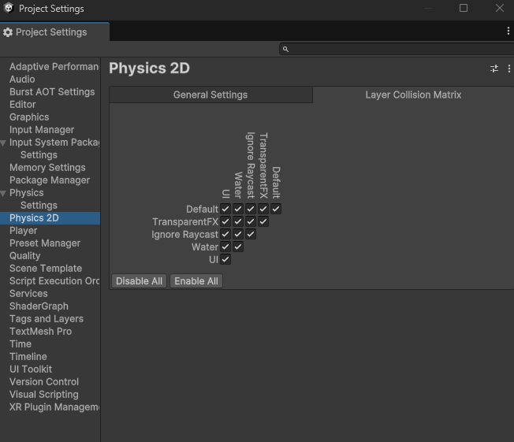

# Físicas en Unity

Unity cuenta con un motor de físicas que permite simular el comportamiento de objetos en un entorno 3D. Este motor de físicas es muy potente y permite simular una gran cantidad de efectos físicos, como gravedad, colisiones, fricción, etc.  

El motor interpreta los objetos y es capaz de aplicarles gravedad, fuerzas externas, peso , fricción, detectar colisiones y más. En concreto Unity nos ofrece dos motores independientes, uno pensado para los objetos en 3D y otro pensado para el 2D. 

Empezaremos viendo la configuración global de estas físicas, para acceder a ellas debemos hacer clic en **Edit → Project Settings → Physics/Physics 2D** (para el 3D y el 2D respectivamente). Existe una gran variedad de parámetros a configurar, pero a nivel básico podremos modificar la fuerza de la gravedad (la cuál por defecto es la de La Tierra) y el Layer Collision Matrix o matriz de colisiones. En esta matriz seleccionaremos pues, entre qué capas se detectan colisiones y en cuáles no. 

Para trabajar con físicas en Unity debemos familiarizarnos principalmente con dos componentes, por un lado el Rigidbody o cuerpo rígido, que es el componente encargado de transformar al objeto en una entidad controlada por las físicas o a la que las físicas le afectan por así decirlo.Y por otro lado,  el Collider o colisionador, que se encarga de delimitar las zonas del objeto en las que se pueden detectar las colisiones, existen varios tipos de colliders que mayormente son distintas formas geométricas que seleccionaremos según se adapten mejor al objeto en concreto que estamos tratando. Para la gran mayoría de todos estos componentes existe también su versión en dos dimensiones.  

## Rigidbody

El **Rigidbody** es un componente que nos permite definir varias propiedades clave para las físicas del juego. En primer lugar nos permite definir la masa del objeto, en kilogramos. La masa afectará sobre todo a las colisiones con otros objetos. También podremos definir el **Linear Damping** (llamado **Drag** en versiones anteriores a Unity 6), que es la resistencia que frena el movimiento del objeto, como la del aire. 

Tenemos también una propiedad booleana para definir si el objeto se verá afectado por la gravedad o no (**Use Gravity**). Tenemos también otro booleano para definir si queremos que el objeto se vea afectado por el motor de físicas o no, es la propiedad **Is Kinematic** o es cinemático. Un objeto cinemático no se ve afectado por la gravedad ni por las fuerzas de las colisiones, sino que solo se mueve cuando lo movemos nosotros desde código o con una animación; sin embargo, sí empuja a los objetos dinámicos con los que choca. Es útil, por ejemplo, para plataformas móviles o puertas. 

Por último contamos también con una propiedad llamada **Constraints** que nos servirá para congelar algún eje en concreto de la posición o la rotación del objeto si no queremos permitir que se mueva en alguna dirección concreta. 

### Propiedades más relevantes de un Rigidbody

- **Mass**: La masa del objeto en kilogramos.
- **Linear Damping** (antes *Drag*): La resistencia que frena el movimiento del objeto.
- **Angular Damping** (antes *Angular Drag*): La resistencia que frena la rotación del objeto.
- **Use Gravity**: Si el objeto se ve afectado por la gravedad.
- **Is Kinematic**: Si el objeto es cinemático, es decir, si solo se mueve desde código o animaciones y no por las fuerzas de las físicas.
- **Constraints**: Las restricciones de movimiento del objeto. Esto nos sirve para congelar algún eje en concreto de la posición o la rotación del objeto si no queremos permitir que se mueva en alguna dirección concreta.
- **Interpolate**: Suaviza visualmente el movimiento del objeto entre dos pasos de la simulación física. Es recomendable activarlo en el objeto que sigue la cámara, como el jugador, para evitar tirones.
- **Collision Detection**: La detección de colisiones del objeto. 
    - **Discrete**: Comprueba las colisiones solo en cada paso de la simulación. Es la opción más eficiente, pero un objeto muy rápido puede atravesar a otro delgado entre un paso y el siguiente (*tunneling*).
    - **Continuous**: Evita que el objeto atraviese colliders estáticos, a costa de más cálculo.
    - **Continuous Dynamic**: Evita que el objeto atraviese tanto colliders estáticos como otros objetos con Rigidbody. Es la opción adecuada para objetos muy rápidos, como proyectiles.
    - **Continuous Speculative**: Una alternativa más barata a las anteriores que también tiene en cuenta las rotaciones, aunque en algunos casos puede producir contactos "fantasma".

### Rigidbody 2D

Para juegos 2D se utiliza el componente **Rigidbody 2D**, cuyas propiedades son muy similares. Las diferencias más importantes son:

- **Body Type**: Define el tipo de cuerpo. **Dynamic** se mueve por las físicas, **Kinematic** solo se mueve por código y **Static** no se mueve nunca (para suelos y paredes, aunque un objeto que solo tiene collider ya se considera estático).
- **Gravity Scale**: En lugar de un booleano, un multiplicador de la gravedad. Con `0` el objeto no se ve afectado por ella, algo muy habitual en juegos vistos desde arriba o en el Pong.

:::info[Cambios en Unity 6]
En Unity 6 algunas propiedades del Rigidbody han cambiado de nombre, también en el código: `velocity` pasa a llamarse `linearVelocity`, `drag` pasa a ser `linearDamping` y `angularDrag` pasa a ser `angularDamping`. Los nombres antiguos siguen compilando durante un tiempo, pero están marcados como obsoletos, por lo que en tutoriales antiguos veremos todavía `rb.velocity`.
:::

## Collider

El **Collider** es un componente que se utiliza para definir la forma y tamaño de un objeto en la escena para detectar colisiones. Existen varios tipos de colliders en Unity, como:    

- **Box Collider**: Un cubo 3D.
- **Sphere Collider**: Una esfera 3D.
- **Capsule Collider**: Una cápsula 3D.
- **Mesh Collider**: Un collider basado en la geometría del modelo 3D.

Los colliders se utilizan para detectar colisiones entre objetos y permitir que interactúen entre sí en la escena. Para juegos 2D, se utilizan colliders 2D en lugar de colliders 3D. Existen varios tipos de colliders 2D en Unity, como:  

- **Box Collider 2D**: Un rectángulo 2D.
- **Circle Collider 2D**: Un círculo 2D.
- **Polygon Collider 2D**: Un polígono 2D.
- **Edge Collider 2D**: Un borde 2D.
- **Capsule Collider 2D**: Una cápsula 2D.

Los colliders 2D se utilizan para detectar colisiones entre objetos en un entorno 2D.

Para que un objeto al que le aplicamos físicas pueda colisionar con otro, ambos deben tener un **Collider**. Por ejemplo, para que el personaje principal de un juego de plataformas pueda colisionar con el suelo y no se hunda en la escena, el suelo debe tener también un Collider con el que impacte el Collider del personaje. 

Todos los Colliders poseen un parámetro llamado **IsTrigger**, que, si está activado, hace que el objeto funcione como un disparador que se lanza cuándo otro collider entra en colisión con él, pero sin ofrecer resistencia, simplemente funciona como disparador, ya no hay colisión si no que hay un aviso del contacto de ambos Colliders. Esto se usa por ejemplo para crear Checkpoints. 

A los Colliders también podemos agregarles materiales físicos o **Physics Material** (llamados *Physic Material* antes de Unity 6). Estos materiales podemos crearlos desde el menú **Create** de la pestaña Project (en 2D, **Create → 2D → Physics Material 2D**) y asignarlos al componente **Collider** en su propiedad **Material**. Estos materiales poseen unos parámetros que pueden dotar a nuestro objeto de más realismo, como son la fricción dinámica y estática o el rebote entre otros. 

También podemos modificar mucho más las físicas desde código, utilizando scripts que se encarguen de ello, para modificar las fuerzas, velocidades, aceleraciones, etc, en tiempo de ejecución. 

### Propiedades más relevantes de un Collider

- **Is Trigger**: Si el collider funciona como un disparador. Esto nos sirve para crear Checkpoints, por ejemplo.
- **Provides Contacts**: Si el collider proporciona contactos. 
- **Material**: El material físico del collider.
- **Center** (u **Offset** en 2D): El centro del collider en su espacio local. Se especifica en coordenadas X, Y, Z, es decir, usa un Vector3 (un Vector2 en los colliders 2D).
- **Size**: El tamaño del collider en su espacio local, en el caso del Box Collider. Otros colliders tienen propiedades equivalentes, como **Radius** en el Sphere Collider o el Circle Collider 2D.

:::info[Colisiones y triggers desde código]
Cuando dos colliders chocan, Unity llama automáticamente a ciertos métodos de los scripts de ambos objetos: `OnCollisionEnter`, `OnCollisionStay` y `OnCollisionExit` para colisiones normales, y `OnTriggerEnter`, `OnTriggerStay` y `OnTriggerExit` para triggers (con el sufijo `2D` en las físicas 2D, por ejemplo `OnTriggerEnter2D`). Para que se produzcan, **al menos uno de los dos objetos debe tener un Rigidbody**. Los veremos en el apartado de [scripting](./9-Scripting.mdx).
:::

### Matriz de colisiones

La matriz de colisiones es una herramienta que nos permite definir qué capas de colisión interactúan entre sí. Esto es útil para controlar qué objetos colisionan entre sí y cuáles no. 

Para acceder a la matriz de colisiones en Unity, debemos ir a **Edit → Project Settings → Physics** o **Physics 2D** y buscar la sección **Layer Collision Matrix**. Aquí podremos ver todas las capas de colisión y definir si colisionan entre sí o no.   

## Ejemplo de uso de Rigidbody y Collider

Vamos a ver un ejemplo sencillo de cómo utilizar un **Rigidbody** y un **Collider** en Unity. Para ello, vamos a crear un cubo que caiga por la gravedad y colisione con un suelo.  

1. Crearemos un nuevo proyecto en Unity y crearemos un nuevo GameObject 3D en la escena. Para ello, haremos clic en **GameObject → 3D Object → Cube**.
2. Seleccionaremos el cubo en la jerarquía y añadiremos un componente **Rigidbody**. Para ello, haremos clic en **Add Component → Physics → Rigidbody**.
3. Comprobaremos en el inspector que el cubo tiene un componente **Box Collider**. Los objetos 3D básicos que crea Unity ya incluyen el collider adecuado a su forma, por lo que no hace falta añadirlo.
4. Crearemos un suelo en la escena. Para ello, haremos clic en **GameObject → 3D Object → Plane**. El plano ya incluye un **Mesh Collider**.
5. Ajustaremos la posición del suelo para que esté debajo del cubo.

Una vez hecho esto, si ejecutamos la escena, veremos cómo el cubo cae por la gravedad y colisiona con el suelo. Esto es debido a que hemos añadido un **Rigidbody** al cubo para que sea afectado por la gravedad y un **Collider** al cubo y al suelo para que colisionen entre sí.    

Este es un ejemplo muy sencillo de cómo utilizar un **Rigidbody** y un **Collider** en Unity. A partir de aquí, podemos crear escenas más complejas con objetos que interactúen entre sí y simulen comportamientos físicos realistas.   

En resumen, las físicas en Unity son un aspecto fundamental a la hora de crear juegos y aplicaciones interactivas. Con los componentes **Rigidbody** y **Collider**, podemos simular el comportamiento de objetos en un entorno 3D y crear experiencias interactivas y realistas para los usuarios. 
