# Pong 

El pong fue publicado por Atari en 1972 y es uno de los primeros videojuegos de la historia. El juego es un simulador de tenis de mesa en el que los jugadores controlan una paleta y deben golpear una pelota de un lado a otro de la pantalla. El objetivo es hacer que la pelota pase al otro lado de la pantalla sin que el oponente la devuelva. El juego fue un gran éxito y ayudó a popularizar los videojuegos en todo el mundo.

Creado por Nolan Bushnell y basado en el juego de tenis de mesa, Pong fue un gran éxito en los salones recreativos de la época. El juego fue tan popular que Atari tuvo que fabricar más máquinas para satisfacer la demanda. Pong fue el primer juego de arcade de Atari y ayudó a establecer a la compañía como un líder en la industria de los videojuegos.  

Vamos a hacer una versión mínima de Pong en Unity. Este juego nos va a servir para conocer un poco mejor el entorno, el sistema de físicas, las colisiones y el manejo general del programa.

## Primera versión PvP

Empezaremos creando una primera versión del juego en la que dos jugadores controlan las palas y deben golpear la pelota para que no se salga de la pantalla. En esta versión no habrá IA.

Cada jugador jugará con unas teclas concretas del teclado, el jugador de la izqueirda jugará con las teclas W y S, mientras que el de la derecha jugará con las flechas arriba y abajo. La pelota se moverá sola y rebotará en las palas y en las barras superior e inferior. Si la pelota se sale de la pantalla, el jugador que no la haya golpeado perderá un punto. El juego terminará cuando uno de los jugadores llegue a 5 puntos.


### Creando el proyecto

Partiremos de un proyecto vacío en Unity utilizando la plantilla de Universal 2D Core de Unity 6. 

Esta plantilla ya nos viene con una escena 2D que contiene una cámara y una luz de tipo **GlobalLight**, podemos cambiar el color de fondo de lo que muestra la cámara en su componente Camera y en concreto en la propiedad **Environment -> Background** (Siempre y cuándo el **Background Type** lo dejemos como viene por defecto, en *Solid Color*).

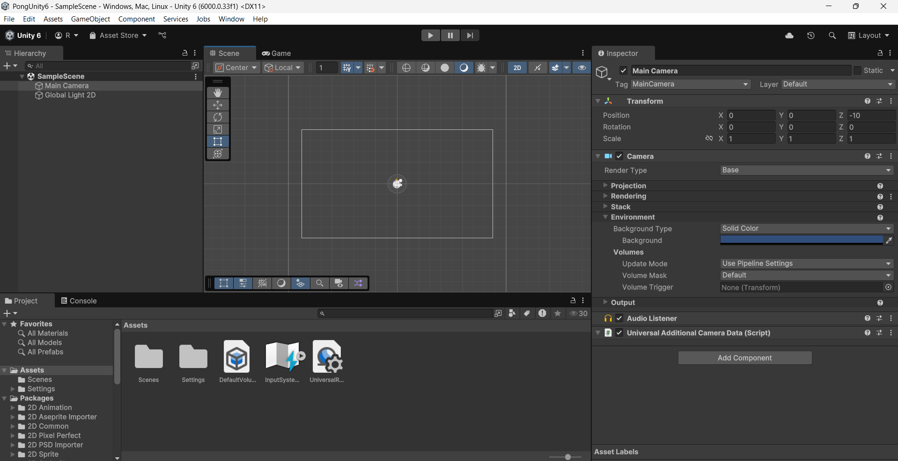

### Creando el escenario

Para empezar a crear el escenario del juego crearemos varios **GameObject** de la siguiente forma:
1. Hacemos clic derecho sobre la pestaña de la jerarquía y seleccionamos 2D Object -> Sprite -> Square.
2. Cambiamos el nombre del objeto a **BarraSuperior** o algo por el estilo.
3. Posicionamos el objeto en la parte superior de la pantalla y ajustamos su tamaño para que sea una barra que ocupe toda la pantalla, es decir, que ocupe el ancho del cuadrado que marca lo que la cámara va a renderizar.
4. Le añadimos un componente **Box Collider 2D** para que más adelante la pelota y las palas de los jugadores colisionen con ella.
5. Con Control + D duplicamos el objeto y lo posicionamos en la parte inferior de la pantalla.

Para crear las "porterías" vamos a hacer exactamente el mismo proceso que para las barras superior e inferior, pero en este caso vamos a posicionarlas fuera del alcance de la cámara, justo a la derecha y a la izquierda del límite que marca la cámara para que no se vean.

Si en la pantalla de **Game** queremos ver como se vería el juego en ejecución, podemos hacer clic en el botón **Maximize on Play** que se encuentra en la esquina superior derecha de la ventana de **Game**. Pero para ver una resolución parecida a la cámara que estamos renderizando podemos clicar el aspecto dónde por defecto pone **Free Aspect** y poner un valor de 16:9.

Crearemos también una línea en el medio utilizando los mismos pasos que para las barras, pero en este caso la posicionaremos en el centro de la pantalla y la haremos más estrecha.
Esta línea sin embargo, no debe llevar el componente **Box Collider 2D**, ya que es meramente visual y no queremos que la pelota colisione contra ella. 

Para las palas de los jugadores vamos a hacer lo mismo que para las barras, pero en este caso las vamos a hacer más estrechas y las vamos a posicionar en los extremos de la pantalla.

Podemos jugar con la posición en el eje X de las palas y ponerlo a nuestro gusto, pero es importante que las palas no se salgan de la pantalla, ya que si la pelota colisiona con ellas y se sale de la pantalla, el juego no funcionará correctamente.

:::note[Sobre los nombres de los GameObject]
Es importante que los nombres de los GameObject sean descriptivos y claros, ya que nos ayudarán a identificarlos más fácilmente en la jerarquía y en el código.
::: 

:::info[Sobre los colores y los tamaños]
Podemos cambiar los colores de los objetos y ajustar los tamaños a nuestro gusto, pero es importante que las barras superior e inferior ocupen toda la pantalla y que las palas no se salgan de la pantalla.    
:::

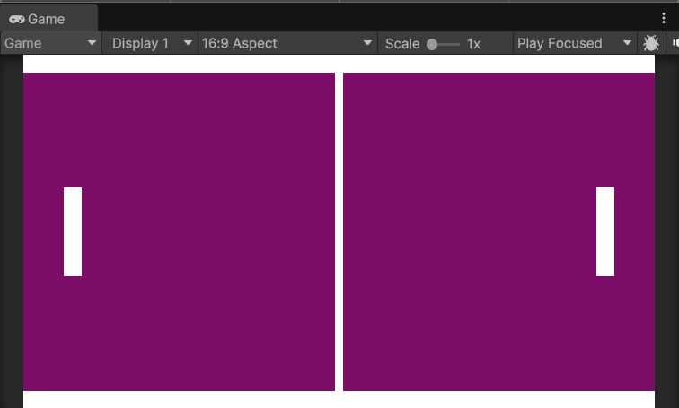

#### Creando la pelota

Para crear la pelota vamos a seguir los mismos pasos que para las barras, pero en este caso vamos a hacerla más pequeña y la vamos a posicionar en el centro de la pantalla.
Podemos usar un color diferente para la pelota para que se distinga mejor de las barras y las palas.
También podemos usar un Sprite circular en lugar de un cuadrado, no hay problema en ello.

Al igual que a las palas y a las barras, le añadimos un componente **Box Collider 2D** para que colisione con las barras y las palas.

Podemos darle otro color a la pelota para que se distinga mejor de las palas y las barras, al hacerlo es posible que nos ocurra que queda "dibujada" por detrás de la línea central decorativa (si la hemos añadido). 

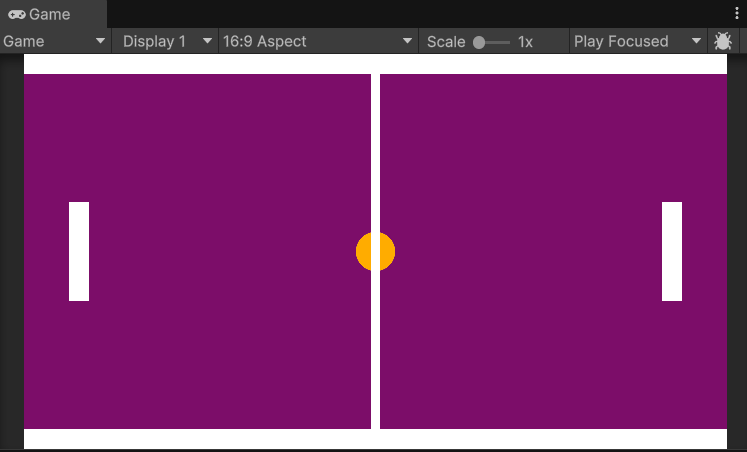

Para solucionar esto bastaría con seleccionar la línea central y en su componente **Sprite Renderer** darle un valor al **Order in Layer** inferior al de la pelota, por ejemplo, -1, ya que por defecto el resto de objetos deberían tener un valor 0.

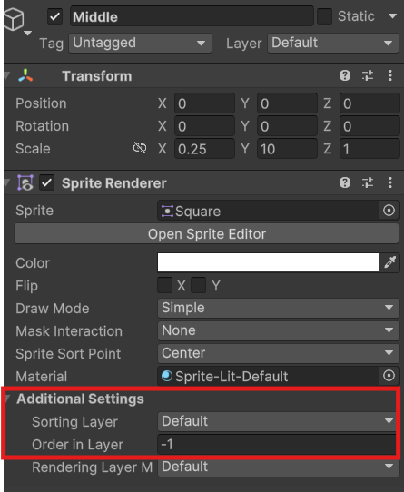

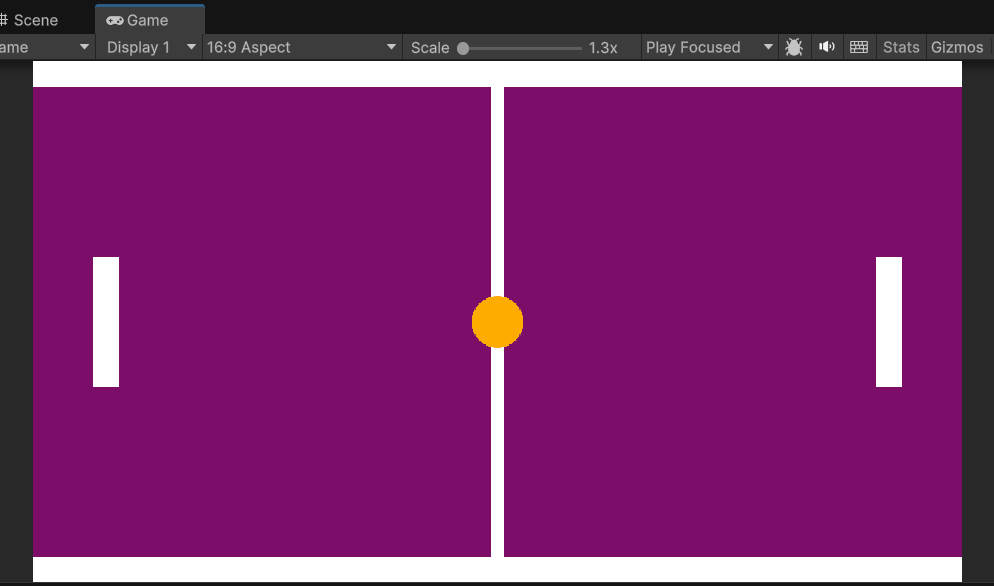

Llegados a este punto añadiremos un nuevo componente a las palas y a la pelota, el componente **Rigidbody 2D**. Este componente es el encargado de aplicar las físicas a los objetos, en este caso, a las palas y a la pelota.  

Si ahora mismo ejecutamos el juego podremos ver como los tres elementos caen por la pantalla, esto es debido a que el componente **Rigidbody 2D** les está aplicando la gravedad. Para evitar esto, vamos a desactivar la propiedad **Gravity Scale** de los **Rigidbody 2D** de las palas y de la pelota.  

Para solucionar esto vamos a poner la propiedad **Gravity Scale** de los **Rigidbody 2D** de las palas y de la pelota a 0.

Si volvemos a ejecutar ya deberían de mantenerse en la posición en la que estaban.

Ahora ya podemos empezar con el Scripting para mover las palas y la pelota.

#### Dándole vida a la pelota

Para hacer que la pelota se mueva vamos a generar un Script. Para ello, nos situamos en la pestaña de **Project** y hacemos clic derecho en la carpeta **Assets** y seleccionamos **Create -> C# Script**.

Lo ideal para mantener el proyecto organizado es crear una carpeta llamada **Scripts** y dentro de ella crear el script o moverlo a la misma.

Vamos a llamarlo **Ball** y lo abrimos con el editor de código que tengamos configurado. En mi caso Visual Studio.

:::info[Sobre el editor de código]
Unity nos permite configurar el editor de código que queramos, pero por defecto viene configurado con Visual Studio. Si no lo tenemos instalado, podemos descargarlo desde [la página oficial de Microsoft](https://visualstudio.microsoft.com/es/downloads/).
:::

:::tip[Elegir un editor de código por defecto]
Si no tenemos un editor de código por defecto, podemos elegir uno desde **Edit -> Preferences -> External Tools** y seleccionar el editor que queramos usar.
:::

Partiremos de un MonoBehaviour básico, por lo que el código inicial será el siguiente:

```csharp title="Ball.cs"
using UnityEngine;

public class Ball : MonoBehaviour
{
    // Start is called once before the first execution of Update after the MonoBehaviour is created
    void Start()
    {
        
    }

    // Update is called once per frame
    void Update()
    {
        
    }
}
```

:::info[Sobre el MonoBehaviour]
Al heredar de **MonoBehaviour** estamos creando un script que se ejecutará en el contexto de Unity. Esto significa que podemos utilizar las funciones de Unity, como **Start()** y **Update()**, para ejecutar código en momentos específicos del ciclo de vida del juego.

**Start()** se ejecuta una vez al inicio del juego, mientras que **Update()** se ejecuta una vez por cada frame del juego. Esto es útil para ejecutar código que necesita ser actualizado constantemente, como el movimiento de la pelota.  

Tenéis más información sobre el ciclo de vida de un MonoBehaviour en la documentación oficial de Unity y en la sección de [Scripting en Unity](../1-Unity/9-Scripting.mdx).
:::

Podemos eliminar el método **Update()** por ahora, ya que no lo vamos a utilizar.

Empezaremos creando dentro de la clase **Ball** una variable pública de tipo **float** que llamaremos **speed** y le daremos un valor de 5.0f. Esta variable será la velocidad a la que se moverá la pelota.

Aunque le demos un valor inicial, al ser pública podremos modificarla desde el editor de Unity. Para ello, simplemente debemos seleccionar el objeto que contiene el script y en el componente **Ball** podremos ver la variable **speed** y modificar su valor.

Además de la velocidad, añadiremos también una variable de tipo **Rigidbody2D** que llamaremos **rb**. Esta variable contendrá la referencia al componente **Rigidbody2D** de la pelota. Más adelante se lo asignaremos arrastrándolo desde el editor.

Necesitamos este componente para aplicarle fuerzas a la pelota y hacer que se mueva. 

Vamos a inicializar también, por último, una variable de tipo **Vector2** llamada *startPos* que contendrá la posición inicial de la pelota. Esta variable la utilizaremos para reiniciar la posición de la pelota cuando un jugador pierda un punto.

```csharp title="Ball.cs"
using UnityEngine;

public class Ball : MonoBehaviour
{
  // highlight-start
    public float speed = 5.0f;
    public Rigidbody2D rb; // This is set in the inspector, represents the Rigidbody2D component of the ball
    private Vector2 startPos; // Represents the initial position of the ball
  // highlight-end

    // Start is called once before the first execution of Update after the MonoBehaviour is created
    void Start()
    {
        
    }
}
```

:::warning[Sobre las variables públicas]
Las variables públicas son visibles en el editor de Unity y podemos modificarlas desde allí. Esto es útil para ajustar valores sin necesidad de modificar el código.

**Es importante tener en cuenta que si le damos un valor inicial en el script, este valor se sobrescribirá por el que le demos en el editor.**
:::

Ahora, en el método **Start()** vamos a inicializar la variable **startPos** con la posición de la pelota. Para ello, utilizamos la propiedad **transform.position** de la pelota, que nos dará la posición actual del objeto en el espacio 2D.

```csharp title="Ball.cs"
using UnityEngine;

public class Ball : MonoBehaviour
{
    public float speed = 5.0f;
    public Rigidbody2D rb; // This is set in the inspector, represents the Rigidbody2D component of the ball
    private Vector2 startPos; // Represents the initial position of the ball

    // Start is called once before the first execution of Update after the MonoBehaviour is created
    void Start()
    {
        // highlight-next-line
        startPos = transform.position; // Initialize startPos with the current position of the ball
    }
}
```

:::info[Sobre la posición de los objetos]
La posición de los objetos en Unity se representa mediante un vector de 3 dimensiones (X, Y, Z). En el caso de los objetos 2D, la dimensión Z no se utiliza y la posición se representa mediante un vector de 2 dimensiones (X, Y). 

La posición de los objetos se puede modificar mediante el componente **Transform** de cada objeto. Este componente contiene la posición, rotación y escala del objeto en el espacio 3D.
:::

Una vez tenemos la posición inicial de la pelota almacenada, crearemos un método llamado **Launch()** para lanzar la pelota al comienzo del juevo. Este método se encargará de asignar la velocidad a la pelota y de darle una dirección aleatoria al lanzarla.

Para hacer que no siempre salga hacia el mismo lado, utilizaremos la función **Random.Range()** para generar un número aleatorio entre -1 y 1. 

Declararemos dos variables, una para el eje x y otro para el eje y, que llamaremos **xDir** e **yDir** respectivamente. Inicializaremos estas variables a 1 o -1 de forma aleatoria, para darle velocidad en ese eje pero no siempre en la misma dirección.

Una vez calculadas las direcciones accederemos a la propiedad **linearVelocity** del **Rigidbody2D** de la pelota y le asignaremos un nuevo vector con las direcciones calculadas multiplicando el valor aleatorio por la velocidad asignada.

Esta propiedad es un **Vector2** que representa la velocidad lineal del objeto en el espacio 2D. Al asignarle un nuevo vector, estamos cambiando la dirección y la velocidad de la pelota. Para hacerlo, le pasaremos un nuevo objeto **Vector2** con las direcciones calculadas y la velocidad deseada.

Llamaremos a este método **Launch()** para que sea más fácil de identificar y lo llamaremos desde el método **Start()** para que la pelota se lance al inicio del juego.

```csharp title="Ball.cs"   
using UnityEngine;

public class Ball : MonoBehaviour
{
    public float speed = 5f;
    public Rigidbody2D rb;
    private Vector2 startPos;


    // Start is called once before the first execution of Update after the MonoBehaviour is created
    void Start()
    {
        startPos = transform.position;   
        // highlight-next-line
        Launch(); // Call the Launch method to start the ball's movement
    }
    
    // highlight-start
    public void Launch()
    {
        float xDir = Random.Range(0, 2) == 0 ? -1 : 1;
        float yDir = Random.Range(0, 2) == 0 ? -1 : 1;
        rb.linearVelocity = new Vector2(xDir * speed, yDir * speed); // This was "velocity" in previous Unity versions
    }
    // highlight-end
}

```

Si ejecutamos el juego ahora, la pelota debería moverse en una dirección aleatoria al inicio del juego. Podemos probar varias veces para ver como la pelota se mueve en diferentes direcciones.

:::warning[Si la pelota no se mueve]
Si la pelota no se mueve, asegúrate de que el componente **Rigidbody2D** está asignado correctamente en el editor. Para ello, selecciona la pelota en la jerarquía y en el componente **Ball** arrastra el componente **Rigidbody2D** de la pelota al campo **rb** desde el propio inspector.

En caso de ejecutar sin haberlo hecho Unity nos mostrará un error en la consola indicando que el componente **Rigidbody2D** no está asignado:

```plaintext
UnassignedReferenceException: The variable rb of Ball has not been assigned.
You probably need to assign the rb variable of the Ball script in the inspector.
UnityEngine.Object+MarshalledUnityObject.TryThrowEditorNullExceptionObject (UnityEngine.Object unityObj, System.String parameterName) (at <84f0d810adef4e6c8deab33e4ae93f7c>:0)
UnityEngine.Bindings.ThrowHelper.ThrowNullReferenceException (System.Object obj) (at <84f0d810adef4e6c8deab33e4ae93f7c>:0)
UnityEngine.Rigidbody2D.set_linearVelocity (UnityEngine.Vector2 value) (at <947c566dcd374e379abfce2ae0b65eaf>:0)
Ball.Launch () (at Assets/Scripts/Ball.cs:21)
Ball.Start () (at Assets/Scripts/Ball.cs:14)
```
:::

:::info[Sobre el Rigidbody2D]
El **Rigidbody2D** es un componente que permite simular la física en objetos 2D. Este componente nos permite aplicar fuerzas, colisiones y movimientos a los objetos de forma realista. 
En este caso, estamos utilizando el **Rigidbody2D** para mover la pelota y hacer que colisione con las palas y las barras.
:::

:::note[Sobre la propiedad linearVelocity]
La propiedad **linearVelocity** es la velocidad lineal del objeto en el espacio 2D. Esta propiedad se utiliza para mover el objeto en una dirección específica y a una velocidad determinada.   

En versiones anteriores de Unity, esta propiedad se llamaba **velocity**. Si estás utilizando una versión anterior de Unity, puedes cambiar **linearVelocity** por **velocity** y debería funcionar sin problemas.
:::

Obviamente, la pelota sale disparada pero todavía no rebota como queremos si no que al chocar con las palas o las barras se va frenando.

Para solucionar esto le daremos un material físico 2D que simule el rebote. Para ello, crearemos un nuevo **Physics Material 2D** desde la pestaña de **Project** y haciendo clic derecho en la carpeta **Assets** y seleccionando **Create -> 2D -> Physics Material 2D**.

Para tener todo mejor organizado, crearemos una carpeta llamada **Materials** y dentro de ella crearemos el material físico o lo movemos ahí si ya lo hemos creado.

Vamos a llamarlo **BallMaterial** y lo abrimos para configurarlo. En el inspector podemos ver varias propiedades, pero las que nos interesan son **Friction** y **Bounciness**.
La propiedad **Friction** es la fricción del material, que determina cuánto se frena el objeto al chocar con otro objeto. La propiedad **Bounciness** es la elasticidad del material, que determina cuánto rebota el objeto al chocar con otro objeto.
Podemos dejar la fricción a 0 y la elasticidad a 1 para que la pelota rebote al máximo.

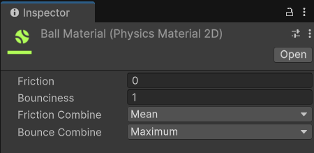

Una vez configurado el material, lo arrastramos al componente **Circle Collider 2D** de la pelota. Esto hará que la pelota rebote al chocar con las palas y las barras.

Si ejecutamos el juego ahora, la pelota debería rebotar al chocar con las palas y las barras.

Sin embargo, ahora tenemos otro problemilla, y es que al rebotar contra las palas estas salen disparadas para atrás y frenan la pelota y se descolocan completamente.

Para evitar esto debemos hacer que las palas no puedan moverse en el eje X (horizontal) y que solo se muevan en el eje Y (vertical). 

Para ello, vamos a seleccionarlas ambas y en el componente **Rigidbody 2D** de las palas vamos a poner la propiedad **Constraints** en **Freeze Position X**. Esto hará que las palas no se muevan en el eje X y solo se muevan en el eje Y.

Una vez hecho esto, vamos a seleccionarlas de nuevo pero esta vez junto con la pelota y en el componente **Rigidbody 2D** de la pelota vamos a poner la propiedad **Constraints** en **Freeze Rotation Z**. Esto hará que la pelota no rote al chocar con las palas y las barras.

Esto, aunque visualmente no se note, hará que la pelota no rote al chocar con las palas y las barras, y tampoco las propias palas.

Ahora, al ejecutar ya podemos ver como la pelota rebota al chocar con las palas y las barras, y las palas no se mueven en el eje X.

:::info[Sobre los Constraints]
Los **Constraints** son propiedades del componente **Rigidbody2D** que nos permiten restringir el movimiento y la rotación de los objetos. Esto es útil para evitar que los objetos se muevan o roten de forma no deseada al chocar con otros objetos.
:::

:::note[Sobre el Freeze Position y Freeze Rotation]
La propiedad **Freeze Position** es un constraint que nos permite restringir el movimiento de un objeto en un eje específico. En este caso, estamos restringiendo el movimiento de las palas en el eje X para que solo se muevan en el eje Y.

La propiedad **Freeze Rotation** es un constraint que nos permite restringir la rotación de un objeto en un eje específico. En este caso, estamos restringiendo la rotación de la pelota en el eje Z para que no rote al chocar con las palas y las barras.
:::

Antes de continuar, vamos a añadir un método en el Script de la pelota que nos permita reiniciar la posición de la pelota al inicio del juego.

Este método se llamará **Reset()** y simplemente le quitará la velocidad residual que lleve la pelota, le asignará la posición inicial de la pelota a la posición actual de la misma y volverá a lanzarla para seguir con el juevo.
Este método debe ser **público** para poder llamarlo desde otros scripts.

```csharp title="Ball.cs"

...
    public void Reset()
    {
        rb.linearVelocity = Vector2.zero;
        transform.position = startPos;
        Launch();
    }
}

```

Ya todo funciona como debería, pero todavía no podemos mover las palas para jugar, vamos a hacer que esto sea posible.

### Moviendo las palas

#### Configurando el InputManager

Antes de empezar a programar, vamos a abrir el **Input Manager** de Unity. Para ello, vamos a **Edit -> Project Settings -> Input Manager**.

En este menú podemos ver los ejes de entrada que tiene configurados Unity por defecto. Estos ejes son los que utilizaremos para mover las palas.

Podemos ver que ya hay varios ejes configurados, pero los que nos interesa el eje **Vertical**. Este eje es el que utilizaremos para mover las palas hacia arriba y hacia abajo.

Vamos a crear dos nuevos ejes, uno para cada pala. Para ello, hacemos clic derecho sobre el eje **Vertical** y seleccionamos **Duplicate Array Element**. Esto creará una copia del eje **Vertical**.

Vamos a renombrar el nuevo eje a **VerticalLeft** y el otro a **VerticalRight**.

Una vez hecho esto, vamos a cambiar las propiedades de cada eje para que se ajusten a lo que queremos.

Para el eje **VerticalLeft** vamos a cambiar el nombre a **VerticalLeft** y en la propiedad **Positive Button** vamos a poner la tecla **w** y en la propiedad **Negative Button** vamos a poner la tecla **s**.
Para el eje **VerticalRight** vamos a cambiar el nombre a **VerticalRight** y en la propiedad **Positive Button** vamos a poner la tecla **up** y en la propiedad **Negative Button** vamos a poner la tecla **down**.

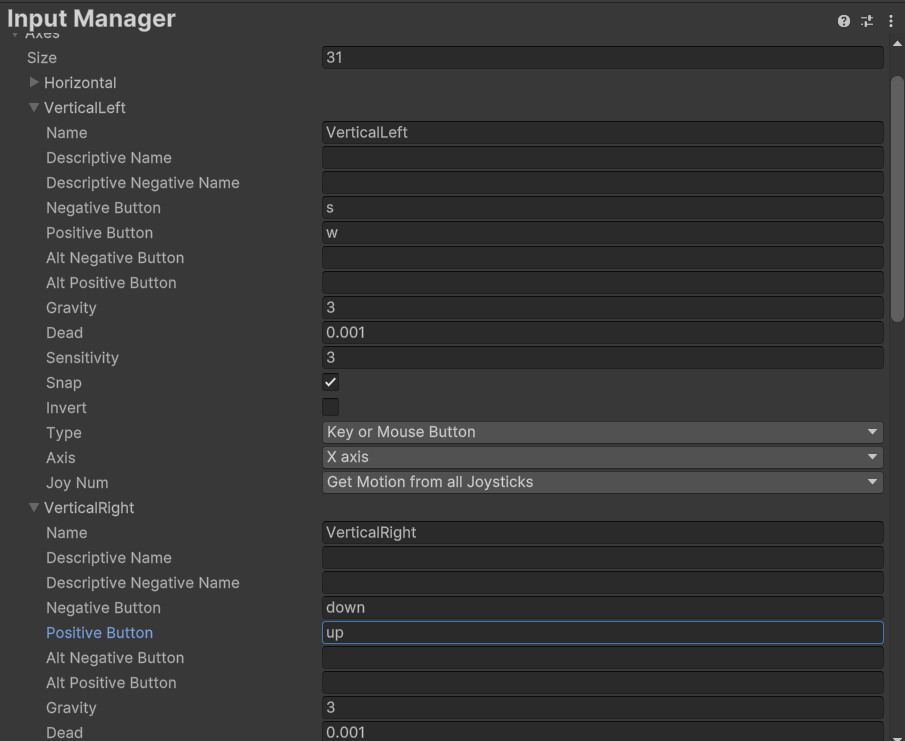

:::info[Sobre el Input Manager]
El **Input Manager** es una herramienta de Unity que nos permite gestionar los ejes de entrada y las teclas que utilizaremos en el juego. Podemos crear nuevos ejes, duplicar ejes existentes y cambiar las propiedades de cada eje para ajustarlas a nuestras necesidades.
:::

:::note[Sobre los ejes de entrada]
Los ejes de entrada son una forma de gestionar las entradas del jugador en Unity. Estos ejes nos permiten asignar teclas y botones a acciones específicas en el juego. Por ejemplo, podemos asignar la tecla **w** para mover hacia arriba y la tecla **s** para mover hacia abajo. 
Esto nos permite gestionar las entradas del jugador de forma más sencilla y flexible.
:::

#### Creando el Script de las palas

Vamos a crear un nuevo Script para las palas. Para ello, hacemos clic derecho en la carpeta **Scripts** y seleccionamos **Create -> C# Script**. Vamos a llamarlo **Player** y lo abrimos con el editor de código. 

Comenzaremos igual que antes asignando unas cuantas variables que necesitaremos para el movimiento de las palas. En este caso, vamos a necesitar una variable pública de tipo **float** que llamaremos **speed** y le daremos un valor de 5.0f. Esta variable será la velocidad a la que se moverán las palas.

Al igual que con la bola, podemos modificarla desde el editor para ir ajustando la velocidad que más nos guste. 

Añadiremos también una variable pública de tipo **Rigidbody2D** que llamaremos **rb**. Esta variable contendrá la referencia al componente **Rigidbody2D** de la pala. Más adelante se lo asignaremos arrastrándolo desde el editor.

También añadiremos una variable privada de tipo float llamada **verticalInput** que contendrá la entrada vertical del jugador. Esta variable la utilizaremos para mover la pala hacia arriba y hacia abajo.

Por último, también añadiremos otra variable privada de tipo **Vector2** llamada **startPos** que contendrá la posición inicial de la pala. Esta variable la utilizaremos para reiniciar la posición de la pala cuando un jugador pierda un punto.

```csharp title="Player.cs"
using UnityEngine;

public class Player : MonoBehaviour
{
    // highlight-start
    public float speed = 5f; // This is set in the inspector
    public Rigidbody2D rb; // This is set in the inspector
    private float verticalInput = 0f;
    private Vector2 startPos; // Represents the initial transform position of the gameobject
    // highlight-end

    // Start is called once before the first execution of Update after the MonoBehaviour is created
    void Start()
    {
        // highlight-next-line
        startPos = transform.position;
    }

    // Update is called once per frame
    void Update()
    {

    }
}
```

A continuación comenzaremos a programar el movimiento de la pala. Para ello, en el método **Update()** vamos a asignar la variable **verticalInput** a la entrada vertical del jugador. Para ello, utilizaremos la función **Input.GetAxisRaw()** y le pasaremos el nombre del eje que queremos utilizar.
En este caso, utilizaremos el eje **VerticalLeft** para la pala izquierda y el eje **VerticalRight** para la pala derecha. Pero antes de hacer esa distinción probaremos con el **VerticalLeft** para ambas palas y luego ya lo separaremos.

Detectamos el movimiento y después aplicamos velocidad al igual que con la pelota anteriormente usando el **Rigidbody2D** de la pala. Para ello, utilizamos la propiedad **velocity** del **Rigidbody2D** de la pala y le asignamos un nuevo vector con la dirección y la velocidad deseada.
Para ello, utilizamos la propiedad **linearVelocity** del **Rigidbody2D** de la pala y le asignamos un nuevo vector con la dirección y la velocidad deseada.

```csharp title="Player.cs"
...
    // highlight-start
    void Update()
    {
        verticalInput = Input.GetAxisRaw("VerticalLeft");
        rb.velocity = new Vector2(rb.linearVelocity.x, verticalInput * speed);
    }
    // highlight-end
}
```

:::info[Sobre el Input.GetAxisRaw()]
La función **Input.GetAxisRaw()** nos permite obtener la entrada del jugador de forma más precisa y rápida. Esta función devuelve un valor entre -1 y 1, donde -1 representa la entrada negativa (hacia abajo) y 1 representa la entrada positiva (hacia arriba).
Esto nos permite mover la pala hacia arriba y hacia abajo de forma más precisa y rápida.
:::

:::nota[Input.GetAxisRaw() vs Input.GetAxis()]
La función **Input.GetAxis()** nos permite obtener la entrada del jugador de forma más suave y gradual. Esta función devuelve un valor entre -1 y 1, donde -1 representa la entrada negativa (hacia abajo) y 1 representa la entrada positiva (hacia arriba).
Sin embargo, esta función puede ser un poco más lenta y menos precisa que **Input.GetAxisRaw()**.

Para este juego, utilizaremos **Input.GetAxisRaw()** para obtener la entrada del jugador de forma más precisa y rápida. Sin embargo, si queremos un movimiento más suave y gradual, podemos utilizar **Input.GetAxis()**.
:::

Si ejecutamos, veremos como podemos mover ambas palas con las teclas W y S.

:::warning[Si no se mueve la pala]
Si la pala no se mueve, asegúrate de que el componente **Rigidbody2D** está asignado correctamente en el editor. Para ello, selecciona la pala en la jerarquía y en el componente **Player** arrastra el componente **Rigidbody2D** de la pala al campo **rb** desde el propio inspector.
:::

Vamos a separar los controles de las palas para que cada una tenga su propio control. Para ello, vamos a crear una variable pública de tipo **boolean** que llamaremos **isPlayerLeft**. Esta variable nos servirá para distinguir entre la pala izquierda y la pala derecha.
Vamos a ponerla en **true** para la pala izquierda y en **false** para la pala derecha.

Además, en el propio método **Update()** vamos a comprobar si la pala es la izquierda o la derecha. Para ello, utilizaremos un **if** y comprobaremos si la variable **isPlayerLeft** es **true** o **false**.
Si es **true**, utilizaremos el eje **VerticalLeft** y si es **false**, utilizaremos el eje **VerticalRight**.

```csharp title="Player.cs"
...
    public bool isPlayerLeft = true; // This is set in the inspector

    void Update()
    {
        if (isPlayerLeft)
        {
            verticalInput = Input.GetAxisRaw("VerticalLeft");
        }
        else
        {
            verticalInput = Input.GetAxisRaw("VerticalRight");
        }
        rb.velocity = new Vector2(rb.linearVelocity.x, verticalInput * speed);
    }
}
```

Tras realizar estos cambios, en el inspector de cada pala podemos ver la variable **isPlayerLeft** y podemos marcarla como **true** o **false**.
Si marcamos la pala izquierda como **true** y la pala derecha como **false**, ahora podremos mover ambas palas con las teclas W y S para la pala izquierda y las flechas arriba y abajo para la pala derecha.

Podemos probar a ejecutar el juego y ver como ambas palas se mueven correctamente.

Por último, al igual que habíamos hecho con la pelota, vamos a añadir un método en el Script de las palas que nos permita reiniciar la posición de la pala al inicio del juego. 

Este método se llamará **Reset()** y simplemente le asignará la posición inicial de la pala a la posición actual de la misma.

```csharp title="Player.cs"
...
    public void Reset()
    {
        rb.linearVelocity = Vector2.zero;
        transform.position = startPos;
    }
}
```

### Marcar puntos y Sistema de puntuación

Antes de continuar podemos organizar un poquito la escena creando un GameObject vacío y llamándolo "Map" o "Escencario" y metiendo dentro de él todos los objetos que hemos creado hasta ahora. Esto nos ayudará a mantener la jerarquía más ordenada y a identificar más fácilmente los objetos del juego.

Para ello, hacemos clic derecho en la jerarquía y seleccionamos **Create Empty**. Esto creará un nuevo GameObject vacío en la jerarquía. Vamos a renombrarlo a **Map** o **Escenario** y arrastramos todos los objetos que hemos creado hasta ahora dentro de este nuevo GameObject.

Ahora que ya tenemos las palas y la pelota funcionando, vamos a añadir un sistema de puntuación al juego. Para ello, vamos a crear un nuevo Script que se encargará de gestionar la puntuación del juego.

Vamos a crear un nuevo Script llamado **GameManager** y lo abrimos con el editor de código. Este Script se encargará de gestionar la puntuación del juego y de reiniciar la posición de la pelota y las palas cuando un jugador pierda un punto.

Vamos a crear una variable pública de tipo **int** que llamaremos **leftScore** y otra que llamaremos **rightScore**. Estas variables se encargarán de almacenar la puntuación de cada jugador. 

Además, vamos a añadir 3 variables de tipo **GameObject** que llamaremos **leftPlayer**, **rightPlayer** y **ball**. Estas variables se encargarán de almacenar las referencias a las palas y la pelota. Las usaremos básicamente para tras cada punto llamar a los métodos **Reset()** de las palas y la pelota.

Vamos a añadir también dos variables públicas de tipo **TextMeshProUGUI** que llamaremos **leftScoreText** y **rightScoreText**. Estas variables se encargarán de almacenar las referencias a los textos que mostrarán la puntuación de cada jugador.

:::info[Sobre el TextMeshProUGUI]
El **TextMeshProUGUI** es un componente de Unity que nos permite mostrar texto en la pantalla de forma más avanzada y con más opciones de personalización que el componente **Text**. Este componente nos permite cambiar el tamaño, el color, la fuente y muchas otras propiedades del texto.  
Para utilizar este componente, debemos importar el paquete **TextMeshPro** desde el **Package Manager** de Unity. Una vez importado, podemos añadir el componente **TextMeshProUGUI** a cualquier GameObject y utilizarlo para mostrar texto en la pantalla.    
Podemos crear un nuevo objeto de tipo **TextMeshProUGUI** desde la pestaña de la jerarquía y seleccionando **UI -> Text - TextMeshPro**. Esto creará un nuevo objeto de texto en la escena. 
Podemos cambiar el texto, el tamaño, el color y muchas otras propiedades desde el inspector.
:::

Las variables del script nos quedarán tal que así:

```csharp title="GameManager.cs"
using UnityEngine;

public class GameManager : MonoBehaviour
{
    public GameObject ball, playerLeft, playerRight;
    public int leftPlayerScore, rightPlayerScore;
    public TMPro.TextMeshProUGUI playerLeftScoreText, playerRightScoreText;
}
```

Todas las referencias a los GameObject y TextMeshProUGUI las arrastraremos desde el editor al script para asignarlas.

Ahora añadiremos a este Script un método para resetear las posiciones de la pelota y las palas. Este método se llamará **ResetPositions()** y simplemente llamará a los métodos **Reset()** de las palas y la pelota.

Para acceder a los métodos **Reset()** de las palas y la pelota, utilizaremos las variables que hemos creado anteriormente. Y para acceder a los componentes de los Scripts que contienen los métodos, utilizaremos la función **GetComponent()**.

```csharp title="GameManager.cs"
using UnityEngine;

public class GameManager : MonoBehaviour
{
    public GameObject ball, playerLeft, playerRight;
    public int leftPlayerScore, rightPlayerScore;
    public TMPro.TextMeshProUGUI playerLeftScoreText, playerRightScoreText;

    // This method is called to reset the ball and players to their starting positions
    private void ReserPositions()
    {
        // highlight-next-line
        ball.GetComponent<Ball>().Reset();
        playerLeft.GetComponent<Player>().Reset();
        playerRight.GetComponent<Player>().Reset();
    }
}

```

:::info[Sobre el GetComponent()]
La función **GetComponent()** nos permite acceder a los componentes de un GameObject. Esto es útil para acceder a los métodos y propiedades de los componentes de un GameObject.
En este caso, estamos utilizando **GetComponent\<Ball\>()** para acceder al componente **Ball** de la pelota y **GetComponent\<Player\>()** para acceder al componente **Player** de las palas. 
Esto nos permite llamar a los métodos **Reset()** de las palas y la pelota desde el Script **GameManager**.
:::

Con el método **ResetPositions()** creado, vamos a añadir un método que se encargue de marcar un punto al jugador que haya marcado el gol. Este método se llamará **ScorePoint()** y recibirá un parámetro de tipo **bool** que nos indicará si el jugador que ha marcado el gol es el izquierdo o el derecho.

Este método se encargará de aumentar la puntuación del jugador que ha marcado el gol y de actualizar el texto de la puntuación en la pantalla.
Para ello, utilizaremos un **if** y comprobaremos si el jugador que ha marcado el gol es el izquierdo o el derecho. Si es el izquierdo, aumentaremos la puntuación del jugador izquierdo y actualizaremos el texto de la puntuación del jugador izquierdo. Si es el derecho, haremos lo mismo pero con el jugador derecho.

```csharp title="GameManager.cs"    
using UnityEngine;

public class GameManager : MonoBehaviour
{
    public GameObject ball, playerLeft, playerRight;
    public int leftPlayerScore, rightPlayerScore;
    public TMPro.TextMeshProUGUI playerLeftScoreText, playerRightScoreText;

    // This method is called when the ball enters the goal area (the trigger collider)
    public void GoalScored(bool isPlayerLeft)
    {
        if (isPlayerLeft)
        {
            leftPlayerScore++;
            playerLeftScoreText.text = leftPlayerScore.ToString();
        }
        else
        {
            rightPlayerScore++;
            playerRightScoreText.text = rightPlayerScore.ToString();
        }
        ReserPositions();
    }

    // This method is called to reset the ball and players to their starting positions
    private void ReserPositions()
    {
        ball.GetComponent<Ball>().Reset();
        playerLeft.GetComponent<Player>().Reset();
        playerRight.GetComponent<Player>().Reset();
    }
}

```

Para poner en marcha todo esto vamos a necesitar por un lado, crear los textos para mostrar la puntuación y por otro lado, crear los triggers para detectar cuando la pelota entra en la portería.

En primer lugar crearemos las porterías si no las habíamos creado ya. 

Para ello, crearemos dos sprites rectangulares como los de las barras superior e inferior y los posicionaremos fuera de cámara. Uno a la izquierda de la pala izquierda y otro a la derecha de la pala derecha, de forma que sea imposible que la pelota pase por ahí tras rebotar sin que la pala lo toque.

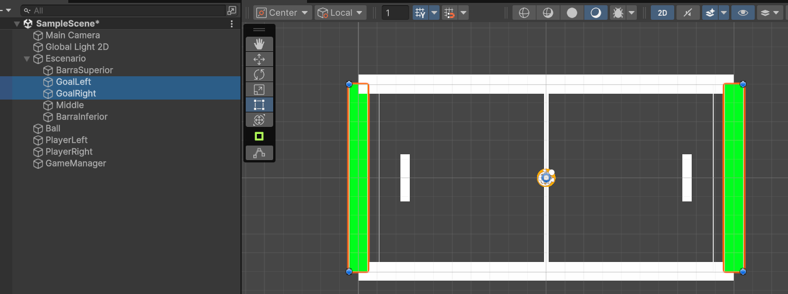

Una vez tengamos las porterías colocadas, simplemente les añadiremos un componente **Box Collider 2D** y marcaremos la opción **Is Trigger**. Esto hará que el collider actúe como un trigger y no como un collider normal, es decir, no afectará a la física de los objetos que colisionen con él.

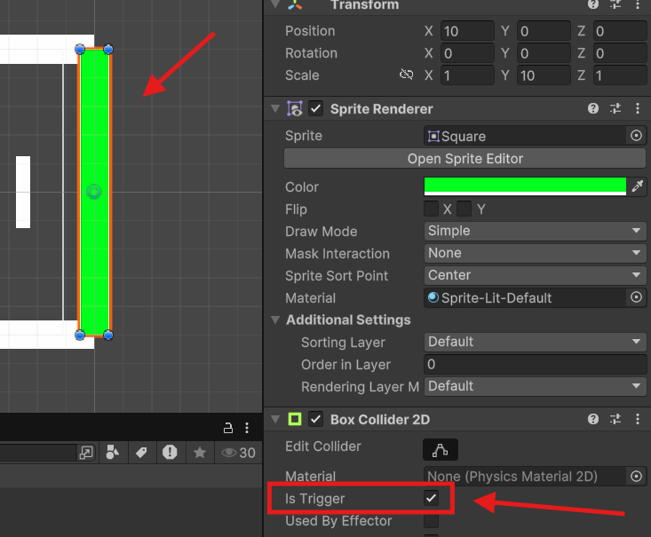

:::info[Sobre los triggers]
Los **triggers** son colisionadores que no afectan a la física de los objetos que colisionan con ellos. Esto significa que los objetos pueden atravesar el trigger sin ser afectados por la física. Sin embargo, podemos detectar cuando un objeto entra o sale del trigger utilizando los métodos **OnTriggerEnter2D()** y **OnTriggerExit2D()**.
:::

Una vez creados los triggers de las porterías, vamos a hacer que se detecte cuando la pelota entra en la portería. Para ello, vamos a crear un nuevo Script llamado **Goal** y lo abrimos con el editor de código.

```csharp title="Goal.cs"	
using UnityEngine;

public class Goal : MonoBehaviour
{
    // highlight-next-line
    public bool isPlayerLeftGoal; // This is set in the inspector

    // This method is called when the ball enters the goal area (the trigger collider)
    private void OnTriggerEnter2D(Collider2D collision)
    {
        if (collision.gameObject.CompareTag("Ball"))
        {
            if (isPlayerLeftGoal)
            {
                FindAnyObjectByType<GameManager>().GoalScored(true); // true to score a foal of the left player
            }
            else
            {
                FindAnyObjectByType<GameManager>().GoalScored(false); // false to score a goal of the right player
            }
        }
    }
}
```

Para poder detectar la colisión con la pelota, utilizamos el método **OnTriggerEnter2D()**. Este método se llama automáticamente cuando un objeto entra en el trigger. En este caso, estamos comprobando si el objeto que ha entrado en el trigger es la pelota utilizando la función **CompareTag()**.

Si el objeto que ha entrado en el trigger es la pelota, llamamos al método **GoalScored()** del **GameManager** y le pasamos un parámetro de tipo **bool** que indica si el jugador que ha marcado el gol es el izquierdo o el derecho.

Debemos acordarnos también de asignar la etiqueta **Ball** a la pelota para que el método **CompareTag()** funcione correctamente. Para ello, seleccionamos la pelota en la jerarquía y en el componente **Tag** seleccionamos la etiqueta **Ball** (si no existe, la creamos).

En el script podemos ver como hemos creado una variable pública de tipo **bool** que llamamos **isPlayerLeftGoal**. Esta variable nos servirá para distinguir entre la portería izquierda y la portería derecha. La pondremos en **true** para la portería derecha y en **false** para la portería izquierda, ya que cuándo es verdadero es cuándo ha sido el jugador de la izquierda el que ha marcado, por eso se pone en la contraria.

Además, como podemos observar estamos utilizando la función **FindAnyObjectByType()** para acceder al componente **GameManager**. Esta función nos permite buscar un objeto en la escena por su tipo y acceder a sus componentes. En este caso, estamos buscando el componente **GameManager** y llamando al método **GoalScored()** para marcar el gol.

Una vez creado el script, lo arrastramos a los dos triggers de las porterías y asignamos la variable **isPlayerLeftGoal** a **true** para la portería derecha y a **false** para la portería izquierda.

A continuación, vamos a crear los textos para mostrar la puntuación de cada jugador. Para ello, hacemos clic derecho en la jerarquía y seleccionamos **UI -> Text - TextMeshPro**. Esto creará un nuevo objeto de texto en la escena.

Opcionalmente al añadir un TextMeshProUGUI, Unity nos preguntará si queremos importar el paquete de TextMeshPro. Si no lo hemos hecho ya, le decimos que sí y lo importamos. Esto creará una carpeta llamada **TextMesh Pro** en la carpeta **Assets** y añadirá los archivos necesarios para utilizar TextMeshPro en nuestro proyecto.

También nos preguntará si queremos añadir el **TMP Essentials**. Le decimos que sí y lo añadimos. Esto añadirá los archivos necesarios para utilizar TextMeshPro en nuestro proyecto. Y por último, nos preguntará si queremos añadir el **TMP Examples & Extras**. Podemos añadirlo o no, pero no es necesario para este proyecto.

Con el objeto de texto creado, lo renombramos a **LeftScore** y lo posicionamos en la parte superior izquierda de la pantalla. Hacemos lo mismo con el otro objeto de texto y lo renombramos a **RightScore** y lo posicionamos en la parte superior derecha de la pantalla.

Para posicionar los textos, podemos utilizar el componente **Rect Transform** del objeto de texto. Este componente nos permite cambiar la posición, el tamaño y la escala del objeto de texto en la pantalla. Podemos cambiar la posición del objeto de texto arrastrándolo en la escena o cambiando los valores de la propiedad **Pos X** y **Pos Y** en el inspector.

También es cómodo posicionarlo pulsando sobre el botón de anclaje y seleccionando la posición que queremos. En este caso, seleccionamos la parte superior izquierda para el texto de la izquierda y la parte superior derecha para el texto de la derecha.

Modificamos ambos textos poniendo un valor inicial de 0 y cambiamos el tamaño de la fuente a 50. También podemos cambiar el color del texto y la alineación del texto desde el inspector. Para ello, seleccionamos el objeto de texto y en el componente **TextMeshProUGUI** cambiamos las propiedades que queramos.

En este ejemplo, para darle un toque más adecuado, estamos usando la fuente **Electronic Highway** que viene por defecto con los ejemplos de TextMeshPro para darle un toque retro.

Así queda en nuestro ejemplo:

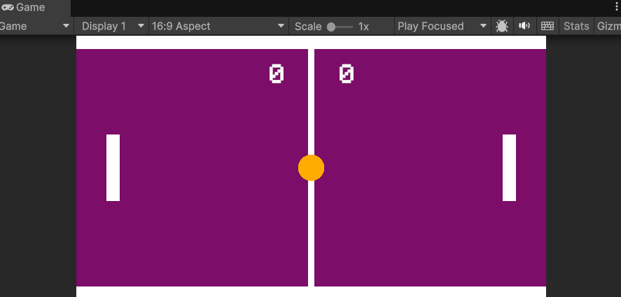

Una vez añadidos a la escena ahora debemos asignarselos a las referencias del **GameManager** junto con el resto de elementos declarados en el script. Para ello, seleccionamos el objeto **GameManager** en la jerarquía y arrastramos los objetos de texto a las variables **ScoreLeft** y **ScoreRight** desde el inspector, junto con todas las demás:

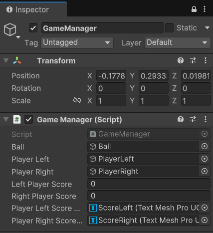

Si hemos hecho todo correctamente, al ejecutar el juego ahora deberíamos ver los textos de la puntuación en la pantalla y al marcar un gol, la puntuación debería actualizarse correctamente.

El juego ya es "jugable", pero todavía podemos añadir algunas mejoras para pulirlo. 

A continuación iremos añadiendo detalles como que la pelota vaya más rápido al chocar con las palas, añadir una pequeña "IA" para que la pala derecha juegue sola y un menú de inicio y fin de partida.

## Haciendo la versión PVE (Player vs Environment)

Antes de ponernos a hacer menús ni a hacer que el juego termine tras marcar una serie de puntos, vamos a aprovechar esta versión inicial para probar a programar la versión PVE.

PVE significa **Player vs Environment**, es decir, el jugador contra el entorno. En este caso, el entorno será la pala derecha que se moverá sola para intentar interceptar la pelota.

Para programar este comportamiento, vamos a comenzar por crear un nuevo Script llamado **AIPlayer** y lo abrimos con el editor de código.

Este Script será el encargado de mover la pala dependiendo de la posición de la pelota, esto podemos hacerlo de muchas formas, a partir de la referencia de la pelota o a partir de la posición de la pala. En este caso, lo haremos a partir de la posición de la pelota, ya que es más sencillo y nos permitirá hacer una IA más sencilla.

También podríamos hacer que la pala se moviese de forma aleatoria o que se moviese de forma más inteligente, pero en este caso lo haremos de forma sencilla para que la pala siga la pelota.

Lo que nos interesa entonces es conocer la posición en el eje Y de la pelota y la pala. Para ello, crearemos una variable pública de tipo **GameObject** que llamaremos **ball**. Esta variable contendrá la referencia a la pelota y la arrastraremos desde el editor al script para asignarla una vez tengamos el Script añadido a la pala derecha.

Lo que vamos a hacer es que dependiendo de si la pelota está por encima o por debajo de la pala, la pala se moverá hacia arriba o hacia abajo. Esto lo haremos también en base a una velocidad que le daremos a la pala, por lo que crearemos una variable de tipo **float** que llamaremos **speed** y le daremos un valor de 5.0f. Esta variable será la velocidad a la que se moverá la pala.

Jugando con esta variable y con la velocidad de la pala podríamos hacer la dificultad variable en el futuro.

```csharp title="AIPlayer.cs"
using UnityEngine;

public class AIPlayer : MonoBehaviour
{

    [SerializeField] private float speed = 3f;

    public GameObject ball;

    private Vector2 ballPosition;

    // Update is called once per frame
    void Update()
    {
        // Ejecutamos Movement en el Update para que compruebe a dónde moverse en cada frame
        Movement();
    }

    private void Movement()
    {
        ballPosition = ball.transform.position; // Posición de la pelota

        if (transform.position.y > ballPosition.y) // Si la posición de la IA es mayor que la de la pelota, se mueve hacia abajo
        {
            transform.Translate(Vector2.down * speed * Time.deltaTime);
            // También se podría hacer así: transform.position += new Vector3(0, -speed * Time.deltaTime, 0);
        }
        else if (transform.position.y < ballPosition.y) // Si la posición de la IA es menor que la de la pelota, se mueve hacia arriba
        {
            transform.Translate(Vector2.up * speed * Time.deltaTime);
        }
    }
}
```

:::info[Sobre el SerializeField]
El atributo **[SerializeField]** nos permite serializar una variable privada para que aparezca en el inspector de Unity. Esto es útil para poder modificar la variable desde el inspector sin necesidad de hacerla pública.
:::

Le asignamos el Script a la pala de la derecha y arrastramos la pelota al campo **ball** desde el editor. Esto hará que la pala de la derecha siga la pelota y se mueva hacia arriba o hacia abajo dependiendo de la posición de la pelota.

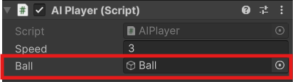

Si ejecutamos el juego podemos probar como la pala de la derecha se mueve sola para intentar interceptar la pelota. Si la pelota va muy rápido, la IA no podrá interceptarla, pero si la pelota va despacio, la IA podrá interceptarla sin problemas.

Decir que podemos alternar entre el PVP y el PVE simplemente desactivando el Script de la IA o el de la pala derecha. De esta forma podemos jugar contra un amigo o contra la IA.

:::warning[Si la bola rebota horizontalmente]
Hay que tener en cuenta que en el punto del desarrollo que estamos ahora mismo puede ser que nos encontremos con un bug que hace que la pelota rebote de forma horizontal indefinidamente y la partida no avance. Esto es un bug que ocurre cuando la pelota rebota contra la pala y la pala se mueve hacia arriba o hacia abajo al mismo tiempo. 

Para solucionarlo, podemos añadir una pequeña fuerza a la pelota al chocar con la pala para que no rebote de forma horizontal indefinidamente. Ya veremos en futuros ejemplos como se implementa esto.
:::

:::warning[Si tras el primer gol la pala derecha se va al medio]
Como vamos a dejar de activar el Script de Player en la versión PVE debemos añadir una variable booleana para no resetear la posición de la pala derecha en la versión PVE, ya que si no intentará hacerlo pero como no tiene la posición inicial puede darnos un bug en el que tras el primer gol la pala derecha se posicione en la línea central.

Algo así:
```csharp title="GameManager.cs"
using System;
using UnityEngine;

public class GameManager : MonoBehaviour
{

...
// highlight-next-line
    public Boolean pvp;

...

    // This method is called to reset the ball and players to their starting positions
    private void ReserPositions()
    {
        ball.GetComponent<Ball>().Reset();
        playerLeft.GetComponent<Player>().Reset();
        // highlight-next-line
        if (pvp)
        {
            playerRight.GetComponent<Player>().Reset();
        }
    }
}


Ahora que la versión PVE está funcionando, puede ser que si le damos demasiada velocidad a la IA, la pelota no pueda pasar por la pala y no podamos marcar puntos. 

Para evitar esto, podemos hacer varias cosas, como añadir un límite a la posición de la pala para que no se mueva más allá de un punto determinado. 

Pero esto puede parecer algo injusto, en lugar de eso, vamos a hacer que conforme avance la partida, la pelota vaya cogiendo más y más velocidad, lo cuál también hará las partidas PVP algo más interesantes según avanza el punto. 

Para ello, vamos a irnos al Script de la pelota y vamos a añadir una variable pública de tipo **float** que llamaremos **speedMultiplier**. Esta variable será la velocidad a la que se multiplicará la velocidad de la pelota cada vez que colisione con una de las palas.

Podríamos hacer que subiese la velocidad también al chocar con las barras, pero si probáis esto veréis que el **GameFeel** no es el mismo y puede parecer injusto que de repente la pelota salgo algo más *disparada* de lo que el usuario espera tras chocar con una pared superior o inferior. 

De todas formas sentíos libres de probar lo que queráis y dejar el juego a vuestro completo gusto.

:::info[Sobre el GameFeel]
El **GameFeel** es la sensación que tiene el jugador al jugar a un juego. Esto incluye la velocidad, la física, la animación y muchos otros aspectos del juego. Un buen **GameFeel** hace que el juego sea más divertido y agradable de jugar.
:::

```csharp title="Ball.cs"

using UnityEngine;

public class Ball : MonoBehaviour
{
    public float speed = 5f;
    public Rigidbody2D rb;
    private Vector2 startPos;
    // highlight-next-line
    public float speedMultiplier = 0.1f; // This is set in the inspector

    ...
     /* El resto del código del Script*/
    ...

    private void OnCollisionEnter2D(Collision2D other)
    {
        if (other.gameObject.CompareTag("Player"))
        {
            rb.linearVelocity *= 1 + speedMultiplier;
        }
    }
}
```

Fijaos que lo que estamos haciendo es multiplicar la velocidad del Rigidbody2D de la pelota cuándo colisiona con alguno de los elementos tagueados con **Player**. Esto hará que la velocidad de la pelota aumente cada vez que colisione con una de las palas.

Si no os funciona, aseguraos de que la pala tiene la etiqueta **Player**. Para ello, seleccionamos la pala en la jerarquía y en el componente **Tag** seleccionamos la etiqueta **Player** (si no existe, la creamos).

Vamos a aprovechar que estamos editando este Script para solucionar el posible error que nos encontrábamos antes de tener de repente un rebote completamente horizontal de la pelota.

Para ello, vamos a añadir el siguiente código al Script y ahora explicamos en qué consiste y cuándo utilizarlo:

```csharp
    private void VelocityFix()
    {
        float velocidadDelta = 0.5f; // Velocidad que queremos que aumente la bola
        float velocidadMinima = 0.2f; // Velocidad mínima que queremos que tenga la bola

        if (Mathf.Abs(rb.linearVelocityX) < velocidadMinima) // Si la velocidad de la bola en el eje x es menor que la mínima
        {
            velocidadDelta = Random.value < 0.5f ? velocidadDelta : -velocidadDelta; // Elegimos un valor aleatorio entre -0.5 y 0.5
            rb.linearVelocity = new Vector2(rb.linearVelocityX + velocidadDelta, rb.linearVelocityY); // Aumentamos la velocidad de la bola
        }

        if (Mathf.Abs(rb.linearVelocityY) < velocidadMinima) // Si la velocidad de la bola en el eje y es menor que la mínima
        {
            velocidadDelta = Random.value < 0.5f ? velocidadDelta : -velocidadDelta; // Elegimos un valor aleatorio entre -0.5 y 0.5
            // Otra forma de aumentar la velocidad (esta vez en el eje y)
            rb.linearVelocity += new Vector2(0f, velocidadDelta); // Aumentamos la velocidad de la bola
        }
    }
```

Esta función se encargará de comprobar si la velocidad de la pelota es menor que un valor mínimo y si es así, aumentará la velocidad de la pelota en una dirección aleatoria. Esto hará que la pelota no rebote de forma horizontal indefinidamente y que la velocidad de la pelota aumente con el tiempo.

La cuestión ahora es, en qué momento llamamos a esta función. Debemos tener en cuenta que en nuestro juego el problema está cuándo la pelota deja de tener velocidad en Y mínima, es decir, si la pelota se queda rebotando entre las dos palas y las mismas, sin moverse, no pueden hacer que la dirección de la pelota cambie. 

El caso en el que la pelota se queda rebotando entre las dos paredes superior e inferior es muy improbable, pero lo tenemos en cuenta en el método por si acaso, pero no lo vamos a utilizar de momento.

Partiendo de estos problemas y posibles soluciones, el momento de llamar a este método entonces es cuándo el movimiento es casi completamente horizontal y la peltoa está rebotando entre las dos palas, por lo que incluiremos la llamada a este método en el método **OnCollisionEnter2D()** y, en concreto, justo después de aumentar la velocidad de la pelota al chocar con una pala. De esta forma, si la pelota se queda rebotando entre las dos palas, la velocidad de la pelota aumentará y cambiará de dirección.

El código completo del método **OnCollisionEnter2D()** quedaría así:

```csharp title="Ball.cs"
    private void OnCollisionEnter2D(Collision2D other)
    {
        if (other.gameObject.CompareTag("Player"))
        {
            rb.linearVelocity *= 1 + speedMultiplier;
            VelocityFix(); // Llamamos a la función para arreglar la velocidad de la bola
        }
    }
```

:::tip[Sobre el Mathf.Abs()]
La función **Mathf.Abs()** nos permite obtener el valor absoluto de un número. Esto es útil para comprobar si un número es mayor o menor que otro número sin importar si es positivo o negativo. En este caso, estamos utilizando **Mathf.Abs()** para comprobar si la velocidad de la pelota en el eje X o Y es menor que un valor mínimo. 
Esto nos permite asegurarnos de que la velocidad de la pelota es mayor que un valor mínimo y evitar que la pelota rebote de forma horizontal indefinidamente.
::: 

Ya tenemos una versión PVP y una versión PVE del juego funcionando. Ahora vamos a añadir un menú de inicio y un menú de fin de partida para que el juego sea más completo y tenga un mejor aspecto.

## Menú de inicio y fin de partida

### Creando varias escenas

Antes de ponernos a crear los menús, vamos a plantearnos que hay que crear varias escenas para poder tener un menú de inicio y un menú de fin de partida.

Además, tendría sentido crear una escena diferente para la versión PVP y otra para la versión PVE, así simplemente, dependiendo de la versión que queramos jugar, cargamos una escena u otra.

Vamos a hacer esto lo primero, si hemos seguido hasta ahora el ejemplo deberíamos tener una única escena llamada *SampleScene* o algo por el estilo si no la hemos renombrado. 

Vamos a renombrarla como PVP y vamos a desactivar el Script de **IAPlayer** de la pala derecha, dejando activado el de **Player**.

Una vez hecho esto, desde el menú de **Assets** nos vamos a la carpeta **Scenes** y seleccionando nuestra escena, pulsamos **control + D** para duplicarla y renombramos la copia como PVE. 

Hacemos doble click sobre la escena PVE recién renombrada y ahora en la jerarquía debería de aparecernos el nombre de la escena recién seleccionada. 

Vamos de nuevo al GameObject de la pala derecha y esta vez activamos el Script de **IAPlayer** dejando desactivado su contraparte, el de **Player**.

Con estos simples cambios ya tenemos una escena para jugar PVP y otra para jugar PVE.

A continuación vamos a crear la escena para el menú principal.

### Creando el menú principal

Vamos a irnos a la carpeta de **Assets** y de nuevo, a la subcarpeta de **Scenes** y en ella haremos clic derecho y seleccionaremos **Create -> Scene -> Scene** y la renombraremos como *MainMenu* o algo por el estilo.

Vamos a incluir tanto esta escena recién creada como las de PVP y PVE en el **Build Profiles** de Unity. Para ello, vamos a **File -> Build Profiles -> Scene List** y en la ventana que se nos abre, arrastramos las tres escenas a la lista de escenas que se van a incluir en el build dentro del array de escenas llamado **Scene List**. 

Podéis ordenarlas en el orden que queráis pero quizás el de arriba a abajo sea el más lógico, es decir, primero el menú principal y luego las dos escenas de juego.

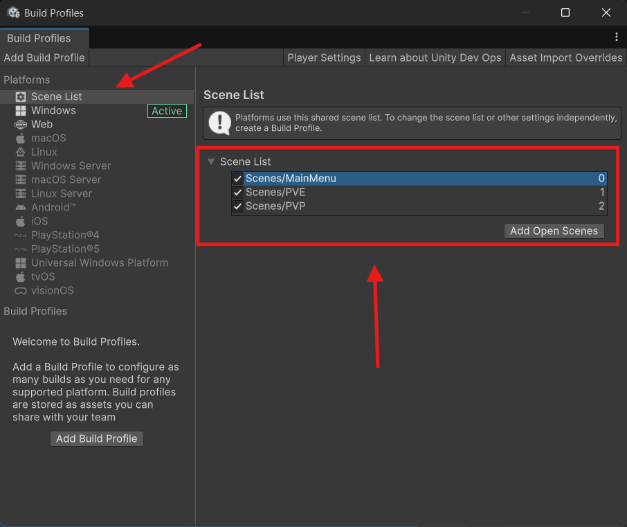

Una vez hecho esto hacemos doble clic sobre la escena recién creada y esto nos la cargará en la jerarquía. Deberíamos estar ante una escena vacía con una cámara por defecto y poco más como cuándo inciamos el proyecto.

Ahora lo que queremos ahcer es generar una UI a partir de un Canvas y con un título y un par de botones, uno para jugar una partida PVP y otro para jugar una partida PVE. 

El cómo posicionar los elementos o la parte visual la dejo completamente a vuestra elección, lo importante de este menú es hacer que cada uno de los botones cargue su correspondiente escena.

Para ello, vamos a crear un Script llamado **MainMenu** y lo abrimos con el editor de código. Este Script se encargará de gestionar el menú principal y de cargar las escenas correspondientes al pulsar los botones.

Simplemente necesitamos un método por cada acción de clic que queramos hacer. En este caso, vamos a crear dos métodos, uno para cargar la escena PVP y otro para cargar la escena PVE.

Para poder trabajar con las escenas, debemos importar el espacio de nombres **UnityEngine.SceneManagement**. Esto nos permitirá utilizar la función **SceneManager.LoadScene()** para cargar las escenas.

```csharp title="MainMenu.cs"
using UnityEngine;
using UnityEngine.SceneManagement;

public class MainMenu : MonoBehaviour
{
    public void PVE()
    {
        // Load the CPU scene
        SceneManager.LoadScene("PVE");
    }

    public void PVP()
    {
        // Load the PVP scene
        SceneManager.LoadScene("PVP");
    }
}

```

:::info[Sobre el SceneManager]
El **SceneManager** es una clase de Unity que nos permite gestionar las escenas del juego. Esto incluye cargar, descargar y cambiar entre escenas. En este caso, estamos utilizando **SceneManager.LoadScene()** para cargar las escenas correspondientes al pulsar los botones del menú.
:::

Con la UI creada y los métodos del Script creados, ahora simplemente debemos asignar el Script al Canvas y arrastrar los botones a los métodos correspondientes desde el editor. Para ello, seleccionamos el botón en la jerarquía y en el componente **Button** arrastramos el objeto **MainMenu** al campo **On Click()**. Luego seleccionamos el método que queremos que se ejecute al pulsar el botón.

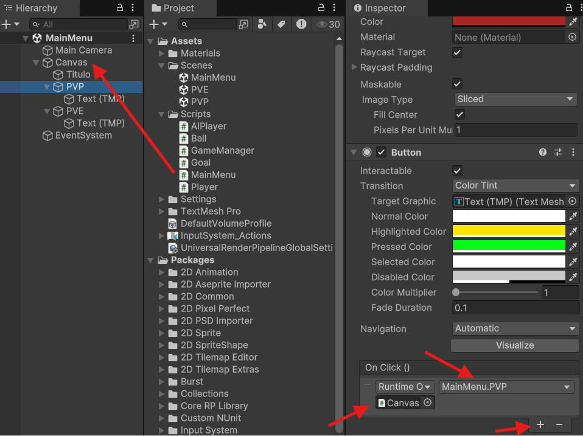

Vamos a dar también la opción de cerrar el juego al pulsar el botón de Escape. Para ello, vamos a añadir el siguiente código al Script **MainMenu**:

```csharp title="MainMenu.cs"
    private void Update()
    {
        if (Input.GetKeyDown(KeyCode.Escape))
        {
            Application.Quit();
        }
    }
```
:::info[Sobre el Application.Quit()]
El método **Application.Quit()** se encarga de cerrar la aplicación. Esto es útil para cerrar el juego al pulsar el botón de Escape. 

Sin embargo, este método solo funciona en la versión compilada del juego y no en el editor de Unity. 

Para probar que funciona la detección de la tecla podemos hacer un Log por consola:

```csharp title="MainMenu.cs"
    Debug.Log("Escape pressed, quitting the game...");
```
:::

Vamos a añadir junto con esto un pequeño mensaje en el menú principal para indicar que pulsando escape se puede salir del juego:

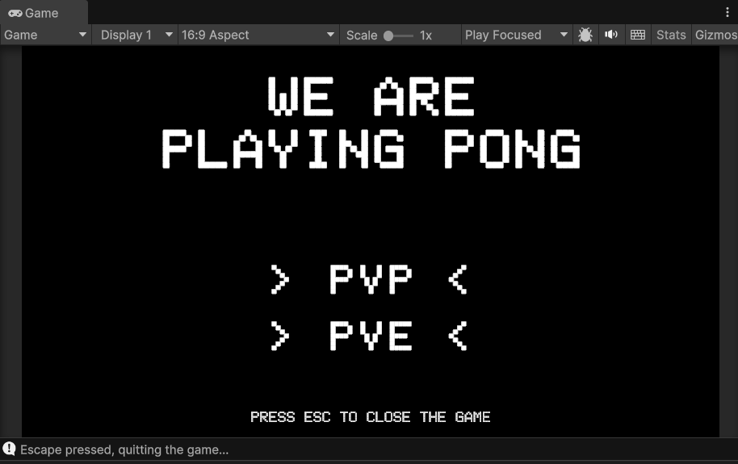

Lo siquiente que debemos hacer es crear una escena de fin de partida. 

Para ello hay que decidir tabién cuándo acaba una partida, esto lo dejo a vuestra elección, en este caso vamos a hacer que gane el primero que llegue a 5 puntos, pero podría hacerse también con un número limitado de puntos impar o algo por el estilo.

### Pantalla de ganador

