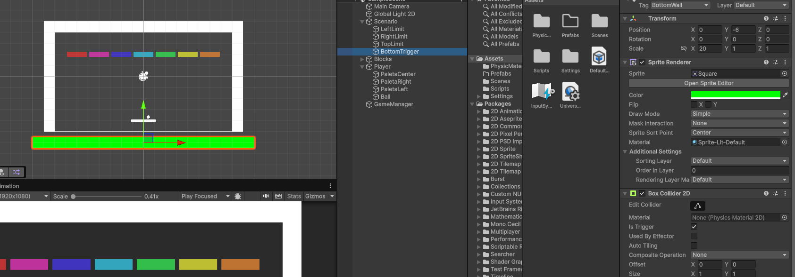
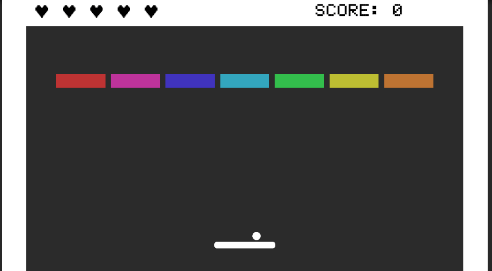
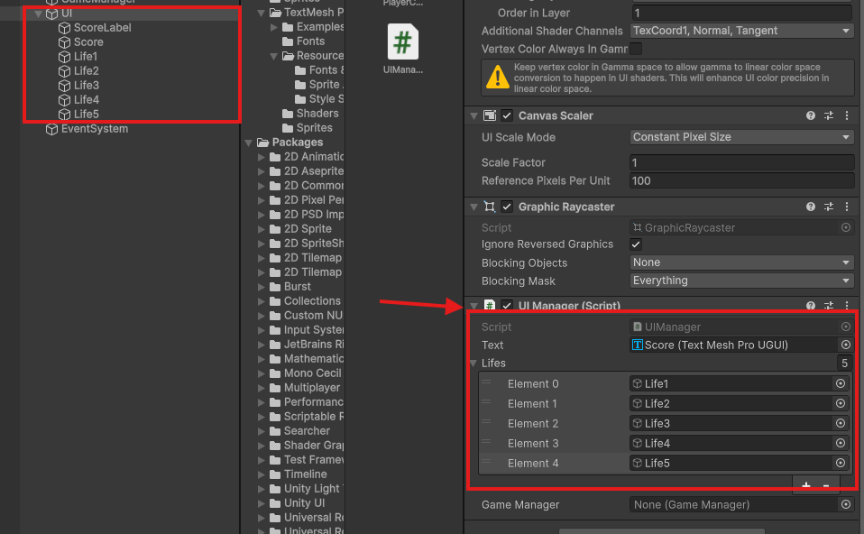

# Breakout

El videojuego Breakout es un clásico de los videojuegos, lanzado por Atari en 1976. Es un juego de arcade que consiste en controlar una paleta para hacer rebotar una bola y destruir bloques en la pantalla. El objetivo es eliminar todos los bloques sin dejar que la bola caiga al suelo.

También es conocido por ser uno de los primeros juegos en utilizar gráficos de píxeles y por su jugabilidad adictiva. A lo largo de los años, ha habido muchas versiones y variaciones del juego, pero la mecánica básica sigue siendo la misma.

Años más tarde, salió también el Arkanoid, que es una versión más moderna y compleja de Breakout, con nuevos elementos de juego y power-ups. Arkanoid se lanzó en 1986 y fue un gran éxito en las salas de arcade, convirtiéndose en un clásico por derecho propio.

Vamos a hacer nuestra versión de este juego en Unity 6.

## Creando el escenario

Partiremos de un proyecto nuevo en Unity 2D, y lo primero que haremos será crear un nuevo proyecto en blanco. Para ello, abrimos Unity Hub y creamos un nuevo proyecto 2D. Una vez creado el proyecto, lo abrimos y nos aparecerá la pantalla de bienvenida de Unity.

Una vez creado el proyecto seleccionaremos la disposición de ventanas que más nos guste para trabajar y nosotros comenzaremos cambiando el fondo de la cámara a un color sólido oscuro, da igual el que elijáis pero tened en cuenta que después deben distinguirse bien los bloques de colores típicos del juego.

También sería interesante en la pantalla de **Game** seleccionar una resolución apropiada para ir viendo como queda el escenario, nosotros utilizaremos FullHD en horizontal.

Empezaremos creando el escenario del juego, para ello, hay varios tutoriales que podemos seguir que nos ayudarán creando el escenario a partir de Sprites 2D. Podéis seguirlos sin problema, al final de esta sección anclaremos varios interesantes. 

Sin embargo, en esta versión intentaremos crear casi todo con figuras básicas de Unity, para ello, comenzaremos delimitando el escenario por los laterales y en la parte superior utilizando 3 rectángulos 2D posicionados justo en los límiites de la cámara, de la siguiente forma:


:::tip[Organiza el escenario]
Para organizar el escenario, es recomendable crear un objeto vacío llamado "Scenario" o "Walls" y agrupar los 3 rectángulos dentro de él. Esto nos permitirá moverlos y organizarlos mejor en la jerarquía.
:::

Una vez creadas y posicionadas debemos añadirle un BoxCollider2D para que la pelota pueda rebotar contra las paredes. Para ello, seleccionamos los 3 rectángulos y en el inspector, añadimos un nuevo componente de tipo Box Collider 2D. Esto nos permitirá detectar las colisiones entre la bola y las paredes.

A continuarción, crearemos varios bloques de diferentes colores posicionándolos en la escena de forma que ocupen una cuadrilla de ancho y media de alto más o menos, intentando reducir un poco el ancho para que se vea la separación entre ellos. 

Para crear estos bloques simplemente seguiremos añadiendo cuadrados 2D y cambiando su color, para ello, seleccionamos el cuadrado y en el inspector, en la parte de Sprite Renderer, seleccionamos el color que queramos. Comenzaremos con una fila con diferentes colores que más adelante utilizaremos para crear prefabs. 

Con los bloques creados, vamos a seleccionarlos todos y añadirles un BoxCollider 2D, para que puedan colisionar con la bola. Para ello, seleccionamos todos los bloques y en el inspector, añadimos un nuevo componente de tipo Box Collider 2D. Esto nos permitirá detectar las colisiones entre la bola y los bloques.

También vamos a crear un nuevo tag llamado "block" para poder identificar los bloques en el código. Para ello, vamos a la ventana de tags y layers, y añadimos un nuevo tag llamado "block". Luego, seleccionamos todos los bloques y les asignamos este tag.


:::tip[Organiza los bloques]
Para organizar los bloques, es recomendable crear un objeto vacío llamado "Blocks" y agrupar todos los bloques dentro de él. Esto nos permitirá moverlos y organizarlos mejor en la jerarquía.
:::

:::tip[Mover los bloques en la escenar]
Para mover los bloques y que ocupen siempre la misma distancia entre ellos es más fácil posicionarlos si los movemos manteniendo la tecla Control pulsada, lo cual hará que el objeto se mueva en pasos de 1 cuadrícula. Esto nos permitirá alinear los bloques de forma más sencilla.
:::

Con esto, ya tenemos el escenario básico del juego. Ahora vamos a crear la bola y la paleta.

Para crear la paleta, vamos a crear un nuevo objeto 2D de tipo cuadrado y lo posicionamos en la parte inferior de la pantalla. Luego, le cambiamos el tamaño para que sea más ancho que alto, vamos a añadir también dos círculos 2D a los extremos de la paleta para que se vea más realista. Para ello, creamos dos objetos 2D de tipo círculo y los posicionamos en los extremos de la paleta. Luego, le cambiamos el tamaño para que sean más pequeños que la paleta.

Con los tres elementos creados, vamos a seleccionarlos y agruparlos en un objeto vacío que llamaremos "Player". Para ello, seleccionamos los tres objetos y hacemos clic derecho en la jerarquía y seleccionamos "Create Empty Parent". Luego, le cambiamos el nombre al objeto vacío a "Player". Esto nos permitirá mover la paleta y los círculos juntos como un solo objeto.
Con la paleta creada, vamos a añadirle un BoxCollider 2D para que pueda colisionar con la bola. Para ello, seleccionamos la paleta y en el inspector, añadimos un nuevo componente de tipo Box Collider 2D. Esto nos permitirá detectar las colisiones entre la paleta y la bola.

Podemos ajustar el tamaño del BoxCollider 2D para que se ajuste al tamaño de la paleta. Para ello, seleccionamos el BoxCollider 2D y ajustamos el tamaño en el inspector. También podemos ajustar la posición del BoxCollider 2D para que se ajuste al tamaño de la paleta. Para ello, seleccionamos el BoxCollider 2D y ajustamos la posición en el inspector.


Ahora vamos con la pelota, para ello, vamos a crear un nuevo objeto 2D de tipo círculo y vamos a posicionarlo un poco por encima de la paleta pero sin centrarla del todo. Además, vamos a hacer que sea hija del GameObject **Player** en la Jerarquía. Esto lo hacemos para que al iniciar la partida más adelante podamos lanzar la pelota desde la posición que elija el jugador. 


Una vez creada la pelota, vamos a añadirle un Rigidbody 2D para que pueda moverse y colisionar con los bloques. Para ello, seleccionamos la pelota y en el inspector, añadimos un nuevo componente de tipo Rigidbody 2D. Esto nos permitirá detectar las colisiones entre la bola y los bloques.

También vamos a añadir un nuevo componente de tipo Circle Collider 2D para que la pelota pueda colisionar con los bloques. Esto nos permitirá detectar las colisiones entre la bola y los bloques.

Con esto, ya tenemos el escenario básico del juego. Ahora vamos a crear el script que controlará la paleta y la bola.

## Creando la mecánica principal

Vamos a hacer el Rigidbody2D de la paleta **Kinematic** para que no se vea afectada por la gravedad y no se mueva al colisionar con la bola.

Crearemos un Script vacío llamado "PlayerController" y lo añadiremos al GameObject **Player**. Este script se encargará de controlar la paleta. 

A diferencia de en lo desarrollado en el Pong para el movimiento, esta vez vamos a hacer que el movimiento sea modificando el **transform.position** de la paleta, ya que es más sencillo y no necesitamos un movimiento suave.

Además, vamos a limitar el movimiento de la pala poniéndole límites en su eje X en lugar de detectándo las collisiones con los límites de la pantalla (simplemente por practicar). Para ello, vamos a crear una variariable llamada "bound" que será la mitad del ancho de la cámara, y luego limitaremos el movimiento de la pala a esos límites.

Para ello, como siempre, vamos a organizar bien el proyecto y crear una carpeta para los Scripts, y una vez dentro, vamos acrear y abrir el script y vamos a añadir el siguiente código:

```csharp title="PlayerController.cs"
using UnityEngine;

public class Player : MonoBehaviour
{
    [SerializeField] private float speed;
    /*
    Los límites definidos con bound nos hacen falta debido a que el jugador se puede salir de la pantalla
    debido a que su rigidbody es quinemático, por lo que no se ve afectado por la gravedad ni puede colisionar
    con objetos estáticos.
    */
    [SerializeField] private float bound = 6.8f; // x axis bound 


    // Update is called once per frame
    void Update()
    {
        PlayerMovement();
    }

    void PlayerMovement()
    {
        float moveInput = Input.GetAxisRaw("Horizontal");
        // Controlaríamos el movimiento de la siguiente forma de no ser el rigidbody quinemático
        // transform.position += new Vector3(moveInput * speed * Time.deltaTime, 0f, 0f);

        Vector2 playerPosition = transform.position;
        // Mathf.Clamp nos permite limitar un valor entre un mínimo y un máximo
        playerPosition.x = Mathf.Clamp(playerPosition.x + moveInput * speed * Time.deltaTime, -bound, bound);
        transform.position = playerPosition;
    }
}
```

:::info[Sobre los bounds]
Los límites de movimiento dependen del escenario, por lo que si cambias la resolución de la cámara o el tamaño de la pantalla, tendrás que ajustar los límites.
:::

Ya podemos mover al jugador, ahora vamos a hacer que pueda lanzar la pelota, para ello, vamos a crear un Script para la misma, que se lo asignaremos. 

En este script vamos a incluir un método que cuándo el jugador pulse la tecla espacio, la pelota se lance, pero debemos tener cuidado de hacer que esto se desactive en cuánto se lance, si no, podríamos relanzarla cuándo ya no toca. 

Además, hay que asegurarse de que la pelota deja de ser hija del objeto del jugador tras ser lanzada, de lo contrariop odríamos mover la pelota con las flechas haciendo que siga el movimiento del jugador y sería algo injusto e injugable.

Vamos a realizar todo esto dentro de un método llamado **Launch** que se ejecutará cuándo el jugador pulse la tecla espacio.

Vamos con el código:

```csharp title="Ball.cs"
using UnityEngine;

public class Ball : MonoBehaviour
{
    [SerializeField] private Vector2 initialSpeed;
    private Rigidbody2D rb;
    private bool isMoving = false; // Para evitar que la bola se mueva antes de que el jugador la lance
    // Start is called before the first frame update
    void Start()
    {
        rb = GetComponent<Rigidbody2D>();
    }

    // Update is called once per frame
    void Update()
    {
        Launch(); // Lanzamos la bola
    }


    private void Launch()
    {
        if (Input.GetKeyDown(KeyCode.Space) && !isMoving) // Si pulsamos la barra espaciadora y la bola no se est� moviendo
        {
            isMoving = true; // La bola ya se est� moviendo
            transform.parent = null; // Desvinculamos la bola del jugador
            rb.linearVelocity = initialSpeed; // Le asignamos una velocidad inicial a la bola
        }
    }
}

```

:::info[Sobre el Rigidbody2D]
El Rigidbody2D de la bola debe ser dinámico para que pueda moverse y colisionar con los bloques. Si lo hacemos quinemático, no se moverá al lanzarla.
:::

Ahora vamos a añadir el script a la bola y le asignamos la velocidad inicial que queramos, por ejemplo, 5 en el eje X y 10 en el eje Y.
Esto hará que la bola se mueva hacia arriba y a la derecha al lanzarla. También podemos ajustar la velocidad en el inspector para que se ajuste a nuestras necesidades.

Si probamos a lanzar la bola, veremos que se mueve y o bien cae, lo cual significa que debemos de hacer que no le afecte la gravedad a su Rigidbody2D, y si esto ya lo hemos hecho, lo normal es que se lance y tras chocar con un bloque o una pared comience a frenarse. 

Esto último es normal ya que todavía no le hemos asignado un material de física, por lo que vamos a crear uno nuevo y lo asignamos al Rigidbody2D de la bola. Para ello, creamos un nuevo material de física 2D y lo asignamos al Rigidbody2D de la bola. Esto nos permitirá ajustar la fricción y el rebote de la bola.

Para ello, creamos un nuevo material de física 2D y lo llamamos "BallMaterial". Luego, en el inspector, ajustamos la fricción a 0 y el rebote a 1. Esto hará que la bola no se detenga al chocar con los bloques y las paredes.

Con el material creado y asignado vamos ahora a hacer que la bola destruya los bloques al chocar con ellos. Para ello, volvemos al Script de la bola y añadimos el siguiente código:

```csharp title="Ball.cs"
    private void OnCollisionEnter2D(Collision2D collision)
    {
        if (collision.gameObject.CompareTag("block")) // Si colisionamos con un bloque
        {
            Destroy(collision.gameObject); // Destruimos el bloque
            rb.linearVelocity *= velocityMultiplier; // Aumentamos la velocidad de la bola
        }
        VelocityFix(); // Corregimos la velocidad de la bola
    }
```

Con esto, la bola destruirá los bloques al chocar con ellos. También podemos ajustar la velocidad de la bola al destruir un bloque, para que sea más rápida. Para ello, creamos una variable llamada "velocityMultiplier" y la multiplicamos por la velocidad de la bola al destruir un bloque. Esto hará que la bola sea más rápida al destruir un bloque.

Más adelante debemos poner un límite a este aumento de velocidad para que no se vuelva demaisado rápida, pero por ahora lo dejaremos así.

Vamos a añadir también el método **VelocityFix** que se encargará de corregir la velocidad de la bola al chocar con un bloque o una pared. Esto es necesario porque si la bola choca con un bloque o una pared, puede que la velocidad no sea la correcta y la bola se quede atascada. Para ello, vamos a añadir el siguiente código:

```csharp title="Ball.cs"
  private void VelocityFix()
  {
      float velocidadDelta = 0.5f; // Velocidad que queremos que aumente la bola
      float velocidadMinima = 0.2f; // Velocidad m�nima que queremos que tenga la bola

      if (Mathf.Abs(rb.linearVelocity.x) < velocidadMinima) // Si la velocidad de la bola en el eje x es menor que la m�nima
      {
          velocidadDelta = Random.value < 0.5f ? velocidadDelta : -velocidadDelta; // Elegimos un valor aleatorio entre -0.5 y 0.5
          rb.linearVelocity = new Vector2(rb.linearVelocity.x + velocidadDelta, rb.linearVelocity.y); // Aumentamos la velocidad de la bola
      }

      if (Mathf.Abs(rb.linearVelocity.y) < velocidadMinima) // Si la velocidad de la bola en el eje y es menor que la m�nima
      {
          velocidadDelta = Random.value < 0.5f ? velocidadDelta : -velocidadDelta; // Elegimos un valor aleatorio entre -0.5 y 0.5
          // Otra forma de aumentar la velocidad (esta vez en el eje y)
          rb.linearVelocity += new Vector2(0f, velocidadDelta); // Aumentamos la velocidad de la bola
      }
  }
    
```

Una vez hecho esto, la pelota ya rebota y destruye bloques, vamos a hacer ahora que sea posible reiniciar la partida si la bola cae por debajo del escenario y también que si terminamos con todos los bloques se pase al siguiente nivel. 

Para gestionar todo esto debemos de empezar creando el GameManager, que será el encargado de gestionar el estado del juego y la lógica de reinicio y cambio de nivel.

## Creando el GameManager

Vamos a crear un objeto vacío en la escena llamado "GameManager" y le añadimos un nuevo script llamado "GameManager". Este script se encargará de gestionar el estado del juego y la lógica de reinicio y cambio de nivel.

Como queremos que en el futuro cambio de niveles el GameManager sobreviva a este cambio, ya que más adelante añadiremos puntuación y un número determinado de vidas, es importante que nunca existan dos GameManager al mismo tiempo.
Para ello, vamos a utilizar el patrón Singleton, que nos permitirá tener una única instancia del GameManager en la escena. Esto lo realizaremos en el método Awake del GameManager, que se ejecuta al iniciar la escena.

Además, vamos a hacer que en el método start busque todos los bloques que existene en la escena utilizando el tag para ello, y los contemos para poder gestionar el número de bloques restantes.

De momento esto lo haremos en el método Start, pero más adelante lo haremos en un método aparte ya que el método Start si el GameManager sobrevive al cambio de escena, no se volverá a ejecutar en los siguientes niveles.

Por último, aunque todavía no tenemos más, añadiremos un método para resetear el nivel y otro para cargar el nivel siguiente, aunque todavía no hará nada más que enviar un mensaje de Log por consola para saber que funciona.

```csharp title="GameManager.cs"	
using UnityEngine;
using UnityEngine.SceneManagement; // Para poder usar SceneManager

public class GameManager : MonoBehaviour
{
    public static GameManager Instance { get; private set; }

    [SerializeField] private int blocksLeft; // Bloques restantes en la escena

    private void Awake()
    {
        // Patrón Singleton
        if (Instance != null && Instance != this) // Si ya existe una instancia de GameManager
        {
            Destroy(gameObject); // Destruimos el objeto
        }
        else // Si no existe una instancia de GameManager
        {
            Instance = this; // La creamos
        }
    }

    void Start()
    {
        /* FindGameObjectsWithTag nos permite obtener todos los objetos con una etiqueta determinada
         y nos los devuelve en un array de GameObjects
        */
        blocksLeft = GameObject.FindGameObjectsWithTag("block").Length; // Obtenemos el número de bloques en la escena
    }

    public void BlockDestroyed()
    {
        blocksLeft--; // Restamos un bloque
        if (blocksLeft <= 0) // Si no quedan bloques
        {
            Debug.Log("Level completed!");
            LoadNextLevel(); // Cargamos el siguiente nivel
        }
    }

    private void LoadNextLevel()
    {
        Debug.Log("Level completed!"); // Mensaje de depuración
        // SceneManager.LoadScene(SceneManager.GetActiveScene().buildIndex + 1); // Cargamos la siguiente escena
    }

    public void ReloadScene()
    {
        SceneManager.LoadScene(SceneManager.GetActiveScene().buildIndex); // Recargamos la escena actual
    }
}

```

:::tip[Sobre los bloques restantes]
La variable que cuenta los bloques debe ser privada, pero la hacemos SerializeField para poder ver el valor en el inspector, de esta forma, al ejecutar el juego, podemos ver si está recogiendo correctamente y actualizando los bloques en tiempo real desde el inspector
:::

Ahora, para hacer que el número de bloques disminuya cada vez que la bola choque con un bloque, vamos a modificar el método **OnCollisionEnter2D** de la bola para que llame al método **BlockDestroyed** del GameManager.  

```csharp title="Ball.cs"
    private void OnCollisionEnter2D(Collision2D collision)
    {
        if (collision.gameObject.CompareTag("block")) // Si colisionamos con un bloque
        {
            Destroy(collision.gameObject); // Destruimos el bloque
            rb.linearVelocity *= velocityMultiplier; // Aumentamos la velocidad de la bola
        // highlight-next-line
            GameManager.Instance.BlockDestroyed(); // Restamos un bloque
        }
        VelocityFix(); // Corregimos la velocidad de la bola
    }
```

Ya podemos ver en el inspector, con el GameManager seleccionado, como al jugar se va actualizando el número de bloques restantes.

Ahora vamos a hacer que si la bola cae por debajo del escenario se reinicie el nivel, más adelante modificaremos este comportamiento para que se pierda una vida, pero por ahora simplemente reiniciaremos el nivel.    

Para esto, vamos a duplicar la barra superior y la vamos a poner en la parte inferior de la pantalla, pero fuera de la vista de la cámara. Además, vamos a hacer que su BoxCollider2D sea un Trigger, para que no colisione con la bola y la paleta.

Podemos también cambiarle el color al Sprite de la barra inferior para diferenciarlo claramente en la escena. Además, vamos a añadirle un nuevo tag llamado "BottomWall" para poder identificarlo en el código.



Por último, vamos a añadir el siguiente código al Script de la bola para que si detecta la colisión con el trigger de la barra inferior, llame al método **ReloadScene** del GameManager. 
```csharp title="Ball.cs"
    private void OnTriggerEnter2D(Collider2D collision)
    {
        if (collision.gameObject.CompareTag("BottomWall")) // Si colisionamos con la barra inferior
        {
            GameManager.Instance.ReloadScene(); // Recargamos la escena
        }
    }
``` 

Con esto, ya tenemos la mecánica básica del juego. Ahora vamos a añadir un sistema de puntuación y un número de vidas.

## Añadiendo puntuación y vidas

Antes de nada, vamos a añadir un Canvas para gestionar la UI desde él, y vamos a añadirle un nuevo Script llamado "UIManager". Este script se encargará de gestionar la UI del juego, como la puntuación y el número de vidas.

Además, vamos a añadir un texto para mostrar la puntuación y vamos a crear 5 imágenes de UI con un png de un corazón tipo pixel art que dejaremos en la carpeta de Sprites. 
Las posicionamos en nuestro canvas y les ponemos un color que destaque sobre el fondo, al igual que al texto.

Añadiremos 5 pero luego gestionaremos la cantidad con la que empezaremos el juego desde el GameManager. Vamos a aprovechar la barra superior para posicionar los elementos de UI de forma que queden siempre visibles:



:::tip[Si no se ven los elementos de UI]
Chequea que el color de los elementos sea el correcto y no esté en el mismo color que el fondo.

Fíjate también que el "Order in Layer" de los elementos de UI sea mayor que el de los elementos del escenario, si no, no se verán.
:::

Ahora, vamos a empezaar con el Script que añadimos previamente al Canvas, el UIManager. Este script se encargará de gestionar la UI del juego, como la puntuación y el número de vidas.
Vamos a añadir el siguiente código al Script:

```csharp title="UIManager.cs"
using UnityEngine;

public class UIManager : MonoBehaviour
{
    [SerializeField] TMPro.TextMeshProUGUI text;
    [SerializeField] private GameObject[] lifes;
    [SerializeField] GameManager gameManager;

    void Start()
    {
        gameManager = GameManager.Instance;
        gameManager.LoadBlocks();
        SetScore(gameManager.points);
        SetLifes(gameManager.vidas);
    }

    public void AddScore(int score)
    {

        int points = int.Parse(text.text);
        points += score;
        text.text = points.ToString();
    }

    public void ResetScore()
    {
        text.text = "0";
    }

    public void SetScore(int score)
    {
        text.text = score.ToString();
    }

    public void SetLifes(int vidas)
    {
        foreach (var life in lifes)
        {
            life.SetActive(false);
        }
        for (int i = 0; i < vidas; i++)
        {
            lifes[i].SetActive(true);
        }
    }

    public void LoseLife()
    {
        for (int i = lifes.Length - 1; i > 0; i--)
        {
            if (lifes[i].activeSelf)
            {
                lifes[i].SetActive(false);
                break;
            }
        }
    }

    public void AddLife()
    {
        for (int i = 0; i < lifes.Length; i++)
        {
            if (!lifes[i].activeSelf)
            {
                lifes[i].SetActive(true);
                break;
            }
        }
    }


}
```

Vamos a explicar el código del UIManager paso a paso: 

- Primero, añadimos las librerías necesarias para poder usar el TextMeshPro y el GameManager.
- Luego, creamos una variable privada de tipo TextMeshProUGUI para poder acceder al texto de la puntuación y otra para las vidas. Estas variables veremos en la captura cómo debemos de arrastrarlas desde los elementos de la jerarquía para inicializarlas, es importante mantener el orden de las vidas en el array para luego que se muestren correctamente.



- En el método Start, recuperamos la instancia del GameManager y llamamos al método **LoadBlocks** para cargar el número de bloques restantes. Luego, llamamos al método **SetScore** para inicializar la puntuación y al método **SetLifes** para inicializar el número de vidas.
- En el método **AddScore**, añadimos la puntuación al texto de la UI.
- En el método **ResetScore**, reiniciamos la puntuación a 0.
- En el método **SetScore**, establecemos la puntuación en el texto de la UI.
- En el método **SetLifes**, establecemos el número de vidas en la UI. Este método se encarga de activar o desactivar las imágenes de las vidas según el número de vidas que tenga el jugador. Primero las desactiva todas y luego activa las que corresponden al número de vidas para asegurarnos de que se muestran las imágenes en el orden correcto.
- En el método **LoseLife**, desactivamos la imagen de la vida que corresponde al número de vidas restantes. Este método se llama desde el GameManager cuando el jugador pierde una vida.
- En el método **SetLifes**, desactivamos todas las imágenes de las vidas y luego activamos las que corresponden al número de vidas restantes. Este método se llama desde el GameManager cuando el jugador gana o pierde una vida.
- En el método **AddLife**, activamos la imagen de la vida que corresponde al número de vidas restantes. Este método se llama desde el GameManager cuando el jugador gana una vida.

Cómo has podido observar, estamos llamando a varios métodos del GameManager que todavía no tenemos desarrollados, vamos con ello. 

Vamos a gestionar las vidas y la puntuación desde el GameManager, por lo que vamos a añadir el siguiente código resaltado:

```csharp title="GameManager.cs"
using UnityEngine;
using UnityEngine.SceneManagement; // Para poder usar SceneManager

public class GameManager : MonoBehaviour
{
    public static GameManager Instance { get; private set; }

    private int blocksLeft; // Bloques restantes en la escena

    // highlight-start
    public int vidas = 3;

    [SerializeField] private int pointsPerBlock = 10; // Puntos por bloque
    public int points = 0; // Puntos actuales


    // highlight-end


    private void Awake()
    {
        // Patrón Singleton
        if (Instance != null && Instance != this) // Si ya existe una instancia de GameManager
        {
            Destroy(gameObject); // Destruimos el objeto
        }
        else // Si no existe una instancia de GameManager
        {
            Instance = this; // La creamos
            DontDestroyOnLoad(gameObject); // No se destruirá al cargar una nueva escena
        }
    }

    // highlight-start

    public void LoadBlocks()
    {
        /* FindGameObjectsWithTag nos permite obtener todos los objetos con una etiqueta determinada
         y nos los devuelve en un array de GameObjects
        */
        blocksLeft = GameObject.FindGameObjectsWithTag("block").Length; // Obtenemos el número de bloques en la escena
        Debug.Log("Blocks left: " + blocksLeft);
    }

    // highlight-end

    public void BlockDestroyed()
    {
        blocksLeft--; // Restamos un bloque
        // highlight-next-line
        FindAnyObjectByType<UIManager>().AddScore(pointsPerBlock); // Añadimos puntos
        points += pointsPerBlock; // Añadimos puntos
        if (blocksLeft <= 0) // Si no quedan bloques
        {
            Debug.Log("Level completed!");
            LoadNextLevel(); // Cargamos el siguiente nivel
        }
    }

    private void LoadNextLevel()
    {
        SceneManager.LoadScene(SceneManager.GetActiveScene().buildIndex + 1); // Cargamos la siguiente escena
    }

    public void ReloadScene()
    {
        SceneManager.LoadScene(SceneManager.GetActiveScene().buildIndex); // Recargamos la escena actual
    }

    // highlight-start
    public void LoseLife()
    {
        
        vidas--; // Restamos una vida
        FindAnyObjectByType<UIManager>().LoseLife();
        if (vidas <= 0)
        {
            Debug.Log("Game Over!");
            SceneManager.LoadScene("GameOver");
            // TODO: Modificar GameOver para retry
        } else {
            ResetLevel(); // Recargamos la escena
        }       
    }
    // highlight-end
    // highlight-start

    public void AddLife()
    {
        vidas++; // Añadimos una vida
        FindAnyObjectByType<UIManager>().AddLife();
    }
    // highlight-end

    // highlight-start
    public void ResetLevel()
    {
        FindAnyObjectByType<Player>().ResetPlayer(); // Reseteamos la posición del jugador
        FindAnyObjectByType<Ball>().ResetBall(); // Reseteamos la posición de la bola
    }
    // highlight-end
}
```

:::warning[El GameOver]
Todavía no hemos creado la escena de GameOver, por lo que si la bola cae y se pierde la partida, se cargará una escena que no existe y dará un error. Para evitar esto, podemos comentar el código de la línea 70 a la 73.
:::

Hemos añadido un método para añadir y para quitar una vida tanto a nivel lógico como en la UI llamando a los métodos del UIManager.

Además, hemos modificado el método **LoadBlocks** para que se llame desde el GameManager y no desde el Start del GameManager, ya que si el GameManager sobrevive al cambio de escena, el método Start no se volverá a ejecutar.

También hemos añadido un método para resetear el nivel que solo reposiciona la bola y la pelota, que se llama tras perder una vida.

Ya podemos eliminar el método **Start** del GameManager, ya que no lo necesitamos.

Debemos añadir también a nuestros Scripts de la bola y el jugador los métodos que hemos llamado desde el GameManager para resetear la posición de ambos objetos.

Para ello debemos recoger en el start sus positiciones iniciales dentro de un Vector2:

```csharp title="Ball.cs"
    private Vector2 initialPosition;
    // Start is called before the first frame update
    void Start()
    {
        rb = GetComponent<Rigidbody2D>();
        initialPosition = transform.position; // Guardamos la posición inicial de la bola
    }

    public void ResetBall()
    {
        rb.velocity = Vector2.zero; // Reiniciamos la velocidad de la bola
        transform.position = initialPosition; // Reiniciamos la posición de la bola
        transform.parent = FindAnyObjectByType<Player>().transform; // Hacemos que la bola sea hija del jugador
        isMoving = false; // La bola ya no se está moviendo
    }
```

```csharp title="Player.cs"
    private Vector2 initialPosition;
    // Start is called before the first frame update
    void Start()
    {
        PlayerMovement();
        initialPosition = transform.position; // Guardamos la posición inicial de la pala
    }

    public void ResetPlayer()
    {
        transform.position = initialPosition; // Reiniciamos la posición de la pala
    }
```

Con esto, si probamos, ya podemos jugar y se van añadiendo puntos y las vidas se inician correctamente, pero debemos modificar los métodos a los que se llama al perder una vida en la detección de la colisión con el trigger:

```csharp title="Ball.cs"
    private void OnTriggerEnter2D(Collider2D collision)
    {
        if (collision.gameObject.CompareTag("BottomWall")) // Si colisionamos con la barra inferior
        {
            // GameManager.Instance.ReloadScene(); // Recargamos la escena
            GameManager.Instance.LoseLife(); // Restamos una vida
        }
    }
```

:::warning[Si la bola no vuelve a su posición inicial]
Asegúrate de que la pala está tagueada con el tag "Player" y que las posiciones iniciales se están recogiendo correctamente.
:::

## Dándole vida al juego

Ya tenemos un nivel casi funcional, vamos a darle un poco de vida al juego con un par de efectos de sonido cuándo la bola choca y cuándo perdemos una vida, para ello, vamos a añadir unos cuantos clips de SFX gratuitos. 

Podéis encontrar algunos en [Freesound](https://freesound.org/) o en [Mixkit](https://mixkit.co/).

